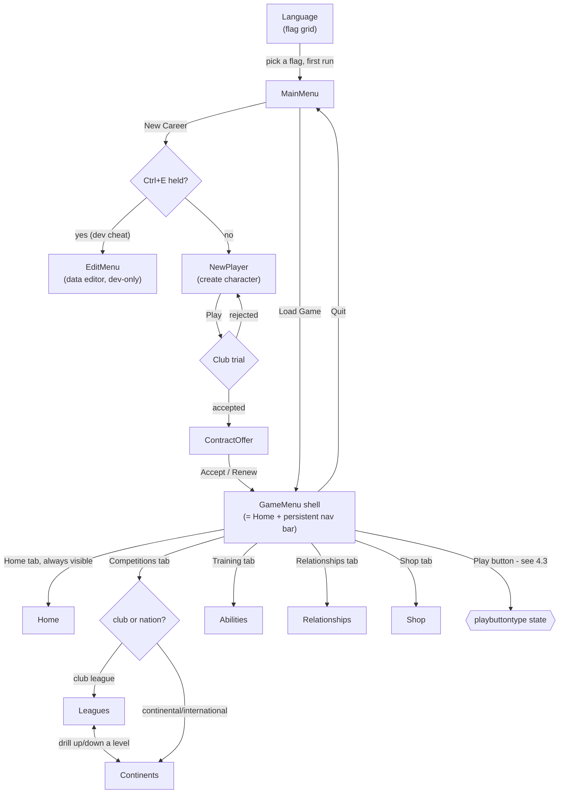

# Screens, navigation and what every button does

> **Source:** `TScreen.CreateScreen` @ 0x005103c3 (VERIFIED) · `TScreen.Update` @ 0x00511237 (VERIFIED) · `TScreen.Draw` @ 0x00510dfc (VERIFIED) · `TScreen.CheckInput` @ 0x00511462 (VERIFIED) · `TScreen.GetInput` @ 0x00511535 (VERIFIED) · `TScreen.SetActive` @ 0x00510a2b (VERIFIED) · `TScreen.MoveSelection` @ 0x00511ea5 (READ) · `TGadget.MouseOver` @ 0x00514113 (VERIFIED) · `TCombo.Activate` @ 0x00518a65 (VERIFIED) · `TLocale.GetLocaleText` @ 0x004c58fc (VERIFIED) · `TScreen_GameMenu.ButtonPlay` @ 0x0053b3f1 (READ) · `TScreen_GameMenu.UpdateNavPanel` @ 0x0053ac42 (READ) · `TScreen.ResetScreens` @ 0x00510a05 (VERIFIED) · `CreateAllScreens` @ 0x0051b986 (VERIFIED)
> **Confidence:** MEDIUM
> **Last checked:** 2026-08-15

This is the map of every screen in New Star Soccer 5, how the game gets you from one to the
next, and what happens when you press each button. It is built from `src/recovered/`, which
holds 36 byte-exact bodies of the base `TScreen` type and hundreds more across its 53
subtypes (`TScreen_MainMenu`, `TScreen_GameMenu`, `TScreen_Home`, and so on) - real BlitzMax
source, proven identical to the shipped binary. Where a claim rests on a Ghidra decompile
instead of a byte-exact body, it is marked `READ`, not `VERIFIED`, and said so inline.

*Jargon note used throughout: "byte-exact" / "VERIFIED" means we recompiled the function and
it produces the identical machine code the original compiler produced - as close to proof as
this project gets. "READ" means a human or pass read Ghidra's decompiled C for that function
but has not (yet) reproduced it byte-for-byte. "INFERRED" means deduced from data files,
naming, or surrounding evidence, without reading the function itself.*

---

## 1. The screen system

### 1.1 What a screen is

Every screen in the game - the main menu, the pause menu, the boot shop, the data editor - 
is an instance of `TScreen` or one of its 53 subtypes (`TScreen_Home`, `TScreen_Options`,
`TScreen_BlackJack`, ...). A `TScreen` is a named container: a background image, an optional
draw callback, an optional update callback, and a list of on-screen widgets ("gadgets" - see
§2). Every screen that has ever been created is kept in one global list,
`g_screens:TList` (`TScreen.New` @ 0x0051005a, VERIFIED), and there is always exactly one
**active screen**, held in the global we call `g_curscreen`/`g_currentscreen` - several
recovered files reach the same address under different guessed names, and it is the current
screen that gets drawn and updated every frame.

At boot, `TScreen.SetUp` (@ 0x00510174, VERIFIED) loads the shared assets every screen needs
once: the fallback background (`GameMedia/Images/Backgrounds/MyBg2.png`), the mouse cursor
animation, and the two menu sound effects, `Click.ogg` and `Select.ogg`.

### 1.2 How a screen gets created

Each screen type has a `CreateScreen()` function that runs **once**, the first time that
screen is needed, and builds every gadget on it (buttons, labels, panels, combo boxes) with
hard-coded positions and sizes. It is expensive - `TScreen_GameMenu.CreateScreen`
(@ 0x00539be4, VERIFIED) is 3,779 bytes of machine code building 9 buttons, 7 labels, 2
panels and a progress bar - so it is not repeated every time you visit the screen.

`CreateScreen` always starts by calling the shared `TScreen.CreateScreen` constructor
(@ 0x005103c3, VERIFIED), which:

1. Registers the screen's name and background image.
2. **If this is the very first screen ever created, makes it active** (`TScreen.SetActive`).
   This is why the game always opens on whichever screen's `CreateScreen` runs first at boot.
3. Looks up a **help entry** for the screen from the tag `"help_" + Upper(name)` (see §3) and
   builds a `THelpBox` for it, queued for the in-game Help button. If no translation exists
   for that tag, it silently falls back to the tag `help_nohelp`.

Separately, each screen type has a `SetUpScreen()` function that runs **every time** you
navigate to that screen. It is cheap: it calls `TScreen.SetActive(name, "")` to make the
screen current, then refreshes whatever labels/tables need up-to-date data (scores, cash,
next opponent, etc.) before drawing anything. `TScreen_GameMenu.SetUpScreen`
(@ 0x0053aaa7, VERIFIED) is the whole pattern in four lines:

```
Function SetUpScreen:Int()
    TScreen.SetActive("gamemenu", "")
    UpdateTitlePanel()
    UpdateNavPanel()
    TScreen_Home.SetUpScreen()   ' see 1.4 -- GameMenu is a shell around Home
End Function
```

**This `CreateScreen` (build once) / `SetUpScreen` (refresh + switch) split is the core
pattern of the whole UI**, and it explains why buttons almost always call
`TScreen_X.SetUpScreen(...)` to navigate rather than rebuilding anything.

### 1.3 The frame loop

Every frame, the engine calls two class-level functions, both static (no particular screen
instance - they always act on the current one):

* **`TScreen.Update`** (@ 0x00511237, VERIFIED) - routes input for the frame. If a combo box
  is open it updates only that; otherwise if a text box has focus it updates that; otherwise
  it calls `TScreen.CheckInput()` (below) and then updates every gadget and every progress
  bar on the screen; finally, if the screen registered an update callback (`fUpdate`), it
  calls that too.
* **`TScreen.Draw`** (@ 0x00510dfc, VERIFIED) - draws the border/letterbox, the background
  image, the screen's own draw callback (`fDraw`, if any) inside a clipped viewport, every
  gadget, any open combo box's dropdown list, the highlight ring around whichever gadget is
  selected, and - if tooltips are turned on - every visible gadget's tooltip. Modal alert
  popups (`TScreenMessage`, small floating text bubbles, distinct from full screens) draw
  last, on top of everything.

The game's logical resolution is a fixed **800×600**; `TScreen.RenderBorder`
(@ 0x00511066, VERIFIED) and `TScreen.UpdateOffset` (@ 0x00510811, VERIFIED) pillarbox/
letterbox that logical canvas inside whatever the real window size is, picking one of two
stadium background images depending on whether the extra space is horizontal or vertical.

### 1.4 How one screen hands off to another

There are three distinct hand-off mechanisms in the code, and they are used in different
situations:

1. **`TScreen_X.SetUpScreen(...)`** - the normal way. Almost every button handler ends by
   calling another screen type's `SetUpScreen`, which internally calls `TScreen.SetActive`.
   This is what §4's navigation graph is built from.
2. **`TScreen.SetActive(name$, gadgetname$)`** (@ 0x00510a2b, VERIFIED) directly, by literal
   screen name string, used when the target screen was already built by someone else and
   just needs focus back - e.g. `TScreen_Negotiate.ButtonAccept` returns to `"contractoffer"`
   by name rather than calling `TScreen_ContractOffer.SetUpScreen()`, because the contract
   screen underneath hasn't changed.
3. **Shell screens.** `TScreen_GameMenu` is not really its own screen - it is the persistent
   top bar (bank, cash, energy, achievements, year/week) and bottom nav bar (Home /
   Competitions / Training / Relationships / Shop / the big Play button) that every in-career
   screen sits inside. Its `SetUpScreen` finishes by calling `TScreen_Home.SetUpScreen()`, so
   "go to the game menu" and "go to Home" are the same action. `TScreen_Home.CreateScreen`
   (@ 0x0053ba31, VERIFIED) explicitly re-adds two `TPanel`s built by a *different* screen's
   `CreateScreen` (the nav bar built for `TScreen_Abilities`) - panels and their child
   buttons are shared objects re-parented across screens, not redrawn from scratch each time.

### 1.5 Modal overlays: DoMessage and DoHelp

Confirmation dialogs and the Help system are **not** part of the navigation graph - they are
synchronous, blocking overlays. `TScreen.DoMessage(text$, yesno:Int, snapshot:Int)`
(@ 0x005126da, VERIFIED) is reached by 222 call sites across the game. It:

1. Optionally grabs a snapshot of the current screen into a background image (so the dialog
   appears to float over a frozen version of what you were looking at).
2. Builds a tiny throwaway screen called `"msgscreen"` with the message text and either one
   OK button or a Yes/No pair.
3. Runs its **own** `Update`/`Draw`/`Flip` loop right there, blocking, until a button sets the
   result flag.
4. Restores the previous screen and returns the result (`0`/`1` for OK, or which of Yes/No
   was pressed) to the caller.

`TScreen.DoHelp(showTutorialButtons:Int)` (@ 0x005132b5, VERIFIED) works the same way but
walks the *current* screen's list of `THelpBox` entries (queued back in `CreateScreen`, §1.2)
one at a time, each its own little modal loop, until you dismiss the last one or hit the
"End Tutorial" button. The screen-level Help button (`TScreen.ButtonHelp`, @ 0x00513283,
VERIFIED) calls `DoHelp(0)`; the tutorial variant (`TScreen.Tutorial`, @ 0x0051329c, VERIFIED)
calls `DoHelp(1)`, which adds the extra "skip tutorial forever" button
(`TScreen.ButtonEndTutorial`, @ 0x00513562, VERIFIED, which also calls
`TProfile.ResetTutorial(1)`).

### 1.6 Teardown

`TScreen.Clear()` (@ 0x005105ed, VERIFIED) blanks a screen's background and gadget list.
`TScreen.ClearAll()` (@ 0x00510540, VERIFIED) is the hard reset used when changing language
or resolution: it clears and discards every registered screen so the whole UI gets rebuilt
from scratch on next use. `TScreen.Delete()` (@ 0x0051011d, VERIFIED) is an empty body - pure
reference-count teardown, nothing bespoke happens on screen destruction.

### 1.7 Rebuilding the whole UI - `TScreen.ResetScreens` and `CreateAllScreens`

`TScreen.ResetScreens()` (@ 0x00510a05, VERIFIED, 38 bytes) is the hard-reset entry point
referenced in §3.3 ("language change" flow) and §1.6 above. It is a three-line wrapper:

```
Function ResetScreens:Int()
    LogLine("ResetScreens")
    ClearAll()
    CreateAllScreens()
End Function
```

`ClearAll()` discards every currently-registered `TScreen` (§1.6). `CreateAllScreens`
(@ 0x0051b986, VERIFIED, name ours - it is a module-level Function, not a `TScreen` member,
so it carries no reflection record and its real name is unrecoverable) is what actually
rebuilds everything: **53 individual `TScreen_X.CreateScreen()` calls plus one
`TPanel_Controls.SetUp()`**, in one fixed, hard-coded order, run back-to-back with no
conditional logic at all - every screen type in the game gets rebuilt every time, not just
the ones that need it. The "app-level `CreateScreensAll`-style routine" is a real, located function, and it
does not run at boot (`docs/game/engine/main-loop.md`'s boot sequence never calls it) - the
only confirmed caller in the recovered corpus is `TScreen_Language.ButtonLanguage` (§3.3),
i.e. **every screen in the game is built once, lazily, the first time the language is set**
(at first boot, or again on every subsequent language change), not incrementally as the
player visits each one for the first time as §1.2's "runs once, the first time that screen
is needed" description might otherwise suggest for a fresh game.

Because rebuilding 53 screens' worth of gadgets is slow enough to be visible, the work is
broken into five batches (5, 13, 9, 14, and 12 screens) each followed by a call to
`TScreen.DoProgressBar(percent:Float, label:String, colour:String, mode:Int)`
(@ 0x00512de9, class-table slot 0xAC, **UNVERIFIED** - see
`src/recovered_unverified/TScreen.DoProgressBar.bmx`) at 60/70/80/90/100 percent, each with
the localized label `GetText("Loading")` and the colour `"00FF00"` (green). This is the
progress bar the player sees on first launch and on every language switch. The whole batch
is bracketed by a matched pair of debug log lines - `LogLine("CreateScreensAll:" +
FormatMoney(GCMemAlloced(), 0))` before and `LogLine("ScreensAllCreated:" +
FormatMoney(GCMemAlloced(), 0))` after - reusing the money formatter as a generic
GC-heap-size printer, the same trick `TEngine.RenderGameEngine`'s debug overlay uses for its
"Mem: " readout.

---

## 2. Gadgets and input

### 2.1 The gadget family

Every on-screen control derives from `TGadget` (19 of its own bodies VERIFIED). `TGadget.New`
(@ 0x00513599, VERIFIED) registers every gadget ever created into a global list
(`g_allgadgets`) and gives it its own child list and text-line list. The concrete gadget
types this project can see doing UI work:

| Type | Role |
|---|---|
| `TButton` | Clickable button; carries a `fHit:Int()` function-pointer field - see §2.2 |
| `TCombo` | Dropdown list (22 of its own bodies VERIFIED) - see §2.4 |
| `TInputBox` | Free-text entry field |
| `TLabel` | Static or dynamic text |
| `TPanel` | A container gadget that groups children (a nav bar, a title bar, a card) |
| `TProgressBar` | Bars: energy, happiness, skill sliders, fame, achievements |
| `TTable` | Scrollable data grid (league tables, fixture lists, stat sheets) |

`TGadget` itself carries the shared machinery: position/size, colour, alpha, font size,
visibility (`hidden`), a parent/child tree (`AddChild`/`GetChildren`), and word-wrapping.
`TGadget.SetText` (@ 0x005141dc, VERIFIED, 824 bytes) is the shared caption engine behind
every button and label - it re-wraps text into `txtlines` whenever it doesn't fit the
gadget's width, with an 8px side margin and a 28px margin for the "give up and wrap
mid-word" fallback path.

### 2.2 How a click reaches a handler

A button's click handler is not a virtual method - it is a **plain function pointer** stored
in the gadget's `fHit` field, set at construction (`TButton.CreateButton`, @ 0x00514fdc,
VERIFIED, parameter `a11:Int()`). Every `ButtonXxx` function you see in `src/recovered/` is
one of these callbacks.

The dispatch is `TScreen.CheckInput()` (@ 0x00511462, VERIFIED), called once per frame from
`TScreen.Update`. It reads one navigation code per frame from `TScreen.GetInput()` (below)
and switches on it:

| Code | Meaning | What happens |
|---:|---|---|
| 0 | nothing pressed | if the mouse moved, run `MouseSelection()` - hit-test every visible gadget under the cursor and make the first hit the active/highlighted one |
| 1-4 | up / down / left / right | `TScreen.MoveSelection(code)` - see §2.3 |
| 5 | select/click | if the active gadget is alive, visible and has an `fHit`, play the click sound and **call `fHit()`** |
| 6 | tab | `TScreen.TabToGadget()` - see §2.3 |

`TGadget.MouseOver()` (@ 0x00514113, VERIFIED) is the hit test itself: it converts the raw
mouse position into screen-local coordinates (subtracting the letterbox offset from §1.3) and
does a plain axis-aligned rectangle test against the gadget's `x/y/w/h`.

### 2.3 Reading the input device - `TScreen.GetInput`

`TScreen.GetInput()` (@ 0x00511535, VERIFIED, 2,416 bytes - the single largest body in
`TScreen`) is the raw-input-to-navigation-code translator behind every menu in the game. In
order:

1. Scales the OS mouse position into the game's 800×600 logical space if the real window is
   smaller than that in either dimension.
2. **`MouseHit(1)`** (left mouse button pressed this frame) is an immediate `Return 5`
   (select).
3. If a joystick/pad is present, its four analogue-stick or digital-pad directions and up to
   three action buttons are checked next, before the keyboard.
4. Four remappable direction keys (configured in Options, §5) are checked, each an immediate
   `Return 1..4`.
5. Three remappable action keys are checked, but only fire `Return 5` if **no combo box is
   currently open** - with a combo open, the same physical keys instead let
   `TScreen_Clubs.ComboLocale`-style handlers use `SelectItemByLetter` for jump-to-letter
   typing.
6. Six hard-coded raw key codes are checked regardless of remapping: arrows (37/38/39/40),
   Enter (13, `Return 5`) and Tab (9, `Return 6`).
7. A second, "held down" pass (not "just pressed") repeats the direction check so that
   holding a direction key **auto-repeats**: the code returns the held direction again once
   every 300ms after an initial 300ms delay (`g_player_int50 > lastRepeat + 300`, then resets
   the repeat clock to `now - 270`, i.e. a ~30ms-shorter interval on each subsequent repeat).

So every menu in the game supports mouse, keyboard *and* joypad from one function, and the
direction/action key bindings are entirely data-driven from the seven configurable control
slots loaded by `TOptions.LoadOptions` (@ 0x004e3aed, VERIFIED) - `k_Up`/`k_Down`/`k_Left`/
`k_Right`/`k_Button`/`k_Button2`/... in `Settings/Options.ini`.

### 2.4 Moving the selection with keys or a pad - `TScreen.MoveSelection`

`TScreen.MoveSelection(direction:Int)` (@ 0x00511ea5, **READ, not byte-matched** - the
methodology says decompile-only claims here) is what turns a "pressed up/down/left/right"
code into "which gadget is now highlighted". Reading the Ghidra decompile:

1. If no gadget is currently active, it just falls back to
   `TScreen.FindNewActiveGadget()` (@ 0x00510cac, VERIFIED) - pick the first alive, visible,
   focusable gadget on the screen.
2. Otherwise it builds a list of every visible, focusable `TGadget` on the current screen.
3. **First pass:** it only considers candidates that are *aligned* with the active gadget - 
   for "up", only gadgets whose vertical position is above the active gadget **and** whose
   horizontal position exactly matches it; symmetrically for down/left/right. Among those, it
   picks the geometrically nearest one by Euclidean distance (with the screen's x/y scale
   factors folded in).
4. **Second pass, only if the first pass found nothing:** it relaxes the alignment
   requirement and just looks for the nearest gadget in the given general direction (still
   gated by which side of the active gadget it is on, but without the exact-alignment test).
5. Whichever candidate wins becomes the new active gadget (with the retain/release
   bookkeeping BlitzMax does for object assignment).

In plain terms: pressing a direction key first tries to jump to something lined up in a row
or column with you (the usual case in a button grid), and only if nothing lines up does it
fall back to "nearest thing in roughly that direction". This is why keyboard/pad navigation
in grids (the boot shop, the language-select flag grid, the achievements list) feels like it
snaps along rows/columns rather than drifting diagonally.

### 2.5 Tab order - `TScreen.TabToGadget`

`TScreen.TabToGadget()` (@ 0x00512441, VERIFIED, 539 bytes) advances focus to the next
focusable gadget in **gadget-list order** (i.e. creation order, not screen position),
skipping anything hidden or dead, restricted to `TButton`/`TInputBox`/`TCombo`/`TTable`, and
wrapping back to the first one after the last. If the newly-focused gadget is a text box, it
sets `gettinginput = 1` so typing goes into it immediately, and flushes the keyboard buffer
so the Tab keystroke itself doesn't leak into the field.

### 2.6 Dropdowns - `TCombo`

A `TCombo` is a button (`btn_head`) that shows the current selection, plus a hidden list of
per-item `TButton`s. `TCombo.Activate()` (@ 0x00518a65, VERIFIED) - triggered by clicking the
head or by Enter/select while it has focus - sets `activated = 1`, swaps the head button's
visual style to its "open" variant, and un-hides the item buttons (defaulting to item 1 if
nothing was selected yet), then makes the currently-selected item's button the active gadget
so the pad/keyboard can immediately move up and down the list. `TCombo.Deactivate()`
(@ 0x00518bf8, VERIFIED) reverses all of that, copies the clicked item's text onto the head
button, and calls an optional `fRet` callback (used by screens that need to react
immediately to a combo change, e.g. re-filtering a table). `TCombo.SelectItem(index)`
(@ 0x00518ef3, VERIFIED) is the direct "select item N" entry point used when a screen
pre-selects a combo value in code (e.g. defaulting the new-player's club to id 62).

While a combo is open, `TScreen.Update`'s very first check (§1.3) routes *all* input to that
combo alone - nothing else on the screen updates, which is why you can't click through an
open dropdown onto the gadget behind it.

---

## 3. Where screen text comes from

### 3.1 The file

Every user-visible string in the game - button captions, tooltips, messages, achievement
names - lives in one file: `GameMedia/Languages/Languages.csv`. It is tab-separated (despite
the `.csv` extension), UTF-8, 2,751 lines: a header row, three metadata rows
(`Tag_Language`, `Tag_NationId`, `Tag_Translator`), and **2,747 rows of `tag → text`**, one
column per language (`en br pt de es fr it pl tr nl` - 10 languages). See
`docs/specs/03-game-systems-from-language-tags.md` for the full tag-namespace catalogue; this
document only covers the *mechanism*.

### 3.2 The lookup: `TLocale`

`TLocale` (6/6 of its methods VERIFIED) holds every language's tag table in memory as a
`TMap` of `TMap`s - outer key is the language code (`"en"`, `"de"`, ...), inner key is the
tag, value is the localised string. The current language code is a single module `String`
global, defaulting to `"en"`.

`TLocale.GetLocaleText(tag$)` (@ 0x004c58fc, VERIFIED) is the actual lookup:

```
Function GetLocaleText:String(tag$)
    Local s:String = String(TMap(g_locale_maps.ValueForKey(g_locale_lang)).ValueForKey(tag))
    If s.Length Then Return s
    Return "@" + tag
End Function
```

**A missing tag comes back as the tag itself with an `@` prefix**, never a blank string or a
crash. This sentinel is checked elsewhere - `TScreen.CreateScreen` (§1.2) tests the help text
it looked up with `.Contains("@")` and substitutes the generic `help_nohelp` text if the
screen-specific help tag doesn't exist. Recovered source calls this function under the short
name `GetText(...)` at its call sites (e.g. `TScreen.CreateScreen`, `TScreen_GameMenu.
CreateScreen`) - the same address, dispatched unqualified within the module.

`TLocale.SetCurrentLanguage(code$)` (@ 0x004c584d, VERIFIED) switches the active language: it
looks the code up in the map of maps, falls back to `"en"` if that language isn't loaded, and
then calls `TLocale.SetUpKeyStrings()` (@ 0x004c5966, VERIFIED, 6,214 bytes) - which
re-resolves the display name for every one of the ~113 keyboard keys shown in the Controls
screen (`key_Up`, `key_Enter`, `key_F1`, ...) through `GetLocaleText` in the new language.

### 3.3 Changing language in the running game

`TScreen_Language` is the flag-grid screen (`TScreen_Language.CreateScreen`, @ 0x0051bc09,
VERIFIED): it builds one button per loaded language, positioned in a grid sized to the
language count, each button's *name* set to the language code and its icon the matching
nation's flag PNG (`Tag_NationId` from the CSV metadata row, §3.1, cross-referenced against
`GameMedia/Data/Nations.csv`). Clicking a flag runs `TScreen_Language.ButtonLanguage`
(@ 0x0051bfc9, VERIFIED):

```
Function ButtonLanguage:Int()
    g_langname = TGadget.GetActiveGadgetName()   ' the clicked button's own name = the language code
    TOptions.SaveOptions()
    TLocale.SetCurrentLanguage(g_langname)
    TScreen.SetUpFonts(g_langname)
    TScreen.ResetScreens()                       ' rebuild every screen so labels re-translate
    If <language screen opened from Options>
        TScreen.SetActive(<screen you came from>, "")
    Else
        TScreen_MainMenu.SetUpScreen()           ' first-run language pick lands on Main Menu
    End If
End Function
```

`TScreen.ResetScreens()` clearing and rebuilding every screen (§1.6) is the reason a language
change takes a visible beat - literally every gadget in the game gets re-created so its
caption is re-looked-up in the new language.

---

## 4. The navigation graph

### 4.1 Numbers

53 distinct `TScreen_*` subtypes have at least one byte-exact recovered body. Every edge
below was extracted directly from the literal `SetUpScreen`/`SetActive` call inside the
corresponding `ButtonXxx` function's **VERIFIED, byte-exact** source in `src/recovered/`
(comment text excluded) - this is not inference, it is what the button's own code says it
calls. To check any single edge yourself: open `src/recovered/<Screen>.<Handler>.bmx` and
look up its VA in `extracted/vtable_map.tsv`.

### 4.2 The spine



### 4.3 The Play button - a five-state machine

The big "Play" button on the game-menu nav bar is the single most-used control in the game,
and it is not a simple "go play a match" button - it routes to five different destinations
depending on `TProfile.playbuttontype` (field offset `+0x130`, confirmed against
`extracted/object_model.json`). `TProfile.NextPlayButton()` (@ 0x005679a0, VERIFIED) cycles
this field 1→5→1 each time there is nothing left to show at the current stage, and
`TProfile.SetPlayButtonIcon()` (@ 0x00567ad5, VERIFIED) sets the button's icon to match. The
routing itself is `TScreen_GameMenu.ButtonPlay` (@ 0x0053b3f1, **READ, not byte-matched**):

| `playbuttontype` | Gate (from `NextPlayButton`, VERIFIED) | Destination (from `ButtonPlay`, READ) | Icon asset (cross-checked against `CreateScreen`, VERIFIED) |
|---:|---|---|---|
| 1 | any of physio/boss/coach report pending | `TScreen_ReportPhysio` | `PlayPhysio.png` / `PlayBoss.png` / `PlayCoach.png` |
| 2 | a web headline is pending | `TScreen_WebPage` | `PlayWeb.png` |
| 3 | *(always available)* | `TProfile.RandomIncident()` - no screen change, just a random relationship-flavoured event | `PlayRelations.png` |
| 4 | *(always available)* | the match flow (below) | `PlayBall.png`, or `PlayCup.png` if the next fixture is a cup tie |
| 5 | a news headline is pending | `TScreen_Newspaper` | `PlayNewspaper.png` |

State 4, "play the match", is itself a small decision tree inside `ButtonPlay` (READ): if the
profile is flagged retired (`+0x3c`), it shows the `CMESSAGE_RETIREMENT` dialog instead of
anything else. Otherwise it checks whether the season has ended (comparing the next
competition's start date against today); if so, it either shows `TScreen_SeasonReview`
directly or, if another competition's fixtures still need to run first, drops into
`TScreen_Leagues` or `TScreen_Continents` for that competition. If the season is mid-flow and
the player's club/nation lookup fails, it falls back to `TScreen_WorldMap`.

**A hidden developer shortcut lives in this same function**: if a flag we call
`g_engine_int161` equals 2 (INFERRED to be a build/run-mode flag - the same global is also
read by the data-editor screens, `TScreen_Competitions` and `TScreen_EditCompetition`) *and*
the right-Alt key (`0xA2`) is held while the current screen is `"leagues"`, the whole match
is skipped and the week is fast-forwarded directly, bypassing normal play - a debug fixture
skip left active in the shipping code.

### 4.4 The career-shell branches

Below the GameMenu spine, each tab leads to its own sub-tree. Edges marked `†` come from
`SetActive` by literal screen name rather than a `SetUpScreen` call (§1.4).

```
Home
├── My Contract  → MyContract
│     ├── Request Transfer / Renew → ContractOffer
│     │     ├── Accept / Reject → ContractOffer (self, shows next offer or closes)
│     │     └── Negotiate → Negotiate
│     │           └── Accept / OK → "contractoffer" †
│     └── Play (accept a shown offer) → Home
├── My Finances  → Finances
├── My Stats     → Stats
├── Happiness    → Relationships
├── Training     → Abilities
├── Lifestyle    → Shop
│     └── Buy    → (stays on Shop; purchase only)
└── Achievements → Achievements

Relationships
├── Team/Casino     → Casino
│     ├── BlackJack → BlackJack       → Quit → Casino
│     ├── Roulette  → Roulette
│     └── Slots     → Slots
├── Friends/Racing  → Stable (horse racing minigame)
│     └── Quit      → Relationships
├── Relationship (pairs minigame) → Pairs
│     └── Success/Fail → Relationships
├── Girlfriend end  → WebPage
│     └── Play      → GameMenu or Relationships
└── (dilemma events pop up independently) → Dilemma
      └── Relationship choice → Relationships
```

### 4.5 Match day

`TScreen_MatchPrep` (the kit-bag screen: energy drinks, booze, painkillers, shin pads) is
reached before a fixture; its Play button (@ 0x0055f249, VERIFIED) calls
`NextFixture(0)` (@ 0x0055f262, VERIFIED), which hands off to `TProfile.PlayNextFixture` - 
**not** a `TScreen`, but the match engine (`TEngine`) taking over rendering directly.
`TScreen_Formation` (tactics/team-sheet) and `TScreen_MatchPaused` are reached **from inside
a running match** as pause overlays, not from the game-menu spine: `TScreen_Formation.
ButtonPlay` (@ 0x0054d192, VERIFIED) either re-opens team selection (if a guard flag is set),
shows `TScreen_MatchPaused` (if the match is already paused), or calls
`TEngine.PauseEngine()` directly to resume play. `TScreen_MatchPaused.ButtonContinue`
(@ 0x0054ae19, VERIFIED) does the same `TEngine.PauseEngine()` unpause. Both screens are
technically registered `TScreen`s (so they go through the same click/draw machinery as
everything else), but their navigation is match-state-driven, not menu-driven - they are the
exception to the "everything is a button-to-SetUpScreen edge" rule.

### 4.6 The data editor (developer tool, not part of normal play)

Reachable only via the `Ctrl+E` cheat on "New Career" (`TScreen_MainMenu.NewGame`,
@ 0x0051d023, VERIFIED - `If KeyDown(162) And KeyDown(69)`, i.e. left-Ctrl + `E`) or from
Options → a hidden path. It is a full CRUD tool over the game's data files (clubs, nations,
continents, competitions, kits) and every one of its ~15 screens follows the same shape: a
list/table screen with New/Edit/Delete/Quit, and an edit-form screen with Next/Prev/Quit.

```
EditMenu
├── Continents → EditContinents
│     └── (member link) → EditNations
├── Nations    → EditNations
│     ├── Next/Prev Nation → EditNations (self)
│     └── Edit Kit → EditKits
│           └── Quit → EditClubs or EditNations (whichever opened it)
├── Test Data  → TestMenu
│     ├── (fixtures test) → TestFixtures → TestFixtures (self, re-filter) / TestMenu
│     └── (tournaments test) → TestTournaments → TestTournaments (self) / TestMenu
├── Save / Save For Mobile → (writes files, no screen change)
└── (from Clubs/Competitions elsewhere in the tool)
      Clubs           ⇄ EditClubs
      Competitions    ⇄ EditCompetition
      ContinentalComps ⇄ EditClubs / EditCompetition
      Promotions      → EditMenu (Quit)
```

Everywhere in this tool, "Quit" returns to `EditMenu`, and most "New"/"Edit" buttons on a
list screen open the matching edit-form screen, which returns to whichever list screen it was
opened from (`EditCompetition.ButtonQuit`, for instance, goes back to either
`TScreen_Competitions` or `TScreen_ContinentalComps` depending on which one launched it - the
recovered source shows both destinations because the function is shared by both callers).

---

## 5. Button catalogue for the screens named in this document's brief

Full one-line bodies, all VERIFIED unless noted. Every function name below is a distinct file
in `src/recovered/`.

### TScreen_MainMenu (21/21 bodies VERIFIED)

| Button | What it does |
|---|---|
| `ButtonHome` (@ 0x0051d9b1) | Opens the game's home-page URL in the OS browser. No screen change. |
| `ButtonLoadGame` (@ 0x0051d138) | Toggles the load-game panel open/closed; on open, refreshes the save-file table. |
| `ButtonReplays` | Same pattern for the replay-file table (not individually re-read for this doc; same shape as `ButtonLoadGame`). |
| `NewGame` (@ 0x0051d023) | The Ctrl+E cheat check, then an online-account/version gate (`CMESSAGE_MUSTBEONLINE` / `CMESSAGE_MUSTUPDATEVERSION` if those checks fail), else `TProfile.SetUp()` + `TScreen_NewPlayer.SetUpScreen()`. |
| `ButtonQuit` (@ 0x0051d010) | `End` - closes the game. |
| `ButtonDeleteSaveFile` / `ButtonDeleteReplayFile` | Delete the selected file, refresh the table (not individually re-read). |
| `ButtonFacebook` / `ButtonTwitter` | Open the corresponding share URL. |
| `ButtonMobile` | Not individually re-read; name strongly suggests a link to the mobile version of the game. |
| `Update` (@ 0x0051cebd) | Not a button - the screen's per-frame callback; cycles a rotating news/credits ticker under the panel every ~1.5s. |

### TScreen_GameMenu (persistent career shell)

| Button | What it does |
|---|---|
| `ButtonPlay` (@ 0x0053b3f1, READ) | The five-state hub - see §4.3. |
| `ButtonCompetitions` (@ 0x0053b2ee) | Looks up the player's next fixture; routes to `TScreen_Leagues` if it's a domestic league match, `TScreen_Continents` if it's continental/international, or `TScreen_Leagues` as a fallback if there is no next fixture at all. |
| `ButtonRelationships` (@ 0x0053b9e8) | `TScreen_Relationships.SetUpScreen(1)`. |
| `ButtonQuit` (@ 0x0053b39d) | Saves the game, replaces the live profile with a fresh `New TProfile`, returns to `TScreen_MainMenu`. |
| `UpdateTitlePanel` (@ 0x0053aada) | Not a button - refreshes name/bank/energy every visit; energy bar turns orange at ≤50%, red at ≤20%. |
| `UpdateNavPanel` (@ 0x0053ac42, READ) | Not a button - refreshes the "Next Opponent" label with the upcoming fixture's date and opponent name, coloured red and annotated if that opponent is banned or injured. |

### TScreen_MainMenu → TScreen_Language → TScreen_Options triangle

`TScreen_Options.ButtonLanguage` (@ 0x00520cb7, VERIFIED) refuses to open the language picker
from any screen other than `"mainmenu"` (shows `CMESSAGE_CHANGELANGUAGE` instead) - language
can only be changed from the main menu or on first boot, never mid-career.
`TScreen_Options.ButtonMusic` (@ 0x00520f79, VERIFIED) is representative of most Options
toggles: read the clicked gadget's own name (`options_musicoff`/`_musiclow`/`_musichigh`),
set the matching value, call the shared `UpdateAudio()`, then `RefreshButtons()` to redraw
every toggle's highlighted state. The ~20 other `TScreen_Options.ButtonXxx` files (Radar,
Currency, MatchLength, MatchSpeed, Difficulty, ToolTips, HighlightBall, ShowEnergy,
FixKick, ...) were not all individually re-read for this document, but every one follows this
same "read active gadget name → set an Options field → `RefreshButtons()`" shape, and all
persist through `TOptions.SaveOptions()` to `Settings/Options.ini`.

### TScreen_Home

Built by `TScreen_Home.CreateScreen` (@ 0x0053ba31, VERIFIED, 4,273 bytes). Its panel buttons
(`btn_Contract`, `btn_Finances`, `btn_Stats`, `btn_Happiness`, `btn_Skills` (Training),
`btn_Lifestyle` (Shop), `btn_Achievements`) each carry their target screen's `SetUpScreen`
directly as their `fHit` - Home is a pure launcher screen with no bespoke handler logic of
its own beyond `ButtonHappiness` → `TScreen_Relationships.SetUpScreen(1)`.

### TScreen_Continents / TScreen_Leagues

These two mirror each other: domestic league tables live in `Leagues`, continental/
international competitions in `Continents`. `ButtonLevel` on either one drills between them.
`TScreen_Continents.ButtonGroup` (@ 0x00549002, VERIFIED) re-centres the standings table on
whichever group contains the player's own club or nation (falling back to the currently
selected combo item) and refreshes both the table and the fixture list for that group.
`TScreen_Leagues.ButtonRound` (@ 0x005462d4, VERIFIED) steps the visible fixture round
forward or backward - but is a no-op for `comptype = 1` competitions (single-table
formats with no rounds to step through). Both screens' `ButtonQuit` return to `TScreen_
GameMenu`.

### TScreen_MyContract

`ButtonRequestTransfer` (@ 0x0055587a, VERIFIED, 612 bytes) is the richest handler here: it's
disabled (`Return 0`) while the button's own alpha is faded below 1.0 (i.e. while it's mid
fade-transition), then switches on `TProfile.transferlisted` - `0` (not listed) asks for
confirmation via `TScreen.DoMessage`, then flags the player transfer-listed, docks 30 boss
relationship points, posts a `CNEWS_TRANSFERREQUEST` web headline, and warns if the transfer
window is currently closed (substituting the reopening week, 26 or 1, into
`CMESSAGE_TRANSFERWINDOWCLOSEDNEXT`); already-listed (`3`/`4`, empty cases) does nothing;
anything else offers to cancel the request, refused if the boss relationship is too low.
`ButtonOffer` and `ButtonRenewContract` both route to `TScreen_ContractOffer`.

### TScreen_Stable (horse racing minigame)

`ButtonStable` (@ 0x005884a4, VERIFIED) refuses entry with `CMESSAGE_NOSTABLE` if the player
owns no horses, otherwise swaps the "for sale" panel out for the "your horses" panel.
`ButtonRace` (@ 0x0058853e, VERIFIED) is a 3-state switch on a screen-local race-progress
flag: `0` sets up the next race, `1` runs it, `2` is an intentional no-op (waiting for the
result screen to be dismissed). `ButtonQuit` returns to `TScreen_Relationships`.

### TScreen_BlackJack

`ButtonPlay` (@ 0x005768c8, VERIFIED) places the bet (bails out with no side effect if
`TProfile.Bet()` reports insufficient funds), hides the casino title buttons and the bet
controls, reveals the Hit/Stand buttons, focuses Hit by default, and hands off to
`TBlackJack.Play()` for the actual card logic. `Win` (@ 0x00576b03, VERIFIED) pays out double
the stake and checks achievement #75; `Lose`/`Tie` (not individually re-read here, but
verified in the corpus) are the loss/push counterparts. `ButtonQuit` returns to
`TScreen_Casino`.

---

## 6. What we do not know yet

* **`TScreen_GameMenu.ButtonPlay`** (@ 0x0053b3f1) and **`UpdateNavPanel`** (@ 0x0053ac42)
  are read from Ghidra's decompile only - not byte-matched. The state-machine table in §4.3
  is cross-checked two ways (against the VERIFIED `NextPlayButton`/`SetPlayButtonIcon` gating
  logic, and against the VERIFIED `CreateScreen`'s icon-asset filenames landing on the same
  addresses), which is why it is presented with medium-high confidence despite the READ tag,
  but it has not been reproduced byte-for-byte.
* **`TScreen.MoveSelection`** (@ 0x00511ea5) is READ only. The two-pass "aligned neighbour,
  then nearest neighbour" algorithm in §2.4 is read directly off Ghidra's decompiled C, which
  the project's own methodology notes can mis-render control flow around early returns - the
  broad shape is very likely right, but exact branch ordering is not proven.
* **Where exactly the boot sequence lands first** - which screen's `CreateScreen` runs first
  at startup, and how the game decides "first run, show the language picker" versus "returning
  player, go straight to Main Menu" - was not determined. `TOptions.LoadOptions` (VERIFIED)
  reads a `language` key from `Settings/Options.ini` but nothing in the recovered corpus
  shows the branch that consumes it to skip or show `TScreen_Language`. **Partially resolved
  (§1.7):** the routine that builds every screen - `CreateAllScreens` @ 0x0051b986, which appears
  as a debug string in `docs/specs/06-binary-string-subsystem-map.md` - is VERIFIED and
  located, and `docs/game/engine/main-loop.md`'s own read of `GameMain` shows it
  is NOT called at boot, so the boot-time creation of the language screen documented there
  (`TScreen_Language.CreateScreen()`, step 8) must be a separate, direct call rather than going
  through `ResetScreens`/`CreateAllScreens`. What still isn't known is the branch (if any) that
  decides whether to show `TScreen_Language` or skip straight past it on a returning player's
  second launch.
* **`g_engine_int161`**, the flag gating the right-Alt fixture-skip cheat in §4.3, is
  INFERRED only from co-occurrence in editor-tool screens (`TScreen_Competitions`,
  `TScreen_EditCompetition`) and `TEngine.RenderGameEngine`. Its exact meaning (a build-type
  flag? a runtime debug toggle?) is not confirmed by reading any function that sets it.
  Nothing in the recovered corpus was found that writes to it.
* **~130 of the ~184 recovered `TScreen_*.ButtonXxx` bodies** were not individually read for
  this document - the navigation edges they produce (§4) come from a direct, mechanical scan
  of their literal `SetUpScreen`/`SetActive` call targets in the VERIFIED source, which is
  reliable for "where does this button go", but their *other* side effects (what they write,
  what they check) are not described here beyond the handful catalogued in §5. Most editor
  and casino/minigame screens were sampled (one or two representative buttons each) rather
  than read exhaustively; `docs/specs/06-binary-string-subsystem-map.md` §2 gives the fuller
  per-screen content inventory from the string pool if a specific screen needs closer
  attention next.
* **`TScreen_Formation` and `TScreen_MatchPaused`'s exact relationship to the match engine
  (`TEngine`)** is described at the level the recovered `TScreen_*` bodies show (§4.5), but
  the engine-side pause/resume state machine itself (`TEngine.PauseEngine` and friends) was
  not opened for this document and belongs in a match-engine document instead.
