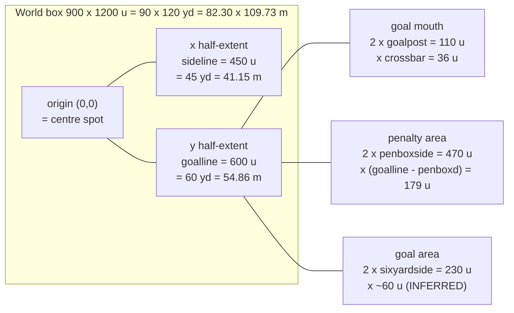

# 04 - Match Engine: Engine.ini, Pitch Geometry, Ball & Player Physics, Sprites, Ratings

**Status:** Reference specification for source reconstruction.
**Scope:** Everything the match engine reads out of `Inc/Engine.ini`, plus the pitch coordinate
system, ball/player equations of motion, the player sprite sheet + palette-swap kit system,
the animation frame-set predicates, the tactics grid, and the match rating formula.

Every numeric claim below was read out of the shipped binary or the shipped asset files.
Where a meaning is *derived* rather than *observed*, it is labelled **INFERRED**.
Where it could not be settled, it is labelled **UNCERTAIN:**.

---

## 1. Provenance of the Engine.ini blob

`Engine.ini` is not shipped on disk. It is `incbin`'d into `NSS5.exe` and resolved at runtime
through the BlitzMax virtual filesystem as `incbin::Inc/Engine.ini`.

| Property | Value |
|---|---|
| Container | `C:/Program Files (x86)/Steam/steamapps/common/New Star Soccer 5/NSS5.exe` |
| File offset (start) | `0x837C34` (8,617,012 decimal) |
| Length | `2422` bytes (`0x976`) |
| File offset (last byte) | `0x8385A9` |
| Encoding | plain 7-bit ASCII, no BOM, zero bytes outside `0x20..0x7E` + CR/LF |
| Line endings | CRLF (134 `\r\n` pairs, 0 bare LF) |
| Trailing newline | **none** - the blob ends on the `0` of `ratingreds=-20` |
| Lines | 135 (9 comment, 8 blank, 118 `key=value`) |
| Duplicate keys | none |
| MD5 | `0FC19A7BE9C6553E74375A2688FD16F6` |
| SHA-256 | `0B843BDF63AD464CB780E39EAAACC9619FFED408BA78A0A4559F2FFE21BBD45D` |

**Byte-level context confirming the boundaries** (so the extraction can be re-verified):

```
0x837BF4  60 7d 5c 00 ff ff ff 7f  1a 00 00 00 49 00 6e 00   `}\.........I.n.
0x837C04  63 00 2f 00 4d 00 75 00  73 00 69 00 63 00 2f 00   c./.M.u.s.i.c./.
   ... UTF-16 "Inc/Music/Casino_Loop1.ogg" (0x1A chars) ends exactly at 0x837C34
0x837C34  27 20 4d 61 74 63 68 0d  0a 72 65 70 6c 61 79 6c   ' Match..replayl
   ... 2422 bytes of Engine.ini ...
0x8385A6  73 3d 2d 32 30                                     s=-20        <- last data byte 0x8385A9
0x8385AA  90 90 60 7d 5c 00 ff ff  ff 7f 0e 00 00 00 49 00   ..`}\.........I.
0x8385BA  6e 00 63 00 2f 00 45 00  6e 00 67 00 69 00 6e 00   n.c./.E.n.g.i.n.
0x8385CA  65 00 2e 00 69 00 6e 00  69 00                     e...i.n.i
```

The blob is bracketed by two BlitzMax `String` objects
(`[vtable 0x5C7D60][refcount 0x7FFFFFFF][len][UTF-16 chars]`): the previous incbin's name
ends *at* `0x837C34`, and `"Inc/Engine.ini"` begins two `0x90` alignment-pad bytes *after*
the last data byte. Length 2422 is therefore exact.

Re-extract with:

```sh
dd if=NSS5.exe bs=1 skip=8617012 count=2422 of=Engine.ini
```

Related incbin'd resources (same table, for context): `Inc/Credits.txt`, `Inc/Player.png`,
`Inc/TCCEB.TTF`, `Inc/RUSSIAN.TTF`, `Inc/Music/{Intro,Main,Training_Loop1,Training_Loop2,Shopping_Loop1,Casino_Loop1}.ogg`.
The exe also contains the literal `incbin::Inc/` (used as a path prefix at runtime), which is
how `spritename_player=Player.png` resolves to `incbin::Inc/Player.png`.

---

## 2. Engine.ini - VERBATIM

The following is the file exactly as it exists in the binary. Comment lines use the BlitzMax
comment character `'` followed by a single space. There is **no whitespace around any `=`**,
**no trailing whitespace on any line**, and **no terminating newline** after the final line.

```ini
' Match
replaylength=12000
gamesecond=1000
limitscrollx=50
limitscrolly1=44
limitscrolly2=26

' Pitch
pitchscale=10
sideline=450
goalline=600
goalpost=55
postwidth=3
crossbar=36
netline=16
penboxside=235
penboxd=421
penspoty=480
sixyardside=115

' Ball
ballradius=2
fricAir=0.99
fricGrass=0.985
gravity=0.14
bounce=0.6
kickpow_pass=0.07
kickheight_pass=0.0
kickpow_shoot=0.1
kickheight_shoot=2.85
kickpow_lob=0.08
kickheight_lob=3.65
kickpow_head=0.08
kickheight_head=1.5
kickdistratio_shoot=0.15
kickdistratio_lob=0.15
kickdistratio_pass=0.275
kickdistratio_cross=0.3
aftertouchtime=750
curlinc=0.05
curlmax=0.7

' Player
acceleration=0.55
keeperaccel=0.75
walkingspeed=0.75
joggingspeed=0.85
playerfriction=0.85
slidevelocity=2.25
slidefriction=0.92
touchdist_ball=8.0
jumpspotradius=10.0
playerheight=22
playerradius=10
passcheckradius=5
turningcircle=0.75
powerbarspeed=3.5
highlightpass=0
fixkick=0
jumpvelocity=2.0
shotpowerparry=6.5
shotdistanceparry=7.5
injuryfrequency=15
energydrain=0.00225

' Animation
framelength=80

' Player sprite
spritename_player=Player.png
spritewidth_player=128
spriteheight_player=128
spritecount_player=192
handlex_player=63
handley_player=110
spritescale=0.25
jumpframes=18,19,12
fallframes=8,9,10,13,14,15,30,60,61,62,63
holdballframes=50,51,52,53,54,58,63
basemask=08846B
baseshirt1=EF1818
baseshirt2=CE0808
baseshirt3=B50000
baseshirt4=FFF700
baseshirt5=E7DE00
baseshirt6=BDB500
baseshorts1=39B500
baseshorts2=299400
baseshorts3=216B00
basesocks1=FF9400
basesocks2=BD7300
baseboots1=2929FF
baseboots2=1010CE
baseboots3=00008C
basehair1=F78463
basehair2=B54218
basehair3=630800
baseskin1=FFE7D6
baseskin2=FFDEB5
baseskin3=FFC68C
baseskin4=F78C63
baseskin5=CE734A
baseskin6=9C5A39
basegloves1=00FFFF
basegloves2=00B5B5

' Tactics (Higher width and height makes formation tighter)
formationheight=10
formationwidth=24
withoutballformationwidth=26
wideplayerpush=1.1
formationxshift=1.0
withoutballformationxshift=1.25
formationyshift=2.75
formationdepth=1.0
ymarginmultiply=2.0

' Match Cameramen
camerax1=565
cameray1=300
camerax2=250
cameray2=660

' Match rating
ratingperminute=-0.25
ratingpasses=3
ratingdefensiveheaders=3
ratingshots=1
ratinggoals=17
ratingassists=10
ratingsaves=5
ratingtackles=5
ratingfouls=-3
ratingyellows=-5
ratingreds=-20
```

### 2.1 Parser contract

The reconstruction's parser must accept exactly this dialect:

| Rule | Detail |
|---|---|
| Comment | Line whose first character is `'`. Section headers are *comments only* - there is no `[Section]` syntax. Sections carry **no semantic weight to the parser**; every key lives in one flat namespace. |
| Blank line | Ignored. |
| Assignment | `key=value`, no surrounding whitespace, `=` is the first `=` in the line. |
| Key case | Mixed. `fricAir` and `fricGrass` are camelCase; everything else lower. **Key lookup must be case-insensitive or exact** - the binary stores them exactly as written. |
| Value types | int, float, hex-RGB (6 hex digits, *no* `#` or `$` prefix), comma-separated int list, filename string. |
| Booleans | `highlightpass` and `fixkick` are `0`/`1` ints. |
| Ordering | The engine looks keys up by name (each key name exists as a separate UTF-16 string constant in the exe), so file order is irrelevant. |

Note that `fixkick` also appears in `Settings/Options.ini`'s key set - the exe's string pool
contains one `fixkick` literal shared by both readers. The Engine.ini value is the engine
default; the Options.ini value is the user override. **UNCERTAIN:** which wins.

---

## 3. Units and the coordinate system

### 3.1 The world unit

`pitchscale=10` is the number of **world units per yard**.

Evidence, all independent:

| Observation | Consequence |
|---|---|
| `penspoty=480`, `goalline=600` → penalty spot is `120` units from the goal line | 120 / 10 = **12 yards** - Laws of the Game, exactly |
| `penboxd=421` → penalty-area depth `600 − 421 = 179` units | 179 / 10 = **17.9 ≈ 18 yards** - Laws of the Game (the 1-unit shortfall is line thickness) |
| `EngineMedia/Match/Ball/TenYards.png` is **400×400 px** - the free-kick exclusion circle | radius 10 yd = 100 units → diameter 200 units → 400 px at the 2 px/unit art scale |
| `playerheight=22` | 2.2 yd = **2.01 m** - a footballer's standing head height |
| `playerradius=10`, `jumpspotradius=10.0`, `passcheckradius=5` | exactly 1.0 yd, 1.0 yd, 0.5 yd - round numbers only in yards |
| Options.ini has a `distance` toggle; the exe has `tla_Yards`, `tla_Metres`, `Distance` | the internal unit is yards, converted for display |

Therefore:

```
1 world unit = 0.1 yard = 0.09144 m
1 yard       = 10 world units
1 metre      = 10.9361 world units
```

> **Rejected alternative.** `pitchscale` could in principle mean *units per metre* (which also
> yields a legal 90 m × 120 m pitch, since 120×90 is the FIFA maximum in both systems). It is
> rejected because the penalty spot would be 12 m (regulation 11 m), the penalty area 17.9 m deep
> (regulation 16.5 m), the player 2.2 m tall, and `TenYards.png` would need a non-round 183-unit
> diameter. The yard reading makes four regulation distances land *exactly*; the metre reading
> makes none.

### 3.2 The screen unit

`SetVirtualResolution(800, 600)` is present verbatim in the exe's string table.
At the base match zoom, **1 world unit = 1 virtual pixel**:

| Evidence | Detail |
|---|---|
| `limitscrollx=50` | Pitch half-width 450 − viewport half-width 400 = **50**. The camera may travel ±50 units in x before the touchline reaches the screen edge. Exact match. |
| Player sprite | Tallest content in a 128 px cell is **87 px** (frame 16). 87 × `spritescale` 0.25 = **21.75** ≈ `playerheight=22`. |

Art is authored at *various* scales and drawn with a per-asset `SetScale`; do not infer the
world scale from raw PNG sizes without accounting for this:

| Asset | Pixels | Covers | Authoring scale | Draw scale to reach 1 px/unit |
|---|---|---|---|---|
| `Pitch1..4.png`, `Pitch1b/2b.png` | 452×602 | 900×1200 u + 1 px bleed all round | 0.5 px/unit | ×2 |
| `Mow0.png`, `Mow1.png` | 450×600 | 900×1200 u, no bleed | 0.5 px/unit | ×2 |
| `Pitch.png` (**unused** - not referenced by any string in the exe) | 1808×2408 | 900×1200 u + 4 px bleed | 2 px/unit | ×0.5 |
| `Goal1.png` | 238×106 | 116 u wide (2×(55+3)) × 52 u tall (`netline` 16 + `crossbar` 36), + 3 px bleed | 2 px/unit | ×0.5 |
| `Goal1_Net.png` | 220×58 | 110 u = the goal mouth `2 × goalpost` | 2 px/unit | ×0.5 |
| `TenYards.png` | 400×400 | 200×200 u (10 yd radius) | 2 px/unit | ×0.5 |
| `TacticsPitchSmall.png` | 180×240 | whole pitch, 3:4 - confirms the 900:1200 aspect | 0.2 px/unit | n/a (UI) |
| `Player_*.png`, `Keeper.png` | 2048×1536 | 16×12 cells of 128×128 | 4 px/unit | ×0.25 (= `spritescale`) |

`Goal1.png`'s height decomposing exactly into `netline + crossbar` (16 + 36 = 52 u → 104 px + 2 px
bleed = 106) is a strong independent check on both keys.

### 3.3 Origin and axes

The origin is the **centre spot**. `sideline` and `goalline` are **half-extents**, not full
dimensions. This is forced by `penboxside=235`: a penalty area 470 units wide only fits inside a
900-unit-wide pitch measured from the centre; under a corner origin with a 450-wide pitch the
value is geometrically impossible.

```
x : −450 (left touchline)  →  0 (centre)  →  +450 (right touchline)
y : −600 (north goal line) →  0 (halfway) →  +600 (south goal line)
```

y increases **downward** (Max2D screen convention). Attacking direction is along ±y.

### 3.4 Derived pitch dimensions

| Feature | Engine.ini | World units | Yards | Metres | Laws of the Game | Δ |
|---|---|---|---|---|---|---|
| Pitch width | `sideline=450` (half) | 900 | 90 | 82.30 | 50-100 yd (intl 70-80) | at Law-1 max |
| Pitch length | `goalline=600` (half) | 1200 | 120 | 109.73 | 100-130 yd (intl 110-120) | at intl max |
| Goal mouth (inner) | `goalpost=55` (half) | 110 | 11 | 10.06 | 8 yd / 7.32 m | **+37.5 %** |
| Goal height | `crossbar=36` | 36 | 3.6 | 3.29 | 8 ft / 2.44 m | **+35 %** |
| Goal aspect | 110 : 36 | 3.056 : 1 | - | - | 3.000 : 1 | +1.9 % |
| Post thickness | `postwidth=3` | 3 | 0.3 | 0.274 | ≤ 5 in / 0.12 m | +128 % |
| Goal depth (net) | `netline=16` | 16 | 1.6 | 1.46 | ≥ 1.5 m at the top | ✓ |
| Penalty area width | `penboxside=235` (half) | 470 | 47 | 42.98 | 44 yd / 40.32 m | +6.8 % |
| Penalty area depth | `penboxd=421` | 179 | 17.9 | 16.37 | 18 yd / 16.5 m | −0.6 % ✓ |
| Penalty spot | `penspoty=480` | 120 from goal line | 12 | 10.97 | 12 yd / 11 m | **exact** ✓ |
| Goal area width | `sixyardside=115` (half) | 230 | 23 | 21.03 | 20 yd / 18.32 m | +15 % |
| Goal area depth | *(not in file)* | ~60 (inferred) | ~6 | ~5.49 | 6 yd / 5.5 m | - |

**UNCERTAIN:** the six-yard box **depth** has no key. Either it is baked into the pitch line
texture only (and therefore has no collision meaning - plausible, since nothing in football
depends on the six-yard box except goal-kick placement), or it is derived as `6 * pitchscale = 60`.
Use 60 and place the goal-area line at `|y| = 540`.

**UNCERTAIN:** `goalpost=55` is either the *inner* edge of the post or the post *centre*.
The `Goal1_Net.png` panel is 220 px = 110 u = `2 × 55`, which is the *mouth*, so `goalpost` is
read here as the **inner** edge, with the post body occupying `55 ≤ |x| ≤ 58`
(outer width 116 u, matching `Goal1.png`'s 232 px + 3 px bleed each side). Either reading gives
the same 116-unit outer width; only the 6-unit mouth differs.

### 3.5 Annotated pitch diagram

Not to scale (compressed ≈30 u per column, ≈50 u per row). All labels are exact world units.

```
                                  x = 0
      x=-450    -235  -115  -55     |    +55  +115   +235          x=+450
        |         |     |     |     |     |     |      |             |
        |         |     |     |  NORTH GOAL (defended / attacked)    |
y=-616  ·  · · · ·+-----|-----|-----|-----|-----+· · · ·· · · · · ·  ·  <- back of net  (goalline - netline)
        |         |     |  ###|#####|###  |     |                    |     crossbar height = 36 u above ground
y=-600  +=========+=====#=====#=====#=====#=====+====================+  <- NORTH GOAL LINE  y = -600
        |               ^     |     |     ^                          |     posts at x = ±55, thickness 3
        |          (six-yard box)   |  (six-yard box)                |
y=-540  |         +-----+-----------+-----+                          |  <- goal-area line (INFERRED, 6 yd)
        |         |     x=-115    x=+115  |                          |
        |         |                       |                          |
y=-480  |         |           * penalty spot  (0, -480)              |  <- 12 yd from goal line
        |         |                       |                          |
y=-421  |    +----+-----------------------+----+                     |  <- penalty-area line
        |    |  x=-235                  x=+235 |                     |
        |    |          (18-yd box, 470 x 179) |                     |
        |    +---------------------------------+                     |
        |                                                            |
        |                       .-'''-.                              |
y=   0  +----------------------(  0,0  )-----------------------------+  <- HALFWAY LINE  y = 0
        |                       `-...-'   centre circle r = 100 u    |     (= 10 yd; not a key,
        |                                  (10 yd, see TenYards.png) |      taken from pitch art)
        |                                                            |
y=+421  |    +---------------------------------+                     |  <- penalty-area line
        |    |  x=-235                  x=+235 |                     |
y=+480  |    |            * penalty spot (0, +480)                   |
        |    |                                 |                     |
y=+540  |         +-----+-----------+-----+                          |  <- goal-area line (INFERRED)
        |         |     |     |     |     |    |                     |
y=+600  +=========+=====#=====#=====#=====#====+=====================+  <- SOUTH GOAL LINE  y = +600
        |         |     |  ###|#####|###  |    |                     |
y=+616  ·  · · · ·+-----|-----|-----|-----|----+· · · · · · · · · ·  ·  <- back of net
        |               |     |     |     |                          |
      x=-450          -115  -55     0   +55                      x=+450
                LEFT TOUCHLINE                        RIGHT TOUCHLINE
                    x = -450                              x = +450
```

Cameramen (Section 10) sit outside this box, at `(±565, ±300)` and `(±250, ±660)`.

Same thing as a graph of the half-extents:



---

## 4. Section `' Match`

| Key | Value | Unit | Controls |
|---|---|---|---|
| `replaylength` | 12000 | milliseconds | Size of the rolling replay ring buffer - **12 seconds** of match state is retained for the instant-replay key (`k_Replay=112`, i.e. F1) and for `.rep` file export. At the ~30 Hz logic rate (§5.1) that is ~360 recorded frames. Related strings: `replay_Saved`, `.rep`, `newstarsoccerfivereplayfile`, `zipe::`, `Could not save replay!`, and the `replayscale` option. |
| `gamesecond` | 1000 | milliseconds | Real milliseconds per **one second of match clock** while the ball is in play - i.e. 1:1, real time. The 90-minute fiction is reconciled by the `SkipTime` routine (present in the exe), which fast-forwards the clock between highlights; the `matchlength` option (default 5) sets how many real minutes of *playable* football you get. **UNCERTAIN:** whether `gamesecond` is scaled by `matchlength`, or `matchlength` only governs how much is skipped. |
| `limitscrollx` | 50 | world units | Camera x clamp: `cameraX ∈ [−50, +50]`. Exactly `sideline(450) − 800/2`, i.e. the camera is prevented from ever showing past a touchline. |
| `limitscrolly1` | 44 | world units / virtual px | Vertical camera clamp, "end 1". |
| `limitscrolly2` | 26 | world units / virtual px | Vertical camera clamp, "end 2". |

**UNCERTAIN:** `limitscrolly1` / `limitscrolly2`. Two readings survive:
1. **HUD insets.** The scoreboard band occupies the top 44 virtual px and a bottom bar 26 px, so
   the pitch viewport is 800×530 and `cameraY ∈ ±(600 − 265) = ±335`.
2. **Over-scroll allowances.** `cameraY ∈ [−(300+44), +(300+26)]`, letting the camera drift a
   little past each goal line to show the goal, net and crowd.

Reading 1 is preferred because the asymmetry (44 top vs 26 bottom) matches a HUD, whereas nothing
in the pitch is asymmetric front-to-back. `limitscrollx=50` fits reading 2's arithmetic exactly,
so the two may simply be different quantities that share a name prefix.

---

## 5. Section `' Ball` - the physics model

### 5.1 The logic tick

The engine is a fixed-timestep integrator; **all** `Engine.ini` rates are *per tick*, not per
second. The tick rate is not stored in the file, but four independent derivations converge on
**≈30 Hz** (and rule out 60 Hz by factors of 2-4):

| Derivation | Working | Implied tick rate |
|---|---|---|
| Gravity vs. real g | `0.14 u/tick² × 0.09144 m/u × f² = 9.80665 m/s²` | **f = 27.7 Hz** |
| Sprint top speed | `v∞ = a·k/(1−k) = 0.55·0.85/0.15 = 3.117 u/tick`; elite footballer ≈ 8.5 m/s = 93 u/s | **f ≈ 30 Hz** |
| Max shot speed | `100 × kickpow_shoot = 10 u/tick`; hard shot ≈ 100 km/h = 27.4 m/s = 300 u/s | **f = 30 Hz** |
| Jump hang time | `2 × jumpvelocity / gravity = 28.6 ticks`; a standing jump hangs ≈ 0.95 s | **f = 30 Hz** |

At exactly 30 Hz, effective gravity is `0.14 × 0.09144 × 900 = 11.52 m/s²` (1.17 g) - the usual
arcade-punchy over-gravity. At 60 Hz it would be 46 m/s², which is absurd, and the sprint speed
would be 17 m/s. **Use 30 Hz. INFERRED, but every check agrees.** The *animation* rate is separate
and explicit: `framelength=80` ms → 12.5 fps (§8).

Notation below: `f = 30` ticks/s, `Δ` = one tick.

### 5.2 State and integration

The ball carries `(x, y, z, vx, vy, vz)` with `z ≥ 0` (`z = 0` is the turf, `+z` is up) and a
collision radius `ballradius = 2` units (0.2 yd; diameter 0.37 m - ~1.7× a real ball, i.e. it is
a *forgiving* collision radius, not a visual size).

```
each tick:
    if airborne (z > 0):
        vz  ←  vz − gravity                       ' gravity = 0.14
        vx  ←  vx × fricAir                       ' fricAir  = 0.99
        vy  ←  vy × fricAir
    else:                                          ' rolling
        vx  ←  vx × fricGrass                     ' fricGrass = 0.985
        vy  ←  vy × fricGrass

    x ← x + vx ;  y ← y + vy ;  z ← z + vz

    if z < 0:                                      ' ground contact
        z  ← 0  (or reflect: z ← −z)
        vz ← −vz × bounce                          ' bounce = 0.6
        if |vz| below a small epsilon:  vz ← 0, ball is now rolling
```

**UNCERTAIN:** whether `fricAir` is also applied to `vz`. Applying it to `vz` too would make the
ballistics slightly asymmetric (falling shorter than it rose), which is physically nicer but
complicates the closed-form solutions below. The tables in §5.4 assume drag on the horizontal
components only.

### 5.3 Key table

| Key | Value | Unit | Controls |
|---|---|---|---|
| `ballradius` | 2 | world units | Ball collision radius (0.2 yd, 0.183 m). Used for post/crossbar/net/player intersection tests, not for rendering (`Ball.png` is a 120×40 sheet drawn at its own scale). |
| `fricAir` | 0.99 | per-tick multiplier | Horizontal drag while `z > 0`. Speed halves in `ln0.5/ln0.99 = 69.0` ticks (2.30 s). Total distance from `v₀` if it never landed: `v₀/(1−0.99) = 100·v₀`. |
| `fricGrass` | 0.985 | per-tick multiplier | Rolling resistance while `z = 0`. Half-life `ln0.5/ln0.985 = 45.9` ticks (1.53 s). Total roll-out from `v₀`: `v₀/0.015 = 66.67·v₀`. Grass slows the ball **more** than air - correct. |
| `gravity` | 0.14 | units/tick² | Downward acceleration on `vz`. Shared with the player jump (§6). ≈ 11.5 m/s². |
| `bounce` | 0.6 | coefficient of restitution | `vz ← −vz × 0.6` on turf contact. Successive apex heights scale by `0.6² = 0.36`. From a 29-unit apex the ball is below 1 unit after 4 bounces; total post-landing bounce time is `1.5 ×` the original flight time (`Σ 0.6ⁿ = 0.6/0.4`). |
| `kickpow_pass` | 0.07 | units/tick per power unit | Horizontal launch speed multiplier for a **ground pass**. |
| `kickheight_pass` | 0.0 | units/tick (initial `vz`) | Passes stay on the deck. |
| `kickpow_shoot` | 0.1 | units/tick per power unit | **Shot** - the fastest kick type. |
| `kickheight_shoot` | 2.85 | units/tick (initial `vz`) | Shot loft. |
| `kickpow_lob` | 0.08 | units/tick per power unit | **Lob / chip**. |
| `kickheight_lob` | 3.65 | units/tick (initial `vz`) | Lob loft - the highest. |
| `kickpow_head` | 0.08 | units/tick per power unit | **Header**. |
| `kickheight_head` | 1.5 | units/tick (initial `vz`) | Header loft - the lowest non-zero. |
| `kickdistratio_shoot` | 0.15 | power per unit of distance | See §5.6. |
| `kickdistratio_lob` | 0.15 | power per unit of distance | See §5.6. |
| `kickdistratio_pass` | 0.275 | power per unit of distance | See §5.6. |
| `kickdistratio_cross` | 0.3 | power per unit of distance | See §5.6. There is no `kickpow_cross`/`kickheight_cross`; a cross reuses the lob's launch profile. The exe's kick-type string list is `Cross`, `Long Pass`, `Pass`. |
| `aftertouchtime` | 750 | milliseconds | Aftertouch window - see §5.7. |
| `curlinc` | 0.05 | per tick | Curl ramp rate - see §5.7. |
| `curlmax` | 0.7 | - | Curl cap - see §5.7. |

### 5.4 Equations of motion - closed form

With `g = 0.14`, launch `vz₀ = kickheight_X`, and no vertical drag:

```
apex time      T_up = vz₀ / g                       [ticks]
apex height    H    = vz₀² / (2g)                   [units]
flight time    T    = 2·vz₀ / g                     [ticks]
height(t)      z(t) = vz₀·t − ½·g·t²
horizontal speed at tick n      v(n) = v₀ · k^n          (k = fricAir while airborne)
horizontal distance over N ticks D(N) = v₀ · (1 − k^N)/(1 − k)
```

| Kick | `vz₀` | `T_up` (ticks) | Apex `H` (units) | Apex (yd / m) | Flight `T` (ticks / s @30 Hz) | Clears `crossbar=36`? |
|---|---|---|---|---|---|---|
| pass | 0.0 | - | 0 | 0 | ground | n/a |
| head | 1.50 | 10.71 | **8.04** | 0.80 / 0.735 | 21.43 / 0.71 s | no |
| shoot | 2.85 | 20.36 | **29.01** | 2.90 / 2.653 | 40.71 / 1.36 s | **no** - a full shot peaks 7 units *under* the bar |
| lob | 3.65 | 26.07 | **47.59** | 4.76 / 4.352 | 52.14 / 1.74 s | **yes** - 11.6 units over |

This is the whole design of the kick set in one table: a shot is *deliberately* tuned so its
apex sits just below the crossbar (29.01 vs 36), which is why a max-power shot is on target;
a lob is tuned to clear it (47.59 vs 36), which is why it beats an advancing keeper.

### 5.5 Range at full power

Assuming the power meter runs `0..100` and `v₀ = power × kickpow_X` (§5.6):

| Kick | `v₀` at power 100 (u/tick) | u/s @30 Hz | m/s | km/h | First-bounce range `D(T)` (units / yd) |
|---|---|---|---|---|---|
| shoot | 10.00 | 300 | 27.43 | 98.8 | **335.7 / 33.6** |
| lob | 8.00 | 240 | 21.95 | 79.0 | **326.3 / 32.6** |
| head | 8.00 | 240 | 21.95 | 79.0 | **155.0 / 15.5** |
| pass | 7.00 | 210 | 19.20 | 69.1 | roll-out `v₀/0.015` = **466.7 / 46.7** (asymptotic) |

Shot and lob converging on ~33 yards of first-bounce range while differing wildly in trajectory
is a strong sanity check that the two families are internally consistent.

### 5.6 The `kickdistratio_*` family

**UNCERTAIN - leading hypothesis.** These are the *distance→power* conversion used when a kick has
a known target (AI passes, crosses, assisted shooting):

```
power = clamp(targetDistance × kickdistratio_X, 0, 100)
v₀    = power × kickpow_X
```

Substituting the closed form, the resulting *reach factor* (how far the ball actually travels
relative to the target distance `D`) is:

| Kick | `ratio × kickpow` | Reach multiplier `R` | Interpretation |
|---|---|---|---|
| cross | `0.3 × 0.08 = 0.0240` | `0.0240 × 40.79 = ` **0.979 D** | Lands essentially **exactly on the target** |
| pass | `0.275 × 0.07 = 0.01925` | `0.01925 × 66.67 = ` **1.283 D** | Deliberately over-hit ~28 % - a pass *into space*, ahead of a running receiver |
| shoot | `0.15 × 0.10 = 0.0150` | `0.0150 × 33.57 = ` **0.504 D** | ~half - the distance term is only a *baseline*; the player's power meter supplies the rest |
| lob | `0.15 × 0.08 = 0.0120` | `0.0120 × 40.79 = ` **0.490 D** | same |

(`R = (1 − k^T)/(1 − k)` with `k = fricAir`, `T` from §5.4; ground pass uses `1/(1 − fricGrass)`.)

The cross landing on `0.979 D` - within 2 % of unity, from two independently-authored constants - 
is the reason this hypothesis is preferred. That `shoot` and `lob` share `0.15` and both land on
≈`0.5 D` is also consistent: those two are *player-powered* kick types, the other two are
*auto-powered*.

**Alternative hypothesis (also unrefuted):** `kickdistratio_X` defines the *maximum aimable
distance* as `100 / ratio`: shoot 667 u (66.7 yd), lob 667 u, pass 364 u (36.4 yd), cross 333 u
(33.3 yd). The cross figure (333) matches its actual max range (326) almost exactly, so this reading
also survives. Both should be tested against gameplay during reconstruction.

### 5.7 Aftertouch and curl

| Key | Value | Meaning |
|---|---|---|
| `aftertouchtime` | 750 ms | The window, measured from the moment of the kick, during which directional input still affects the ball. 750 ms = **22.5 ticks** at 30 Hz. |
| `curlinc` | 0.05 | Per-tick increment applied to the accumulated curl term while a lateral direction is held. |
| `curlmax` | 0.7 | Absolute cap on the accumulated curl term (`−0.7 ≤ curl ≤ +0.7`). |

```
on kick:  curl ← 0 ; kickTime ← now

each tick while ball airborne:
    if (now − kickTime) < aftertouchtime and lateral input held:
        curl ← clamp(curl ± curlinc, −curlmax, +curlmax)
    apply curl perpendicular to the ball's horizontal heading
```

Time to saturate: `curlmax / curlinc = 0.7 / 0.05 = 14 ticks = 467 ms` - 62 % of the 750 ms
window, so a player who reacts promptly reaches full curl with time to spare, and a late input
gets only partial curl. That ratio is clearly deliberate.

**What `curl` physically is - INFERRED by elimination:**

- **Not an acceleration.** `0.5 × 0.7 × 40.7² = 580` units of lateral deviation over one shot - 
  more than half the pitch width. Ruled out.
- **A perpendicular velocity term (preferred).** Integrating the ramp (14 ticks ramping to 0.7,
  8.5 ticks held at 0.7 inside the window, then ~18 ticks of the shot's flight with the term
  persisting) gives **≈ 23.6 units ≈ 2.4 yards** of lateral deviation on a full-length shot.
  Realistic.
- **A heading rotation in degrees/tick (also viable).** 0.7°/tick over a 40.7-tick flight is 28°
  of total turn, giving ~4 yards of deviation on a 33-yard shot. Also realistic.

Test both during reconstruction; the velocity reading is simpler and is assumed here.

Related exe strings for the kick/aftertouch path: `Kick:`, `TapKick`, `TapKickAdvanced`,
`HoldKick`, `HoldKickAdvanced`, `Shot`, `Knock`, `SlideBall`, `HeadBall`, `HeadBallAdvanced`,
`DiveHeadBall`, `CBUTTON_SHOOT dir:`, `CBUTTON_PASS dir:`, `CBUTTON_LOB dir:`, `ComCross`,
`HitPost`, `HitNet`, `Player kicked ball out of play`, plus sounds `Bounce.ogg`, `Kick.ogg`,
`Post.ogg`.

---

## 6. Section `' Player`

Same fixed-timestep, same `gravity`. Player state is `(x, y, z, vx, vy, vz, facing)`.

| Key | Value | Unit | Controls |
|---|---|---|---|
| `acceleration` | 0.55 | units/tick² | Outfield player acceleration toward the input direction. |
| `keeperaccel` | 0.75 | units/tick² | Goalkeeper acceleration - **36 % higher**, modelling reflexes/short-range explosiveness. |
| `playerfriction` | 0.85 | per-tick multiplier | Velocity damping. Terminal speed with the `v ← (v + a)·k` update form: `a·k/(1−k) = 0.55·0.85/0.15 = ` **3.117 u/tick** = 93.5 u/s = 9.35 yd/s = **8.55 m/s**. (With the alternative `v ← v·k + a` form it is `a/(1−k) = 3.667` = 10.06 m/s - faster than any human, so the first form is preferred. **INFERRED.**) Keeper terminal speed by the same rule: `0.75·0.85/0.15 = 4.25 u/tick` = 11.7 m/s, which only ever applies over the ≈1 s of a dive. |
| `walkingspeed` | 0.75 | fraction of top speed | See note below. |
| `joggingspeed` | 0.85 | fraction of top speed | See note below. |
| `slidevelocity` | 2.25 | units/tick | Launch speed of a slide tackle - 72 % of a sprint. |
| `slidefriction` | 0.92 | per-tick multiplier | Damping *during* a slide. Much slower decay than `playerfriction`, so the slide carries: asymptotic slide length `2.25/(1−0.92) = ` **28.1 units = 2.8 yards**. Half-life 8.3 ticks (0.28 s). |
| `touchdist_ball` | 8.0 | world units | Radius within which a player can touch/control/kick the ball (0.8 yd, 0.73 m). |
| `jumpspotradius` | 10.0 | world units | Radius around the ball's *predicted landing spot* inside which a player will commit to a jump/header (1.0 yd). |
| `playerheight` | 22 | world units | Maximum ball height a standing player can reach - head/hand contact ceiling. 2.2 yd = 2.01 m. Compare `crossbar=36`: a standing player cannot reach the bar; jumping adds 14.3 (§below) for 36.3 - just enough to reach it. |
| `playerradius` | 10 | world units | Body / personal-space collision radius, 1.0 yd (2 yd diameter). Note this is a *gameplay* radius, not the drawn body - the drawn torso is only ~5 units wide. |
| `passcheckradius` | 5 | world units | Half-width of the swept corridor used to test whether a pass lane is blocked / interceptable (0.5 yd). |
| `turningcircle` | 0.75 | - | Turn constraint. **UNCERTAIN:** most likely the speed multiplier applied when the input direction differs materially from the current heading (a 25 % speed penalty for turning), which is what "turning circle" implies. It could instead be a heading-lerp factor (0.75 → near-instant turning) or a max turn rate in radians/tick (0.75 rad = 43°/tick, implausibly fast). |
| `powerbarspeed` | 3.5 | power units/tick | Fill rate of the charge meter. `100 / 3.5 = 28.6 ticks = 0.95 s` for a full sweep at 30 Hz. **UNCERTAIN:** whether the meter oscillates (up then down) or clamps at 100. |
| `highlightpass` | 0 | boolean | Draw a highlight on the intended pass recipient. Off by default. `EngineMedia/Match/Player/Highlight.png` (52×52) and `ArrowGreen.png` / `ArrowYellow.png` (1680×61) are the related assets. |
| `fixkick` | 0 | boolean | Legacy/assist flag - a "fixed kick" mode. Off by default. Also exists as a user option (`fixkick=` in Options.ini) alongside a `NewButtonKick` routine, so this is almost certainly a control-scheme switch between the old and new kick input. **UNCERTAIN:** exact behaviour. |
| `jumpvelocity` | 2.0 | units/tick (initial `vz`) | Standing jump. Apex `2.0²/(2×0.14) = ` **14.29 units = 1.43 yd = 1.31 m**; hang time `2×2.0/0.14 = 28.6 ticks = 0.95 s`. Standing reach `playerheight` 22 + 14.29 = **36.3 units**, i.e. a jumping player can *just* reach the crossbar (36) - clearly tuned. |
| `shotpowerparry` | 6.5 | units/tick (ball speed) | Catch/parry gate: a shot arriving faster than 6.5 u/tick cannot be held. That is **65 % of a max-power shot** (`100 × kickpow_shoot = 10`). Related strings: `Parry: v=`, `Parry: Punch`, `Parry: Tip over`, `Dive: Tip left`, `Dive: Tip right`, `Catch`, `CheckKeeperSave`, `BlockSave`. |
| `shotdistanceparry` | 7.5 | world units *or* yards | Second half of the catch/parry gate: beyond this reach the keeper can only parry. **UNCERTAIN:** 7.5 world units = 0.75 yd (an "at full stretch" hand-reach margin) or 7.5 yards = 75 units (a "shot taken from inside 7.5 yd can only be parried" rule). Both are footballing-sensible; the unit is not recoverable from the file. |
| `injuryfrequency` | 15 | **UNCERTAIN** | Injury rate control. Either a percent chance on a qualifying heavy challenge, or a 1-in-15 divisor, or a weight into a larger roll. Related strings: `Injury!`, `EngineMedia/Match/Other/Injury.png`, `Oof.ogg`, `CREPORT_BOSSINJURY*`. |
| `energydrain` | 0.00225 | energy/tick | Stamina consumption while exerting. On a 0-100 energy scale that is 0.0675/s → **1481 s ≈ 24.7 minutes** of continuous full effort to empty, which fits a match played in ~5 real minutes of highlights plus recovery. Related: `showenergy` option, `Energy.png`, `EnergyBack.png`, `EnergyBackRed.png`, `NRG28.png`, `matchmsg_Tired`, `TiredFace.png`. |

**UNCERTAIN - `walkingspeed` / `joggingspeed`.** Both readings are defensible:
1. **Speed-mode multipliers.** No input → `0.75 × vmax`; holding a direction → `0.85 × vmax`;
   holding sprint → `1.00 × vmax`. Fits a game where sprint is a held button.
2. **Animation thresholds.** Normalised speed `< 0.75` → walk cycle, `0.75-0.85` → jog cycle,
   `> 0.85` → run cycle. Fits the fact that they are dimensionless and adjacent.

They are *not* absolute speeds: 0.75 and 0.85 u/tick would be 24 % and 27 % of top speed, far too
close together to be meaningful modes.

---

## 7. Section `' Animation`

| Key | Value | Unit | Controls |
|---|---|---|---|
| `framelength` | 80 | milliseconds | Duration of one animation frame → **12.5 animation fps**, i.e. one sprite frame every 2.4 logic ticks at 30 Hz. This is the *only* key in the section; every animation in the game advances on this single global clock. |

The `Do*` animation drivers named in the exe are `DoAnimJump`, `DoAnimDive`, `DoAnimSlide`,
`DoAnimFall`, `DoAnimKick`, plus `ResetAnimationsAll` and the failure label `No Anim!`.

Named animation states in the exe's string table (in binary order):

```
Stand, Kick, Header, Slide, Fall,
StandGK, StandWithBallGK, WalkWithBallGK, DiveGK, DiveFallGK,
JumpGK, JumpWithBallGK, CatchGK, CatchWithBallGK, CatchLowGK, CatchLowWithBallGK,
Celebrate1..Celebrate5,
Commiserate1:ScratchHead, Commiserate1:FallOnFace,
Commiserate1:HoldHead, Commiserate1:FallOnKnees
```

---

## 8. Section `' Player sprite`

### 8.1 Sheet geometry

| Key | Value | Verified against |
|---|---|---|
| `spritename_player` | `Player.png` | Loaded as `incbin::Inc/Player.png` (the exe contains both `Inc/Player.png` and the prefix literal `incbin::Inc/`). The on-disk path `EngineMedia/Match/Player/Player.png` is also referenced but **does not exist** in the shipped install, so the incbin copy is what ships. |
| `spritewidth_player` | 128 | 2048 / 128 = **16 columns** |
| `spriteheight_player` | 128 | 1536 / 128 = **12 rows** |
| `spritecount_player` | 192 | 16 × 12 = **192** exactly - every shipped sheet (`Player_*.png`, `Keeper.png`) is 2048×1536 |
| `handlex_player` | 63 | `(128/2) − 1` - horizontal centre of the cell |
| `handley_player` | 110 | The **ground-contact point**. Rendering a crosshair at (63,110) over every frame puts it on the player's feet in all standing/running poses. |
| `spritescale` | 0.25 | 128 × 0.25 = 32 world units per cell. Tallest sprite content measured is 87 px (frame 16) → 87 × 0.25 = **21.75 ≈ `playerheight` 22**. |

BlitzMax equivalent:

```blitzmax
gPlayerImage = LoadAnimImage("incbin::Inc/" + spritename_player, ..
                             spritewidth_player, spriteheight_player, ..
                             0, spritecount_player, MASKEDIMAGE)
SetImageHandle gPlayerImage, handlex_player, handley_player
' ... and at draw time:  SetScale spritescale, spritescale
```

Frame index → cell: `col = frame Mod 16`, `row = frame / 16` (row-major, standard `LoadAnimImage`).

### 8.2 Direction blocks - the 64-frame stride (INFERRED, strongly)

The 192 frames are **three 64-frame direction blocks**:

| Block | Frames | View |
|---|---|---|
| 0 | 0 - 63 | **Side** (player facing screen-right; mirror horizontally for left) |
| 1 | 64 - 127 | **Away** (running up the screen, back to camera) |
| 2 | 128 - 191 | **Toward** (running down the screen, facing camera) |

Within a block:

| Sub-range | Content |
|---|---|
| 0 - 34 | Outfield poses (idle, run cycle, slide, prone, jump, kneel, kick) |
| 35 - 47 | Unused |
| 48 - 63 | Goalkeeper poses (only populated in `Keeper.png`) |

Verified frame occupancy (`#` = art, `.` = filled with `800080`, `m` = filled with `FF00FF`;
both fill colours mark cells that must never be drawn):

```
Player_Plain.png                          Keeper.png
row 0 (f  0- 15): ################        row 0 (f  0- 15): ################
row 1 (f 16- 31): ##############..        row 1 (f 16- 31): mm############..
row 2 (f 32- 47): ###.............        row 2 (f 32- 47): ###.............
row 3 (f 48- 63): ................        row 3 (f 48- 63): ###########mmm##
row 4 (f 64- 79): ################        row 4 (f 64- 79): ################
row 5 (f 80- 95): mm####..........        row 5 (f 80- 95): mm####..........
row 6 (f 96-111): ###.............        row 6 (f 96-111): ###.............
row 7 (f112-127): ................        row 7 (f112-127): ################
row 8 (f128-143): ################        row 8 (f128-143): ################
row 9 (f144-159): mm##########mm#.        row 9 (f144-159): mm##########mm#.
row10 (f160-175): ###.............        row10 (f160-175): ###.............
row11 (f176-191): ................        row11 (f176-191): ################
```

The stride is proved by the keeper: rows 3 / 7 / 11 are byte-for-byte the *same poses*
(`48-63`, `112-127`, `176-191`), i.e. `48 + 0`, `48 + 64`, `48 + 128`.

Observed side-block pose map (frames 0-34, from rendering the sheet):

| Frames | Pose |
|---|---|
| 0 - 1 | Idle / stand |
| 2 - 7 | Run cycle (6 frames) |
| 8 - 10 | **Slide tackle** (on the ground, leg extended) |
| 11 | Stumble / trip |
| 12 | **Diving header** (airborne, horizontal, arms forward) |
| 13 - 15 | **Prone** (face-down on the turf) |
| 16 - 17 | Reach / head the ball standing |
| 18 - 19 | **Jump** (both feet off the ground) |
| 20 - 23 | Kneeling (commiserate / getting up) |
| 24 - 29 | Kick swing (6 frames) |
| 30 - 31 | Empty in the side block (see `fallframes` note below) |
| 32 - 34 | Lunge / reach |

Keeper block (48-63): `48-49` standing with gloves, `50-54` **holding the ball**, `55-57` arms
raised, `58` **catching high with the ball**, `59-61` empty, `62` kneeling, `63` **kneeling with
the ball**. Rows 7 and 11 add rear- and front-view dives (`124-125`, `188-189`).

### 8.3 The frame-set predicates

`jumpframes`, `fallframes` and `holdballframes` are **not animation sequences**. They are sets of
frame indices used as *state predicates* - "if the sprite is currently on one of these frames,
the following is true of the player". They are expressed as **base indices within a 64-frame
block**, i.e. the engine compares `frame Mod 64` (or adds `block × 64` when drawing).

| Key | Value | Meaning |
|---|---|---|
| `jumpframes` | `18,19,12` | The player is **airborne** (`z > 0`) - collisions, header eligibility, tackle immunity, shadow offset. Frames 18/19 = the standing jump; frame 12 = the diving header. |
| `fallframes` | `8,9,10,13,14,15,30,60,61,62,63` | The player is **on the ground** - cannot be tackled/fouled again, cannot kick, is not an obstacle at head height. 8/9/10 = sliding; 13/14/15 = prone; 30 = the front-view fall (`30 + 128 = 158`, which *is* populated in both sheets although 30 and 94 are not); 60/61 unused; 62/63 = the keeper on the deck. |
| `holdballframes` | `50,51,52,53,54,58,63` | The **ball is drawn inside the sprite**. Verified visually - every one of these keeper frames has a football painted into the artwork. The engine must therefore suppress the separate ball entity (and pin the ball's logical position to the keeper) while any of these is displayed. Adding the block offsets: side `50-54,58,63`; away `114-118,122,127`; toward `178-182,186,191` - all confirmed to contain a ball or a ball hidden behind the body. |

That `63` appears in *both* `fallframes` and `holdballframes` is the tell: frame 63 is the keeper
down on the deck **with the ball smothered**, which is simultaneously "on the ground" and
"holding". This is the single strongest confirmation that these are predicates, not sequences.

### 8.4 The palette-swap kit system

#### 8.4.1 What is in the artwork

All player sheets are **8-bit palettised PNG (colour type 3), 24-27 palette entries, and no
`tRNS` chunk** - transparency is by *mask colour*, not alpha. Dumping the `PLTE` chunk of
`Player_Plain.png` gives:

```
  0: 800080   1: 08846B   2: 00008C   3: 2929FF   4: 1010CE   5: BD7300
  6: FF9400   7: CE734A   8: F78C63   9: FFC68C  10: FFDEB5  11: 9C5A39
 12: 216B00  13: 299400  14: 39B500  15: FFE7D6  16: B50000  17: F78463
 18: CE0808  19: EF1818  20: 630800  21: B54218  22: FF00FF  23: 404040
```

**Every single `base*` value in Engine.ini is present, byte-exact, in the shipped artwork.**
That is the whole mechanism: the `base*` entries are the *search keys* that tell the engine which
pixels belong to which garment slot.

| Engine.ini slot | Hex | Present in |
|---|---|---|
| `basemask` | `08846B` | **every** sheet - the teal background. This is the `SetMaskColor` value; it becomes transparent. |
| `baseshirt1` / `2` / `3` | `EF1818` / `CE0808` / `B50000` | every sheet (red highlight / mid / shadow ramp) = **shirt colour 1** |
| `baseshirt4` / `5` / `6` | `FFF700` / `E7DE00` / `BDB500` | only kit designs that need a **second shirt colour** (yellow ramp) |
| `baseshorts1` / `2` / `3` | `39B500` / `299400` / `216B00` | every sheet (green ramp) |
| `basesocks1` / `2` | `FF9400` / `BD7300` | every sheet (orange ramp - only 2 shades) |
| `baseboots1` / `2` / `3` | `2929FF` / `1010CE` / `00008C` | every sheet (blue ramp) |
| `basehair1` / `2` / `3` | `F78463` / `B54218` / `630800` | every sheet (auburn ramp) |
| `baseskin1`…`6` | `FFE7D6` `FFDEB5` `FFC68C` `F78C63` `CE734A` `9C5A39` | every sheet - a **6-step light→dark skin ramp** |
| `basegloves1` / `2` | `00FFFF` / `00B5B5` | **`Keeper.png` only** (cyan ramp) - gloves are goalkeeper-exclusive |

Two colours in the artwork are *not* Engine.ini slots and must never be recoloured:
`404040` (outline / dark detail) and, in `Keeper.png`, an 18-step grey ramp
(`393939 … FEFEFE`) which is the **football painted into the `holdballframes` art**, not clothing.
`800080` and `FF00FF` are unused-cell fills (§8.2).

Which second-colour shades a design actually uses is design-dependent:

| Design file | Shirt colour 2 shades present |
|---|---|
| `Player_Plain.png` | none (single-colour kit) |
| `Player_Trim.png`, `Player_StripeR/LR/C.png`, `Player_V.png`, `Player_Hoops/Hoop/Hoopsb.png` | mid only (`E7DE00`) - the detail is one flat shade |
| `Player_Stripes.png`, `Player_Sleeves.png`, `Player_SleeveR.png`, `Player_Split.png`, `Player_DiagonalSplit.png`, `Player_Segments.png`, `Player_Chequered.png` | all three (`FFF700`, `E7DE00`, `BDB500`) |

A side observation useful for authoring replacement art: every base colour lies on the 5-bit
(32-level) channel grid `00,08,10,18,21,29,31,39,42,4A,52,5A,63,6B,73,7B,84,8C,94,9C,A5,AD,B5,BD,C6,CE,D6,DE,E7,EF,F7,FF`.
The artwork was produced in a 15/16-bit colour space.

#### 8.4.2 Where the team colours come from

`GameMedia/Data/Clubs.csv` (TAB-separated, 5,437 clubs) carries **four kits per club**, each as a
style name plus **four single hex colours**:

| Column | Example (`Hakim Sanayi Kabul FC`) |
|---|---|
| `homestyle` | `PLAIN` |
| `homekitshirtcol1` | `#FFFFFF` |
| `homekitshirtcol2` | `#FFFFFF` |
| `homekitshortscol` | `#FFFFFF` |
| `homekitsockscol` | `#FFFFFF` |
| `awaystyle` / `awaykit*` | `PLAIN`, `#444444` ×4 |
| `thirdstyle` / `thirdkit*` | `PLAIN`, `#444444` ×4 |
| `keeperstyle` / `keeperkit*` | `PLAIN`, `#00EB00`, `#00EB00`, `#008000`, `#008000` |

Note the `#` prefix here, which the Engine.ini `base*` values do **not** have - the parser must
handle both.

Style values actually used across all 5,437 clubs (× 4 kits = 21,748 kit records):

| Style | Count | Style | Count | Style | Count |
|---|---|---|---|---|---|
| `PLAIN` | 13624 | `SLEEVE` | 184 | `STRIPE_LR` | 119 |
| `TRIM` | 3694 | `STRIPE` | 157 | `STRIPE_RL` | 85 |
| `STRIPES` | 1520 | `STRIPE_C` | 156 | `CHEQUERED` | 31 |
| `SLEEVES` | 1053 | `STRIPE_V` | 131 | `SEGMENTS` | 23 |
| `SPLIT` | 312 | `SINGLEHOOP` | 126 | `SPLIT_LR` | 15 |
| `HOOPS` | 270 | `HOOP` | 228 | `DIAGONALSPLIT_RL` | 1 |
| | | | | `STRIPE_L` | 4 |

Plus 13 blank, one lower-case `plain`, and one corrupted `#FFFFFF` - **the loader must tolerate
these three data errors** (fall back to `PLAIN`).

The full style enum in the exe (23 names) is larger than the 15 shipped sheet files:

```
PLAIN TRIM STRIPES STRIPE STRIPE_L STRIPE_R STRIPE_LR STRIPE_RL STRIPE_C STRIPE_V
SLEEVES SLEEVE SLEEVE_L SLEEVE_R HOOPS HOOP SINGLEHOOP SPLIT SPLIT_LR
DIAGONALSPLIT_LR DIAGONALSPLIT_RL SEGMENTS CHEQUERED
```

```
Player_Plain.png  Player_Trim.png   Player_Stripes.png  Player_StripeR.png
Player_StripeLR.png  Player_StripeC.png  Player_V.png   Player_Sleeves.png
Player_SleeveR.png   Player_Hoops.png    Player_Hoop.png  Player_Split.png
Player_DiagonalSplit.png  Player_Segments.png  Player_Chequered.png
```

**INFERRED:** the `_L`/`_R` and `_LR`/`_RL` variants share one sheet and are distinguished by
horizontal mirroring (e.g. `STRIPE_L` = `Player_StripeR.png` mirrored;
`DIAGONALSPLIT_LR` / `_RL` both = `Player_DiagonalSplit.png`).

#### 8.4.3 The substitution algorithm

```
BuildKitImage(style, shirt1, shirt2, shorts, socks, gloves, hairTone, skinTone) :

  1. sheet := "EngineMedia/Match/Player/" + FileForStyle(style)      ' or Keeper.png
     px    := LoadPixmap(sheet)                                      ' decodes to 32-bit RGBA

  2. Build the substitution table  base -> target  :
        basemask                       -> (left alone; used as the mask key)
        baseshirt1,2,3   (EF1818/CE0808/B50000)  -> Shade(shirt1, 1..3)
        baseshirt4,5,6   (FFF700/E7DE00/BDB500)  -> Shade(shirt2, 1..3)
        baseshorts1,2,3  (39B500/299400/216B00)  -> Shade(shorts, 1..3)
        basesocks1,2     (FF9400/BD7300)         -> Shade(socks,  1..2)
        baseboots1,2,3   (2929FF/1010CE/00008C)  -> Shade(bootColour, 1..3)
        basehair1,2,3    (F78463/B54218/630800)  -> hair ramp for CHAIR_*
        baseskin1..6     (FFE7D6..9C5A39)        -> skin ramp for CSKIN_*
        basegloves1,2    (00FFFF/00B5B5)         -> Shade(gloveColour, 1..2)   [keeper only]

  3. For every pixel: if its RGB exactly equals a table key, write the target RGB.
     Leave 404040, the greys, 800080 and FF00FF untouched.

  4. SetMaskColor  $08, $84, $6B          ' = basemask
     img := LoadImage(px, MASKEDIMAGE)
     SetImageHandle img, 63, 110
```

Because the source PNGs are palettised with ≤ 27 entries, an optimised reconstruction can rewrite
the **`PLTE` table** instead of touching 3.1 M pixels - the result is identical.

**UNCERTAIN - `Shade()`.** Clubs.csv supplies **one** colour per garment but the artwork needs
2-3 shades, so the engine must generate the ramp. The base ramps are hand-authored and do not
follow a single clean multiplier:

| Element | shade1 → shade2 | shade2 → shade3 | shade1 → shade3 |
|---|---|---|---|
| shirt col 1 (R channel) | ×0.862 | ×0.879 | ×0.757 |
| shirt col 2 (R channel) | ×0.906 | ×0.818 | ×0.741 |
| shorts (G channel) | ×0.818 | ×0.723 | ×0.591 |
| socks (R channel) | ×0.741 | - | - |
| boots (B channel) | ×0.808 | ×0.680 | ×0.549 |
| gloves | ×0.710 | - | - |
| hair (R channel) | ×0.733 | ×0.547 | ×0.401 |

A reasonable reconstruction default is `shade1 = clubColour`, `shade2 ≈ 0.85 × clubColour`,
`shade3 ≈ 0.70 × clubColour`, all channels multiplied and clamped. Mapping the club colour to
**shade 1 (the lightest)** and darkening downward is preferred over mapping it to the mid shade,
because `#FFFFFF` kits (extremely common - 13,624 `PLAIN` records, many of them white) have no
headroom to brighten.

#### 8.4.4 Hair, skin, boots

These do not come from Clubs.csv - they are per-player appearance, driven by the exe's enums:

```
CHAIR_BLACK  CHAIR_BROWN  CHAIR_BLOND  CHAIR_RED  CHAIR_GREY  CHAIR_LBROWN  CHAIR_DBLOND
CSKIN_LIGHT  CSKIN_MEDIUM  CSKIN_DARK  CSKIN_BLACK  CSKIN_ASIAN
```

with the fallbacks `CHAIR_UNKNOWN:` / `CSKIN_UNKNOWN:`. Boots are driven by a `BOOTCOL:$$$$`
template and a colour list that begins `404040, 5B2603, E5E60E, EA3C00, 999999, AC541A, D7A303,
FFC28E, C47840, B75E23, 7C3400, C6A754, 4BD998, 9900DE, FF9933, 00FFFF, 2D00EA, EA0005`
(sponsored boots are a shop item in the career layer).
**UNCERTAIN:** the exact split of that 18-colour block between boots, hair and skin ramps - it sits
as one contiguous run in the string table.

---

## 9. Section `' Tactics`

The team shape is a **7 × 5 grid** - verified by parsing every shipped `.tac` file in
`EngineMedia/Tactics/`. Each file is 35 lines of `0`/`1`, row-major, 7 per row, always summing to
**exactly 10** (the outfield players; the keeper is implicit).

```
4-4-2 A.tac                 4-3-3.tac                   4-2-3-1.tac
1 0 1 0 1 0 1  <- 4 DEF     1 0 1 0 1 0 1  <- 4         1 0 1 0 1 0 1  <- 4
0 0 0 0 0 0 0               0 0 0 0 0 0 0               0 0 1 0 1 0 0  <- 2
1 0 1 0 1 0 1  <- 4 MID     0 1 0 1 0 1 0  <- 3         0 0 0 0 0 0 0
0 0 0 0 0 0 0               0 0 0 0 0 0 0               0 1 0 1 0 1 0  <- 3
0 0 1 0 1 0 0  <- 2 ATT     0 1 0 1 0 1 0  <- 3         0 0 0 1 0 0 0  <- 1
```

All 13 shipped formations parse cleanly this way and every one matches its filename:
`3-4-3`, `3-5-2 A`, `3-5-2 B`, `4-1-4-1`, `4-2-2-2`, `4-2-3-1`, `4-2-4`, `4-3-3`, `4-4-1-1`,
`4-4-2 A`, `4-4-2 B`, `4-5-1`, `5-3-2`. The exe also lists `Custom 1/2/3` slots.

Grid indexing: `column ∈ 0..6` (0 = far left, 3 = centre, 6 = far right),
`row ∈ 0..4` (0 = deepest defensive band, 4 = most advanced).

| Key | Value | Controls |
|---|---|---|
| `formationheight` | 10 | Vertical (along-pitch) compression **divisor**. The file's own comment says *"Higher width and height makes formation tighter"*, so row spacing ∝ `1/formationheight`. At `pitchLength/formationheight = 1200/10 = 120` units per row step, the 5 bands span 480 units = **48 yards** of team depth. |
| `formationwidth` | 24 | Horizontal compression divisor, **with the ball**. |
| `withoutballformationwidth` | 26 | Horizontal compression divisor, **without the ball**. `26 > 24` ⇒ the team is **tighter when defending** - the classic compact block. This single comparison confirms the divisor semantics. |
| `wideplayerpush` | 1.1 | Extra outward multiplier applied to the outermost columns (0 and 6) - wingers/full-backs hug the touchline 10 % more than a linear grid would put them. |
| `formationxshift` | 1.0 | How strongly the whole block slides sideways to follow the ball's x, **with the ball**. |
| `withoutballformationxshift` | 1.25 | Same, **without the ball** - the defending block shifts 25 % harder toward the ball side. |
| `formationyshift` | 2.75 | How strongly the block slides up/down the pitch to follow the ball's y. Much larger than the x shift: the shape tracks the ball's *depth* far more aggressively than its *width*. |
| `formationdepth` | 1.0 | Overall depth multiplier on the row spacing (a neutral 1.0 in the shipped config - an authoring hook). |
| `ymarginmultiply` | 2.0 | Multiplier on the y clamp margin that keeps the block from spilling past the goal lines. |

**UNCERTAIN:** the exact formula. What is *certain* is the grid (7 × 5, ten 1s), the divisor
direction (higher = tighter), and that the with-ball / without-ball pairs exist for width and
x-shift. A plausible reconstruction skeleton:

```
xStep = PITCH_X_SPAN / (hasBall ? formationwidth : withoutballformationwidth)
yStep = PITCH_Y_SPAN / formationheight * formationdepth

slotX = (col - 3) * xStep * (isWideColumn ? wideplayerpush : 1.0)
slotY = (row - 2) * yStep

targetX = slotX + ballX * (hasBall ? formationxshift : withoutballformationxshift)
targetY = slotY + ballY * formationyshift
targetY = clamp(targetY, -goalline + margin*ymarginmultiply, goalline - margin*ymarginmultiply)
```

Related exe strings: `.tac`, the formation name list, `sla_GoalKeeper`, `sla_Defender`,
`sla_DefensiveMid`, `sla_Midfielder`, `sla_AttackingMid`, `sla_Forward`, `sla_Substitute`,
`sla_Left`, `sla_Centre`, `sla_Right`, `ForcePositionReset`, `GetSetPieceTakers`,
`CheckComManagement`.

---

## 10. Section `' Match Cameramen`

Purely decorative props: TV cameramen and stills photographers placed around the pitch perimeter.

| Key | Value | World units | Position relative to the pitch |
|---|---|---|---|
| `camerax1` | 565 | x = ±565 | **115 units (11.5 yd) outside the touchline** (`sideline` = 450) |
| `cameray1` | 300 | y = ±300 | Level with the edge of each penalty area, halfway between halfway line and goal line |
| `camerax2` | 250 | x = ±250 | 25 yd off the goal centre - just outside the penalty-area corner (`penboxside` = 235) |
| `cameray2` | 660 | y = ±660 | **60 units (6 yd) behind the goal line** (`goalline` = 600) |

So station 1 is the **halfway-line touchline camera** and station 2 is the **behind-the-goal
camera**. Mirroring both across both axes gives 4 + 4 = 8 possible positions.
**UNCERTAIN:** whether all eight are populated or a subset is chosen per stadium tier.

Assets: `EngineMedia/Match/Pitch/CameraMan.png` (192×128), `Camera.png` (192×64),
`Photographer.png` (480×336), `Photographer2.png` (240×336). Both `CameraMan` and `Camera` are
192 px wide = 3 × 64, i.e. **3 animation frames each**.

---

## 11. Section `' Match rating`

Eleven weights that turn a player's in-match event counters into the match rating displayed
during play (the exe's HUD literal is `Rating: `) and stored per appearance
(`RecordPlayerStats`, `>>> avgrating = `).

| Key | Value | Event | Notes |
|---|---|---|---|
| `ratingperminute` | **−0.25** | per minute of match clock on the pitch | A constant **decay**. Over a full 90 minutes it costs **−22.5**, so a player must actively contribute merely to stand still. This is the load-bearing constant of the whole formula. |
| `ratingpasses` | +3 | completed pass | The bread-and-butter earner: 7.5 passes cancels a full 90-minute decay. |
| `ratingdefensiveheaders` | +3 | defensive header | Same weight as a pass; the exe's My-Stats panel lists `Headers` separately from `Goals`/`Passes`. |
| `ratingshots` | +1 | shot | Deliberately tiny - shooting is not rewarded, *scoring* is. |
| `ratinggoals` | **+17** | goal | The largest positive. One goal ≈ 5.7 passes ≈ 68 minutes of decay. |
| `ratingassists` | +10 | assist | |
| `ratingsaves` | +5 | save | Goalkeeper careers only. |
| `ratingtackles` | +5 | tackle won | |
| `ratingfouls` | −3 | foul conceded | Exactly cancels one pass. |
| `ratingyellows` | −5 | yellow card | |
| `ratingreds` | **−20** | red card | The largest negative - a red is worth slightly more than a goal is worth positively. |

### 11.1 The formula

```
rating =  minutesPlayed        × ratingperminute          ( −0.25 )
        + passes               × ratingpasses             (  +3   )
        + defensiveHeaders     × ratingdefensiveheaders   (  +3   )
        + shots                × ratingshots              (  +1   )
        + goals                × ratinggoals              ( +17   )
        + assists              × ratingassists            ( +10   )
        + saves                × ratingsaves              (  +5   )
        + tackles              × ratingtackles            (  +5   )
        + fouls                × ratingfouls              (  −3   )
        + yellowCards          × ratingyellows            (  −5   )
        + redCards             × ratingreds               ( −20   )

rating = clamp(rating, 0, 100)
```

**INFERRED:** base = 0 and the result is clamped to a 0-100 percentage. This is not stated in the
file, but every worked example lands in a sensible band, and no other base produces a usable
distribution:

| Scenario | Working | Rating |
|---|---|---|
| Man of the match: 90′, 30 passes, 5 tackles, 2 def headers, 4 shots, 2 goals, 1 assist | −22.5 +90 +25 +6 +4 +34 +10 | 146.5 → **100** |
| Strong game: 90′, 20 passes, 3 shots, 1 goal, 1 assist, 3 tackles, 2 fouls | −22.5 +60 +3 +17 +10 +15 −6 | **76.5** |
| Quiet game: 90′, 12 passes, 1 tackle, 1 foul | −22.5 +36 +5 −3 | **15.5** |
| Anonymous: 90′, 8 passes, 1 tackle | −22.5 +24 +5 | **6.5** |
| Sent off: 60′, 6 passes, 1 foul, 1 yellow, 1 red | −15 +18 −3 −5 −20 | −25 → **0** |
| 10-minute sub who does nothing | −2.5 | −2.5 → **0** |

**UNCERTAIN:** whether `minutesPlayed` counts elapsed match clock from kickoff or only the minutes
the player was actually on the pitch (the substitute example above only makes sense if it is the
latter - a late substitute would otherwise start at −22.5 and be unrateable).

**UNCERTAIN:** the exact clamp. `100` is the natural upper bound for a percentage; a soft curve or
a divide-into-a-0-10-scale is also possible. The `>>> avgrating = ` debug print and the
`CNEWS_MATCHSTARMAN` / `CNEWS_MATCHSTARMANYOUNG` man-of-the-match news items both consume this
value.

The related My-Stats counters visible in the exe are: `Goals`, `Passes`, `Assists`, `Headers`,
`Tackles`, `Fouls`, `Distance`, and the team-level `Shots`, `On Target`, `Corners`, `Offside`,
`Penalties`, `Free Kicks`, `Yellow Cards`, `Red Cards`, `Possession`.

---

## 12. Complete key index (118 keys)

| # | Section | Key | Value | Type |
|---|---|---|---|---|
| 1 | Match | `replaylength` | 12000 | ms |
| 2 | Match | `gamesecond` | 1000 | ms |
| 3 | Match | `limitscrollx` | 50 | units |
| 4 | Match | `limitscrolly1` | 44 | units |
| 5 | Match | `limitscrolly2` | 26 | units |
| 6 | Pitch | `pitchscale` | 10 | units/yard |
| 7 | Pitch | `sideline` | 450 | units (half) |
| 8 | Pitch | `goalline` | 600 | units (half) |
| 9 | Pitch | `goalpost` | 55 | units (half) |
| 10 | Pitch | `postwidth` | 3 | units |
| 11 | Pitch | `crossbar` | 36 | units |
| 12 | Pitch | `netline` | 16 | units |
| 13 | Pitch | `penboxside` | 235 | units (half) |
| 14 | Pitch | `penboxd` | 421 | units (abs y) |
| 15 | Pitch | `penspoty` | 480 | units (abs y) |
| 16 | Pitch | `sixyardside` | 115 | units (half) |
| 17 | Ball | `ballradius` | 2 | units |
| 18 | Ball | `fricAir` | 0.99 | ×/tick |
| 19 | Ball | `fricGrass` | 0.985 | ×/tick |
| 20 | Ball | `gravity` | 0.14 | units/tick² |
| 21 | Ball | `bounce` | 0.6 | restitution |
| 22 | Ball | `kickpow_pass` | 0.07 | units/tick per power |
| 23 | Ball | `kickheight_pass` | 0.0 | units/tick |
| 24 | Ball | `kickpow_shoot` | 0.1 | units/tick per power |
| 25 | Ball | `kickheight_shoot` | 2.85 | units/tick |
| 26 | Ball | `kickpow_lob` | 0.08 | units/tick per power |
| 27 | Ball | `kickheight_lob` | 3.65 | units/tick |
| 28 | Ball | `kickpow_head` | 0.08 | units/tick per power |
| 29 | Ball | `kickheight_head` | 1.5 | units/tick |
| 30 | Ball | `kickdistratio_shoot` | 0.15 | power/unit |
| 31 | Ball | `kickdistratio_lob` | 0.15 | power/unit |
| 32 | Ball | `kickdistratio_pass` | 0.275 | power/unit |
| 33 | Ball | `kickdistratio_cross` | 0.3 | power/unit |
| 34 | Ball | `aftertouchtime` | 750 | ms |
| 35 | Ball | `curlinc` | 0.05 | /tick |
| 36 | Ball | `curlmax` | 0.7 | - |
| 37 | Player | `acceleration` | 0.55 | units/tick² |
| 38 | Player | `keeperaccel` | 0.75 | units/tick² |
| 39 | Player | `walkingspeed` | 0.75 | fraction |
| 40 | Player | `joggingspeed` | 0.85 | fraction |
| 41 | Player | `playerfriction` | 0.85 | ×/tick |
| 42 | Player | `slidevelocity` | 2.25 | units/tick |
| 43 | Player | `slidefriction` | 0.92 | ×/tick |
| 44 | Player | `touchdist_ball` | 8.0 | units |
| 45 | Player | `jumpspotradius` | 10.0 | units |
| 46 | Player | `playerheight` | 22 | units |
| 47 | Player | `playerradius` | 10 | units |
| 48 | Player | `passcheckradius` | 5 | units |
| 49 | Player | `turningcircle` | 0.75 | - |
| 50 | Player | `powerbarspeed` | 3.5 | power/tick |
| 51 | Player | `highlightpass` | 0 | bool |
| 52 | Player | `fixkick` | 0 | bool |
| 53 | Player | `jumpvelocity` | 2.0 | units/tick |
| 54 | Player | `shotpowerparry` | 6.5 | units/tick |
| 55 | Player | `shotdistanceparry` | 7.5 | units or yards |
| 56 | Player | `injuryfrequency` | 15 | - |
| 57 | Player | `energydrain` | 0.00225 | energy/tick |
| 58 | Animation | `framelength` | 80 | ms |
| 59 | Sprite | `spritename_player` | Player.png | filename |
| 60 | Sprite | `spritewidth_player` | 128 | px |
| 61 | Sprite | `spriteheight_player` | 128 | px |
| 62 | Sprite | `spritecount_player` | 192 | frames |
| 63 | Sprite | `handlex_player` | 63 | px |
| 64 | Sprite | `handley_player` | 110 | px |
| 65 | Sprite | `spritescale` | 0.25 | units/px |
| 66 | Sprite | `jumpframes` | 18,19,12 | int list |
| 67 | Sprite | `fallframes` | 8,9,10,13,14,15,30,60,61,62,63 | int list |
| 68 | Sprite | `holdballframes` | 50,51,52,53,54,58,63 | int list |
| 69 | Sprite | `basemask` | 08846B | RGB |
| 70-75 | Sprite | `baseshirt1..6` | EF1818 CE0808 B50000 FFF700 E7DE00 BDB500 | RGB |
| 76-78 | Sprite | `baseshorts1..3` | 39B500 299400 216B00 | RGB |
| 79-80 | Sprite | `basesocks1..2` | FF9400 BD7300 | RGB |
| 81-83 | Sprite | `baseboots1..3` | 2929FF 1010CE 00008C | RGB |
| 84-86 | Sprite | `basehair1..3` | F78463 B54218 630800 | RGB |
| 87-92 | Sprite | `baseskin1..6` | FFE7D6 FFDEB5 FFC68C F78C63 CE734A 9C5A39 | RGB |
| 93-94 | Sprite | `basegloves1..2` | 00FFFF 00B5B5 | RGB |
| 95 | Tactics | `formationheight` | 10 | divisor |
| 96 | Tactics | `formationwidth` | 24 | divisor |
| 97 | Tactics | `withoutballformationwidth` | 26 | divisor |
| 98 | Tactics | `wideplayerpush` | 1.1 | multiplier |
| 99 | Tactics | `formationxshift` | 1.0 | multiplier |
| 100 | Tactics | `withoutballformationxshift` | 1.25 | multiplier |
| 101 | Tactics | `formationyshift` | 2.75 | multiplier |
| 102 | Tactics | `formationdepth` | 1.0 | multiplier |
| 103 | Tactics | `ymarginmultiply` | 2.0 | multiplier |
| 104 | Cameramen | `camerax1` | 565 | units |
| 105 | Cameramen | `cameray1` | 300 | units |
| 106 | Cameramen | `camerax2` | 250 | units |
| 107 | Cameramen | `cameray2` | 660 | units |
| 108 | Rating | `ratingperminute` | −0.25 | points/min |
| 109 | Rating | `ratingpasses` | 3 | points |
| 110 | Rating | `ratingdefensiveheaders` | 3 | points |
| 111 | Rating | `ratingshots` | 1 | points |
| 112 | Rating | `ratinggoals` | 17 | points |
| 113 | Rating | `ratingassists` | 10 | points |
| 114 | Rating | `ratingsaves` | 5 | points |
| 115 | Rating | `ratingtackles` | 5 | points |
| 116 | Rating | `ratingfouls` | −3 | points |
| 117 | Rating | `ratingyellows` | −5 | points |
| 118 | Rating | `ratingreds` | −20 | points |

---

## 13. Register of open questions

Everything below must be resolved by decompiling the relevant routine before the reconstruction
can claim bit-parity. Each is cross-referenced to the exe symbol most likely to contain it.

| # | Question | Likely symbol / evidence |
|---|---|---|
| 1 | Exact logic tick rate (30 Hz assumed from four independent derivations) | `MatchLoop`, `FPS: `, `gamesecond` |
| 2 | Is `fricAir` applied to `vz` as well as `vx/vy`? | `CreateBall:` and the ball update routine |
| 3 | What `kickdistratio_*` multiplies (two surviving hypotheses, §5.6) | `Kick:`, `ComCross`, `TapKickAdvanced`, `HoldKickAdvanced` |
| 4 | Is `curl` a lateral velocity or a heading rotation? | ball update / aftertouch block |
| 5 | Player integration order: `v ← (v+a)·k` vs `v ← v·k + a` | player update routine |
| 6 | `walkingspeed` / `joggingspeed`: multipliers or animation thresholds? | `Stand`, `DoAnim*` |
| 7 | `turningcircle`: speed penalty, heading lerp, or turn rate? | player update routine |
| 8 | `shotdistanceparry` unit: world units or yards? | `CheckKeeperSave`, `KeeperDive:`, `Parry: v=` |
| 9 | `injuryfrequency` semantics (percent / 1-in-N / weight) | `Injury!`, `CREPORT_BOSSINJURY*` |
| 10 | `limitscrolly1` / `limitscrolly2`: HUD insets or over-scroll allowances? | camera / `UpdateOffset`, `offsetX:`, `offsetY:` |
| 11 | `gamesecond` vs the `matchlength` option - how is the clock compressed? | `SkipTime`, `MatchLoop` |
| 12 | Six-yard box depth (no key; 60 units assumed) | pitch draw routine |
| 13 | `goalpost` = inner edge or post centre? | `HitPost`, goal collision |
| 14 | The `Shade()` ramp-generation function for kit colours | kit build / `CreateSquad:`, `Create Players` |
| 15 | Split of the 18-colour block between boots / hair / skin | `BOOTCOL:$$$$`, `CHAIR_*`, `CSKIN_*` |
| 16 | Exact style-name → sheet-file mapping, and which are mirrored | kit build routine |
| 17 | Formation position formula (grid verified; formula not) | `.tac` loader, `ForcePositionReset` |
| 18 | Match rating base and clamp | `RecordPlayerStats`, `Rating: `, `>>> avgrating = ` |
| 19 | Whether `fixkick` in Engine.ini or Options.ini wins | `LoadOptions`, `NewButtonKick` |
| 20 | `powerbarspeed`: does the meter oscillate or clamp? | `NewController:`, `CBUTTON_*` |

---

## 14. Source files touched by this document

| Path | Used for |
|---|---|
| `C:/Program Files (x86)/Steam/steamapps/common/New Star Soccer 5/NSS5.exe` | Engine.ini blob @ `0x837C34`, all string-table evidence |
| `.../GameMedia/Data/Clubs.csv` | Kit style + colour columns (13-32), style frequency counts |
| `.../EngineMedia/Tactics/*.tac` | 7×5 formation grid (13 files, all verified) |
| `.../EngineMedia/Match/Player/Player_*.png` (15 files) | Sheet geometry, palettes, frame occupancy, pose map |
| `.../EngineMedia/Match/Player/Keeper.png` | Keeper frames, `holdballframes` verification, `basegloves*` |
| `.../EngineMedia/Match/Pitch/{Pitch,Pitch1..4,Mow0,Mow1,Goal1,Goal1_Net}.png` | Art authoring scale, `netline`+`crossbar` check |
| `.../EngineMedia/Match/Ball/TenYards.png` | `pitchscale` = units-per-yard confirmation |
| `.../EngineMedia/Match/Other/TacticsPitchSmall.png` | 900:1200 pitch aspect confirmation |
| Extracted copy of Engine.ini | MD5 `0FC19A7BE9C6553E74375A2688FD16F6` |
