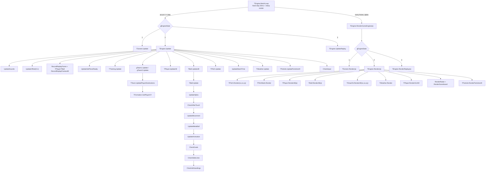
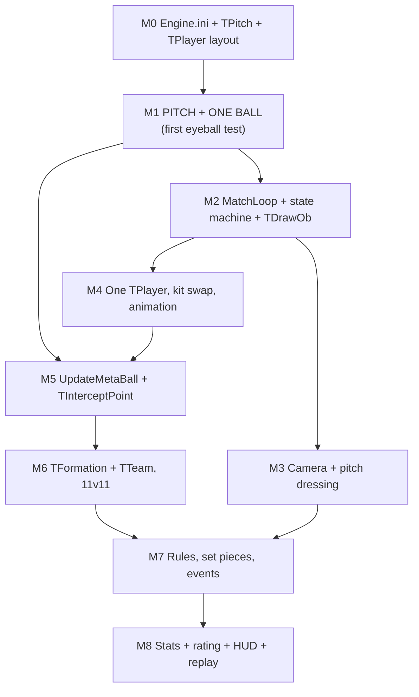

# 09 - `TEngine.MatchLoop` Implementation Specification

**Status:** Implementation spec for source reconstruction. Write code from this document.
**Scope:** The match engine's main loop, its call graph, the ball equations of motion, the pitch
coordinate system, the formation solver, the match-rating formula, and a build order.

**Provenance of this document.** It was written as a synthesis of
[`04-match-engine-physics.md`](04-match-engine-physics.md) and
[`07-object-model.md`](07-object-model.md), but in the course of writing it the top of the call
graph was **disassembled directly out of `NSS5.exe`**. A large fraction of what
`04-match-engine-physics.md` marked `INFERRED` or `UNCERTAIN` is therefore now **VERIFIED**, and
in three places the earlier document was **wrong**. Those corrections are collected in §12.

Every claim below carries one of three tags:

| Tag | Meaning |
|---|---|
| **VERIFIED** | Read out of `NSS5.exe` machine code, its reflection tables, or a shipped asset. A VA is given wherever practical so it can be re-checked. |
| **INFERRED** | Deduced from names, signatures, arity, arithmetic, or football sense. Plausible, not proven. |
| **UNCERTAIN** | Two or more readings survive; both are given. |

---

## 0. New facts established while writing this document

These did not exist in specs 01-08. They are listed up front because they change the shape of the
reconstruction.

| # | Fact | Tag | Evidence |
|---|---|---|---|
| 0.1 | `MatchLoop` is a **fixed-timestep accumulator loop with an interpolated render** ("Fix Your Timestep"). | VERIFIED | Full disassembly, `0x004CF671`-`0x004CF820`, §1.2 |
| 0.2 | The logic tick is **30 ms (33.33 Hz)** by default, user-selectable 36 / 30 / 24 ms via the `options_matchspeed1/2/3` setting. | VERIFIED | `0x00520F43`/`0x00520F4F`/`0x00520F5B` write `0x24`/`0x1E`/`0x18` to the step global; default `0x1E` written at `0x004E4560` |
| 0.3 | The ball is integrated in **polar form** - scalar `velocity` + `direction` (degrees) + `zvelocity` - **not** as `vx/vy/vz`. | VERIFIED | `TBall.UpdateMovement`, `0x004C8BC9`-`0x004C8C1A` |
| 0.4 | `curl` is a **heading rotation added to `direction`**, not a lateral velocity. Resolves spec-04 open question #4. | VERIFIED | `0x004C8B5E`: `direction :+ curlamount` |
| 0.5 | `fricAir` / `fricGrass` multiply the **scalar horizontal speed only**; `zvelocity` is never damped. Resolves spec-04 open question #2. | VERIFIED | `0x004C8B98` / `0x004C8BBD`; nothing multiplies `zvelocity` |
| 0.6 | **`TPlayer` was missing from `object_model.json`.** Its scope is now fully recovered: **100 fields with exact offsets, 135 methods/functions.** | VERIFIED | Scope header at `0x0085C890`; the old parser aborted on decl `kind == 1` (Const), which it did not know |
| 0.7 | `TPlayer`'s class table is at **`0x00C5F94C`** (absent from `class_tables.tsv`). | VERIFIED | `TPlayer.RecordReplayFramesAll` is slot `0x200`, called as `[0xC5FB4C]` from `TEngine.Update` |
| 0.8 | The 12-value **match-state enum** is recovered with its exact names. | VERIFIED | `TEngine.GetStringMatchState`, `0x004D7A8E` |
| 0.9 | `Engine.ini`'s rating weights **override different compile-time defaults** baked into `data` (fouls −5, yellows −8, reds −22 in the binary; −3 / −5 / −20 in `Engine.ini`). | VERIFIED | Initialisers at `0x00C6A62C…0x00C6A654`; overwritten by `TStats_Match.New`, `0x0056D631`+ |
| 0.10 | The rating has **per-event caps** (max 3 goals, 10 shots, 10 passes, 3 assists, 10 headers rewarded) and a **seeded base of 55/60/65**, neither of which is in `Engine.ini`. | VERIFIED | `TStats_Match.UpdateRating`, `0x0056E2DE`-`0x0056E82A` |
| 0.11 | Camera zoom (`scale`) default is **2.0**, and the camera is a two-rate exponential follow (`0.075` in x, `0.05` in y). | VERIFIED | `data` initialiser at `0x00C5B1D4` = `2.0`; `TEngine.UpdateOffset`, `0x004D0009` / `0x004D0040` |
| 0.12 | `TBall.metax/metay` = **predicted landing point**; `jumpx/jumpy` = point reachable by a standing jump; `divex/divey` = point reachable by a diving header. All three are produced by one forward simulation in `UpdateMetaBall`. | VERIFIED | `TBall.UpdateMetaBall`, `0x004C8DCE`-`0x004C902F` |
| 0.13 | A ball carried in the air by an outfield player receives **gravity twice per tick** and its `z` is hard-capped at `playerheight`. | VERIFIED | `0x004C8C1D` + `0x004C8C6E`, cap `[0xC5DE70]` = `playerheight` (`0x004ED11D`) |

### 0.1 Recovered `TPlayer` object layout (VERIFIED)

Included here because the match loop is unimplementable without it. Object header is offsets 0 and
4; user fields start at 8. Consts `CLEFT`, `CRIGHT`, `CUP`, `CDOWN` also exist in the scope.

| Off | Field | Type | Off | Field | Type | Off | Field | Type |
|---:|---|---|---:|---|---|---:|---|---|
| 8 | `newstar` | `i` | 140 | `goalside` | `i` | 272 | `passison` | `i` |
| 12 | `imgPlayer` | `:TImage` | 144 | `keepercatchtime` | `i` | 276 | `calling` | `i` |
| 16 | `id` | `i` | 148 | `kickx` | `i` | 280 | `calltype` | `i` |
| 20 | `teamid` | `i` | 152 | `kicky` | `i` | 284 | `bonus` | `i` |
| 24 | `controller` | `i` | 156 | `receivex` | `i` | 288 | `icalledforball` | `i` |
| 28 | `name` | `$` | 160 | `receivey` | `i` | 292 | `ihadashot` | `i` |
| 32 | `initials` | `$` | 164 | `posxwhenkicked` | `i` | 296 | `facing` | `i` |
| 36 | `age` | `i` | 168 | `posywhenkicked` | `i` | 300 | `spriterotation` | `f` |
| 40 | `value` | `$` | 172 | `offside` | `i` | 304 | `currentanim` | `[]i` |
| 44 | `preferredposition` | `$` | 176 | `offsidewhenkicked` | `i` | 308 | `frame` | `i` |
| 48 | `happiness` | `i` | 180 | `offsidealpha` | `f` | 312 | `lastframetime` | `i` |
| 52 | `boozedup` | `i` | 184 | `offsidetime` | `i` | 316 | `imageframenumber` | `i` |
| 56 | `nrgsickness` | `i` | 188 | `selectionno` | `i` | 320 | `skincol` | `i` |
| 60 | `unhappiness` | `i` | 192 | `kickpower` | `f` | 324 | `haircol` | `i` |
| 64 | `tiredness` | `i` | 196 | `kickdirection` | `f` | 328 | `bootcolint` | `i` |
| 68 | `boozecount` | `i` | 200 | `lastkickdirection` | `f` | 332 | `glovecolint` | `i` |
| 72 | `nrgcount` | `i` | 204 | `directiontoball` | `i` | 336 | `bootcol` | `$` |
| **76** | **`x`** | `f` | 208 | `distancetoball` | `f` | 340 | `glovecol` | `$` |
| **80** | **`y`** | `f` | 212 | `directiontometaball` | `i` | 344 | `joy` | `:TJoy` |
| **84** | **`z`** | `f` | 216 | `distancetometaball` | `f` | 348 | `obtext` | `$` |
| 88 | `oldx` | `f` | 220 | `jumpspotgood` | `i` | 352 | `replayframes` | `:TList` |
| 92 | `oldy` | `f` | 224 | `directiontogoal_opp` | `i` | 356 | `pace` | `f` |
| 96 | `oldz` | `f` | 228 | `directiontogoal_own` | `i` | 360 | `dribbling` | `f` |
| 100 | `xvel` | `f` | 232 | `distancetogoal_opp` | `i` | 364 | `tackling` | `f` |
| 104 | `yvel` | `f` | 236 | `distancetogoal_own` | `i` | 368 | `passing` | `f` |
| 108 | `zvel` | `f` | 240 | `teammateid` | `i` | 372 | `heading` | `f` |
| 112 | `runtime` | `i` | 244 | `lastchangedteammateid` | `i` | 376 | `shooting` | `f` |
| **116** | **`speed`** | `f` | 248 | `directiontoteammate` | `i` | 380 | `flair` | `f` |
| **120** | **`direction`** | `f` | 252 | `distancetoteammate` | `f` | 384 | `slide_start` | `i` |
| 124 | `desx` | `f` | 256 | `opponentid` | `i` | 388 | `slide_delay` | `i` |
| 128 | `desy` | `f` | 260 | `directiontoopponent` | `i` | 392 | `matchstats` | `:TStats_Match` |
| 132 | `metax` | `f` | 264 | `distancetoopponent` | `f` | | | |
| 136 | `metay` | `f` | 268 | `passpotential` | `i` | | | |

`TPlayer` uses the **same polar motion model as `TBall`** (`speed` + `direction`), and carries
`oldx/oldy/oldz` for the same render-interpolation reason (§1.3). `desx/desy` is the AI destination
 - that is exactly what `TFormation.GetPlayerXY` writes (§4).

To regenerate: patch `scripts/parse_reflection.py`'s `DECL_KIND` to include `1: "Const"`.

---

## 1. The call graph

### 1.1 Engine state globals

Everything `TEngine` owns lives in module globals, not instance fields (`TEngine` has **zero**
fields - 56 members, all `Method`/`Function`). Reconstruct these as `Global`s in `engine.bmx`.

| VA | Reconstructed name | Type | Meaning | Tag |
|---|---|---|---|---|
| `0x00C5B1CC` | `gEngineState` | `Int` | Outer loop state. `0` = exit, `1` = screen/menu, `2` = live match, `3` = replay. | VERIFIED |
| `0x00C5B1FC` | `gMatchState` | `Int` | The 12-value match state enum, §1.5. | VERIFIED |
| `0x00C5D234` | `gStepMS` | `Int` | Fixed-timestep length in **milliseconds**. 36 / **30** / 24. | VERIFIED |
| `0x00C5D230` | `gMatchLength` | `Int` | `matchlength` option, 5 or 7 (minutes). | VERIFIED |
| `0x00C6EFD4` | `gTimeNow` | `Int` | `Millisecs() − gTimeBase`. | VERIFIED |
| `0x00C6EFD8` | `gTimeBase` | `Int` | Loop epoch. | VERIFIED |
| `0x00C6F030` | `gLastTime` | `Int` | Previous frame's `gTimeNow`. | VERIFIED |
| `0x00C6F034` | `gAccumulator` | `Int` | Unconsumed milliseconds. | VERIFIED |
| `0x00C73CC8` | *(const `3.0`)* | `Float` | Replay slow-motion multiplier on `gStepMS`. | VERIFIED |
| `0x00C5B2CC` | `gReplaySlowMo` | `Int` | Gate for the above; written only inside `TEngine.StartReplay`/`EndReplay` region. | VERIFIED |
| `0x00C6CF90` | `gTrainingMode` | `Int` | Non-zero ⇒ training, not a match. | VERIFIED |
| `0x00C5B1D4` | `gScale` | `Float` | Camera zoom. **Initialiser = `2.0`.** | VERIFIED |
| `0x00C5B1D8` / `0x00C5B1DC` | `gOffsetX` / `gOffsetY` | `Float` | Camera position. | VERIFIED |
| `0x00C5B1E0` / `0x00C5B1E4` / `0x00C5B1E8` | `gOldOffsetX` / `gOldOffsetY` / `gOldScale` | `Float` | Previous-tick copies, for render interpolation. | VERIFIED |
| `0x00C5B1EC` / `0x00C5B1F0` / `0x00C5B1F4` | `gLimitScrollX` / `gLimitScrollY1` / `gLimitScrollY2` | `Int` | From `Engine.ini`. | VERIFIED |
| `0x00C5B20C` | `gGameSecond` | `Int` | `gamesecond`. | VERIFIED |
| `0x00C5B2B4` | `gReplayLength` | `Int` | `replaylength`. | VERIFIED |
| `0x00C5B2BC` | `gFrameCounter` | `Int` | Monotonic tick counter; the replay frame key. Reset to 0 in `SetUpMatch` (`0x004CE998`). | VERIFIED |
| `0x00C5B218` / `0x00C5B21C` | `gTeam1` / `gTeam2` | `:TTeam` | | VERIFIED |
| `0x00C5B210` | `gWeatherType` | `Int` | Argument to `TWeather.Update`. | VERIFIED |
| `0x00C5B248` | `gSetPieceTaker`-ish | `:TPlayer` | Compared against `ball.controlledby` during a shoot-out. | INFERRED |
| `0x00C5A4C0` | `gBallList` | `:TList` | | VERIFIED |

### 1.2 `TEngine.MatchLoop` - VERIFIED, complete

Disassembled at `0x004CF671`, 432 bytes, no unresolved control flow. This is the whole function:

```blitzmax
Function MatchLoop()

    DebugLog "MatchLoop"                                  ' 0x004CF677

    gTimeNow  = Millisecs() - gTimeBase
    gLastTime = gTimeNow

    ' ---- one-shot entry fixup -------------------------------------------------
    If gTrainingMode > 0 Then
        TEngine.ForcePositionResetAll()
        gMatchState = 12                                  ' "training", §1.5
        If gTrainingScreen.someFlag = 0 Then              ' [gTrainingObj + 0x78]
            SetMatchMusic(3)
        Else
            Select PickMusicVariant(2, 1)
                Case 1 ; SetMatchMusic(3)
                Case 2 ; SetMatchMusic(4)
            End Select
        EndIf
    Else
        SetMatchMusic(0)
    EndIf

    ' ---- the loop -------------------------------------------------------------
    Repeat
        gTimeNow      = Millisecs() - gTimeBase
        gAccumulator :+ (gTimeNow - gLastTime)
        gLastTime     = gTimeNow

        Local step:Float = Float(gStepMS)                  ' 30 ms by default
        If gEngineState = 3 And gReplaySlowMo Then step :* 3.0

        While Float(gAccumulator) >= step
            Select gEngineState
                Case 1 ; TScreen.Update()                  ' menu / paused
                Case 2 ; TEngine.Update()                  ' live match tick
                Case 3 ; TEngine.UpdateReplay()            ' replay tick
            End Select
            gAccumulator = Int(Float(gAccumulator) - step)
        Wend

        TEngine.RenderGameEngine(Float(gAccumulator) / step)   ' alpha in [0,1)

        If AppTerminate() Then End                         ' 0x005B46C8 / 0x004A4620

    Until gEngineState = 0

    Return 0
End Function
```

Consequences that the reconstruction must honour:

| Consequence | Detail |
|---|---|
| **Simulation rate is decoupled from frame rate** | Render runs as fast as the display allows; logic runs at exactly `1000/gStepMS` Hz. |
| **Every `Render*(a:Float)` parameter is an interpolation alpha** | `TEngine.RenderGameEngine(f)`, `TEngine.Render(f)`, `TBall.RenderAll(f)`, `TBall.Render(f)`, `TPlayer.RenderAll(f)`, `TPlayer.Render(f)`, `TScreen.Render(f)`, `TEngine.RenderReplay(f)` - **all** take the same alpha. This is why `TBall`, `TPlayer` and `TCameraMan` carry `oldx/oldy/oldz`. |
| **Match speed changes the physics** | `Engine.ini` rates are per *tick*, and the tick is 24/30/36 ms. The "Fast" setting is genuinely a faster, floatier game, not just a faster clock. Reproduce this quirk. |
| **Replay slow-motion is a `×3` step** | Not a separate integrator: replay simply consumes the accumulator three times more slowly. |
| **The accumulator is an `Int`** | `gAccumulator = Int(Float(gAccumulator) - step)`, so fractional milliseconds are discarded every tick. With an integer `gStepMS` this is lossless; keep the `Int` to match. |

### 1.3 `TEngine.Update` - the per-tick driver, VERIFIED, complete

Disassembled at `0x004CFA6C`, 201 bytes. This is the entire per-tick order:

```blitzmax
Function Update()
    TEngine.UpdateSounds()                                 ' [0xC5BAF0]
    TEngine.UpdateOffset(0.1)                              ' [0xC5BA88], imm 0x3DCCCCCD = 0.1

    gFrameCounter :+ 1
    TEngine.RecordReplayFrame(gFrameCounter)               ' [0xC5BAC4]
    TPlayer.RecordReplayFramesAll(gFrameCounter)           ' [0xC5FB4C]
    TBall.RecordReplayFramesAll(gFrameCounter)             ' [0xC5AF40]

    TEngine.UpdateSetPieceReady()                          ' [0xC5BAAC]
    TTraining.Update()                                     ' [0xC6D4FC]

    If gTeam1 <> Null Then gTeam1.Update()                 ' TTeam vtable 0x64
    If gTeam2 <> Null Then gTeam2.Update()

    TPlayer.UpdateAll()                                    ' [0xC5F990]
    TBall.UpdateAll()                                      ' [0xC5AEE0]
    TPitch.Update()                                        ' [0xC5D96C]
    TEngine.UpdateMatchTime()                              ' [0xC5BAB8]
    TWeather.Update(gWeatherType)                          ' [0xC60204]
    TParticle.UpdateParticlesAll()                         ' [0xC6AFC8]
    TEngine.CheckInput()                                   ' [0xC5BA9C]
End Function
```

Ordering facts worth calling out, all VERIFIED:

1. **Replay frames are recorded *before* the world is updated**, so a replay frame is the state at
   the *start* of tick *n*. Any reconstruction that records after updating will be one tick out.
2. **Camera before entities.** `UpdateOffset` runs first, so the camera chases last tick's ball.
3. **Teams before players before ball.** `TTeam.Update` sets squad destinations (via
   `UpdatePlayerDestinations` → `TFormation.GetPlayerXY`), `TPlayer.UpdateAll` moves and kicks,
   `TBall.UpdateAll` integrates the result.
4. **`CheckInput` is last.** Human input read at the end of a tick is consumed at the start of the
   next - a deliberate one-tick input latency.
5. `UpdateOffset` takes a hard-coded `0.1` here. It is not the smoothing factor (those are `0.075`
   and `0.05` internally, §1.6) - INFERRED: it is a dead-zone or lead distance.

### 1.4 `TEngine.RenderGameEngine` and `TEngine.Render` - VERIFIED, complete

`RenderGameEngine` at `0x004CF821` (587 bytes):

```blitzmax
Function RenderGameEngine(a:Float)
    Select gEngineState
        Case 1 ; TScreen.Render(a)                         ' [0xC61C94]
        Case 2 ; TEngine.Render(a)                         ' [0xC5BA8C]
        Case 3 ; TEngine.RenderReplay(a)                   ' [0xC5BAE0]
    End Select

    TScreenMessage.DrawAll()                               ' [0xC6B26C]

    If gDebugLevel = 2 Then                                ' [0xC6EF50]
        SetColor "FFFFFF"
        Local p:TPlayer = TPlayer.GetHumanPlayer()
        If p <> Null Then DrawMyText "Rating: " + ...
        DrawMyText "FPS: "  + ...
        DrawMyText "Time: " + ...
        DrawMyText "Mem: "  + ...
        DrawMyText TEngine.GetStringMatchState()
    EndIf

    Flip
End Function
```

`Render` at `0x004D0309` (282 bytes) - note the camera interpolation at the top, and that
**exactly three floats `(scale, offX, offY)` are threaded through every world-space draw call**:

```blitzmax
Function Render(a:Float)

    Local sc:Float = gScale   * a + gOldScale   * (1.0 - a)
    Local ox:Float = gOffsetX * a + gOldOffsetX * (1.0 - a)
    Local oy:Float = gOffsetY * a + gOldOffsetY * (1.0 - a)

    TPitch.Render(sc, ox, oy)                              ' [0xC5D970]
    TPitchMark.Render()                                    ' [0xC5DB14]
    TTraining.Render()                                     ' [0xC6D52C]
    TPlayer.RenderAll(a)                                   ' [0xC5F998]
    TBall.RenderAll(a)                                     ' [0xC5AEE8]
    TDrawOb.RenderAll(sc, ox, oy)                          ' [0xC5B1B8]
    TWeather.Render(0)                                     ' [0xC60214]
    TPlayer.RenderGUIAll(sc, gScale)                       ' [0xC5F9A4]

    If gTrainingMode Then
        TTraining.RenderScoreboard(a)                      ' [0xC6D530]
    Else
        TEngine.RenderRadar()                              ' [0xC5BA90]
        TEngine.RenderScoreboard()                         ' [0xC5BA94]
    EndIf

    TParticle.RenderParticlesAll(sc, ox, oy)               ' [0xC6AFD0]
    TBossMessage.DrawAll(sc, ox, oy)                       ' [0xC6B418]
End Function
```

**`TDrawOb` is the depth-sorted sprite list.** `TPlayer.RenderAll` and `TBall.RenderAll` do *not*
draw directly - they push `TDrawOb` records (`TDrawOb.AddDrawOb`, 16 args) and `TDrawOb.RenderAll`
draws them after `TDrawOb.Sort()`. `TDrawOb` has a `Compare(:Object)` method and fields
`z` (sort key) and `z2` (secondary key), `level` (layer). INFERRED from `TDrawOb`'s shape and its
position in the sequence; the alternative is that `TDrawOb` is only for scenery.

### 1.5 The match-state enum - VERIFIED

From `TEngine.GetStringMatchState` (`0x004D7A8E`), which switches on `gMatchState` and returns a
literal. Value 12 is not handled there (it returns `"Error"`), but `MatchLoop` writes it.

| Value | `GetStringMatchState` | Notes |
|---:|---|---|
| 0 | `Tunnel` | Pre-kickoff walk-out. `TPlayer.SetTunnelPositionAll` / `GetTunnelPosition`. |
| 1 | `In Play` | The only state in which `TBall.KeeperHolding()` is polled (`0x004C8AAD`). |
| 2 | `Centre` | Kick-off. |
| 3 | `Throw-In` | |
| 4 | `Free Kick` | |
| 5 | `Corner` | Uses `TTeam.cornerformation`. |
| 6 | `Goal Kick` | |
| 7 | `Penalty` | |
| 8 | `Goal!` | Celebration. `TBall.UpdateMovement` treats this specially: the ball is force-attached to `controlledby` with a `×0.8` carry distance and `+10°` heading offset (`0x004C89C6`). |
| 9 | `Shoot-Out` | |
| 10 | `Shoot-Out Taken` | |
| 11 | `Match Over` | `TPlayer.GetMatchOverPosition`. |
| 12 | *(unhandled)* | Written by `MatchLoop` when `gTrainingMode > 0`. INFERRED name: `matchstate_Training`. |

Suggested BlitzMax constants:

```blitzmax
Const matchstate_Tunnel        = 0
Const matchstate_InPlay        = 1
Const matchstate_Centre        = 2
Const matchstate_ThrowIn       = 3
Const matchstate_FreeKick      = 4
Const matchstate_Corner        = 5
Const matchstate_GoalKick      = 6
Const matchstate_Penalty       = 7
Const matchstate_Goal          = 8
Const matchstate_ShootOut      = 9
Const matchstate_ShootOutTaken = 10
Const matchstate_MatchOver     = 11
Const matchstate_Training      = 12
```

### 1.6 `TEngine.UpdateOffset` - the camera - partly VERIFIED

`0x004CFB35`, 2004 bytes. Fully decompiling it is left as work; the load-bearing parts are read:

```blitzmax
Function UpdateOffset(lead:Float)
    gOldOffsetX = gOffsetX ; gOldOffsetY = gOffsetY ; gOldScale = gScale   ' VERIFIED 0x004CFB3E

    Local tx:Float, ty:Float
    ' target selection, in priority order (VERIFIED by call sites):
    '   TBall.GetActiveBall()        [0xC5AEDC]
    '   TEngine.GetWinningClub()     [0xC5BB28]   ' celebration / match-over framing
    '   TEngine.SetPiece()           [0xC5BAA4]   ' set-piece framing
    '   TPlayer.GetHumanPlayer()     [0xC5FAB0]
    '   TTraining.GetFocus(p, *x, *y)[0xC6D54C]
    ' distances are converted with TPitch.YardsToPixels() [0xC5D998]

    gOffsetX :+ (tx - gOffsetX) * 0.075                    ' VERIFIED 0x004D0009
    Clamp(Varptr gOffsetX, -gLimitScrollX, gLimitScrollX)  ' VERIFIED 0x004D0021 -> 0x00505F90

    gOffsetY :+ (ty - gOffsetY) * 0.05                     ' VERIFIED 0x004D0040
    Clamp(Varptr gOffsetY, ..., ...)                       ' uses gLimitScrollY1 / gLimitScrollY2
End Function
```

The **x follow is 1.5× stiffer than the y follow** - the camera tracks the ball's width readily and
its depth lazily, which is the standard sideline-TV feel. `0x00505F90` is a shared
`Clamp(f:Float Ptr, lo:Float, hi:Float)` helper, used again in `TBall.UpdateMovement` and
`TStats_Match.UpdateRating`.

`gScale` starts at `2.0`. That reconciles spec 04 §3.2 exactly: pitch art is authored at 0.5 px per
world unit and drawn at `gScale` = ×2, giving 1 virtual pixel per world unit at base zoom.

**UNCERTAIN** (unchanged from spec 04 §4): whether `limitscrolly1=44` / `limitscrolly2=26` are HUD
insets or over-scroll allowances. The clamp call at `0x004D0058` uses both, asymmetrically.

### 1.7 The remaining 40 `TEngine` members - grouped

Group membership below is **VERIFIED where the call site was found in the disassembly**, and
**INFERRED** otherwise (from name, signature, and the fact that `MatchLoop`/`Update`/`Render` do not
call it directly, so it must be reached from a state transition, an input handler, or a set-up path).

#### Setup - called once, before the loop

| Member | Sig | Role | Tag |
|---|---|---|---|
| `SetUp` | `()i` | Loads all `Engine.ini` Match keys, match fonts, cards/injury/sub/face/energy images, whistle + crowd sounds, radar images. VA `0x004CD9C3`. | VERIFIED |
| `SetUpChannels` / `StopChannels` | `()i` | Audio channel allocation. | INFERRED |
| `SetUpMatch` | `(:TFixture,:TTeam,:TTeam,()i)i` | Builds the match. Writes `gTeam1` (`0x004CE8DF`), `gTeam2` (`0x004CE8FE`), zeroes `gFrameCounter` (`0x004CE998`). The 4th arg is a **callback function pointer** - INFERRED: the "return to this screen when the match ends" continuation. | VERIFIED |
| `SetUpReplay` | `(:TReplay,()i)i` | Same shape for replay playback. | VERIFIED |
| `SetUpRadarColours` | `()i` | Derives radar dot colours from the two kits. | INFERRED |
| `SetUpWeatherConditions` | `()i` | Picks weather; writes `gWeatherType`. Sibling of `TWeather.SetWeatherTimes(i,i,i)`. | INFERRED |
| `ResetStats`, `ResetClubLastChange` | `()i` | Clear per-match counters; reset `TTeam.lastchangeplayer`. | INFERRED |
| `CreateReplayFrames` | `(:TReplay)i` | Pre-allocates the ring buffer: `replaylength / gStepMS` = 12000/30 = **400 frames**. | INFERRED |

#### Per-tick update - driven by `TEngine.Update`

`UpdateSounds`, `UpdateOffset`, `RecordReplayFrame`, `UpdateSetPieceReady`, `UpdateMatchTime`,
`CheckInput`. **VERIFIED** (§1.3), in that order.

#### Per-frame render - driven by `RenderGameEngine` → `Render`

`Render`, `RenderRadar`, `RenderScoreboard`. **VERIFIED** (§1.4).
`DrawScores` (`0x004D268B`) is **INFERRED** to be called from `RenderScoreboard` (`0x004D0AB3`) - 
they are adjacent, and `RenderScoreboard` is 6 KB while `DrawScores` is 600 bytes.
`DrawMyText($,f,f,i,i,f,f,$,i)i` is the engine's shared text helper (colour string, alignment,
shadow) used by every HUD routine.

#### Set pieces

| Member | Sig | Role | Tag |
|---|---|---|---|
| `SetPiece` | `()i` | **Predicate.** Returns non-zero while a set piece is being set up. Called from `TBall.UpdateMovement` (`0x004C8746`) as the very first branch, and twice from `UpdateOffset`. Body is only 140 bytes. | VERIFIED |
| `SetUpSetPiece` | `(i,i,i,i)i` | Enters a set piece. INFERRED args: `(matchstate, x, y, teamid)`. Writes `[0xC5B248]`. | INFERRED |
| `WaitForSetpiece` | `()i` | Blocking-ish wait state. | INFERRED |
| `UpdateSetPieceReady` | `()i` | Per-tick readiness poll - VERIFIED as called from `TEngine.Update`. Pairs with `TTeam.GetSetPieceTakers(i,:TBall)` and `TPlayer.AllPlayersReady()`. | VERIFIED |
| `ForcePositionResetAll` | `()i` | Teleports everyone to their formation slots. VERIFIED called from `MatchLoop`'s training branch; **INFERRED** also called on every restart. Delegates to `TTeam.ForcePositionReset`. | VERIFIED/INFERRED |

When `SetPiece()` is true, `TBall.UpdateMovement` **short-circuits entirely** and just pins the ball
to `setpiecex/setpiecey` (or to the taker's position, offset by a small constant that flips sign
with the taker's `y`) via `TBall.ResetPosition`. VERIFIED, `0x004C8746`-`0x004C8868`.

#### Match events

| Member | Sig | Role | Tag |
|---|---|---|---|
| `GoalScored` | `(:TBall)i` | INFERRED called from `TBall.CheckGoals()`, which is in `TBall.Update`'s chain. Sets `gMatchState = 8`. | INFERRED |
| `UpdateMatchTime` | `()i` | Advances the match clock using `gamesecond`. VERIFIED per-tick. | VERIFIED |
| `DoHalfEnds` | `()i` | Half-time / full-time transition; INFERRED called from `UpdateMatchTime`. Writes `gWeatherType` (`0x004D4377`+) - weather changes at half time. | INFERRED |
| `SkipMatchTime` / `SkipTime` | `()i` | The highlight-skip fast-forward. `SkipTime` writes `gTeam1`/`gTeam2` (`0x004D7431`/`0x004D746C`) - INFERRED: it re-seeds both squads after a skip. | INFERRED |
| `MatchOver` | `()i` | Sets `gMatchState = 11`. | INFERRED |
| `EndMatch` | `()i` | Tears the match down and invokes the `SetUpMatch` continuation; sets `gEngineState = 0` or `1` to leave `MatchLoop`. | INFERRED |
| `DoShootOut` / `CheckShootOutComplete` | `()i` | States 9/10. | INFERRED |
| `GetWinningClub` | `():TTeam` | VERIFIED called from `UpdateOffset` (camera frames the winner). | VERIFIED |
| `PauseEngine` | `()i` | INFERRED: sets `gEngineState = 1` so `MatchLoop` starts calling `TScreen.Update` - which is exactly how `TScreen_MatchPaused` works without leaving `MatchLoop`. This is why `Case 1` exists in both switches. | INFERRED (strong) |
| `PauseSounds` / `ResumeSounds` | `()i` | Paired with `PauseEngine`. | INFERRED |

#### Replay

| Member | Sig | Role | Tag |
|---|---|---|---|
| `RecordReplayFrame` | `(i)i` | Per-tick, arg = `gFrameCounter`. Records match-state frames; the sibling `TPlayer.RecordReplayFramesAll(i)` and `TBall.RecordReplayFramesAll(i)` record entities. | VERIFIED |
| `UpdateReplay` | `()i` | The `Case 3` per-tick driver. | VERIFIED |
| `RenderReplay` | `(f)i` | The `Case 3` per-frame driver. | VERIFIED |
| `StartReplay` / `EndReplay` | `()i` | Flip `gEngineState` 2↔3. Both write `gReplaySlowMo` (`0x004D4B10`, `0x004D4E20`). | VERIFIED |
| `UpdateReplayFrame` | `(i)i` | Seeks the ring buffer to a frame index. | INFERRED |
| `CheckReplayInput`, `UpdateOffsetReplay(f)`, `RenderReplayGUI`, `RenderReplayRadar`, `UpdateSoundsReplay` | | Replay mirrors of the live routines; called from `UpdateReplay`/`RenderReplay`. | INFERRED |
| `SaveReplay` | `()i` | Writes a `.rep` file (`newstarsoccerfivereplayfile`, `zipe::`). | INFERRED |

**The replay format is completely specified by `TReplayFrame` (21 fields).** One flat frame type
serves balls, players and match-state records, discriminated by `obtype`; `TReplay` holds three
`TList`s (`ballframes`, `playerframes`, `matchstateframes`). Because `TReplayFrame` carries
`x,y,z,xvel,yvel,zvel,frame,facing,rotation,alph,active` plus full appearance
(`clubid,skincol,haircol,bootcol,glovecol`), replay playback needs **no simulation at all** - it is
pure interpolated playback, which is why `UpdateReplay` is only 121 bytes.

#### Substitutions

`DoYourSubstitutionOn()i` and `DoYourSubstitutionOff(i)i` - the *player's own* substitution
(the career-mode "you are being subbed" event), not general squad management. The `Off` variant
takes an `Int`, INFERRED to be the reason code (tactical / injury / red card), matching
`TStats_Match.subbedontime` / `subbedofftime`. General AI substitutions go through
`TTeam.CheckComManagement()`.

### 1.8 Call graph, condensed



---

## 2. Ball physics

### 2.1 The model is polar, not Cartesian - VERIFIED

This is the single most important correction to spec 04. `TBall` has **no `vx`/`vy`**. It has:

| Field | Off | Type | Meaning |
|---|---:|---|---|
| `x`, `y`, `z` | 24, 28, 32 | `f` | Position, world units. `z = 0` is turf. |
| `oldx`, `oldy`, `oldz` | 36, 40, 44 | `f` | Position at the *start* of the current tick. Render interpolation only. |
| `velocity` | 84 | `f` | **Scalar horizontal speed**, units/tick. |
| `direction` | 92 | `f` | **Heading in degrees.** |
| `zvelocity` | 88 | `f` | Vertical velocity, units/tick. |
| `curlamount` | 152 | `f` | Degrees added to `direction` **every tick**, `[-curlmax, +curlmax]`. |
| `metax`, `metay` | 48, 52 | `f` | Predicted landing point (§2.5). |
| `jumpx`, `jumpy` | 56, 60 | `f` | Predicted point at which a standing jump can reach it (§2.5). |
| `divex`, `divey` | 64, 68 | `f` | Predicted point at which a diving header can reach it (§2.5). |
| `setpiecex`, `setpiecey` | 72, 76 | `i` | Set-piece placement. |
| `ingoal` | 80 | `i` | Which goal it has entered, or 0. |
| `teaminpossession` | 96 | `i` | Copied from the controller's/last-toucher's `colour`. |
| `kicktime` | 100 | `i` | `Millisecs()` of the last kick; the aftertouch window origin. |
| `lastkicktype` | 104 | `i` | pass / shoot / lob / head / cross. |
| `lastkickmatchstate` | 108 | `i` | The `gMatchState` at the moment of the kick - how an "indirect free kick" or "goal from a corner" is later attributed. |
| `controlledby` | 112 | `:TPlayer` | Non-null ⇒ the ball is glued to a player (§2.3). |
| `lastkickedby`, `lasttouchedby`, `assistedby` | 116, 120, 124 | `:TPlayer` | Attribution chain for goals / assists / own goals. |
| `setpiecetaker`, `setpiecebuddy` | 128, 132 | `:TPlayer` | |
| `backpass` | 136 | `i` | Deliberate back-pass flag (keeper may not handle). |
| `slidekick` | 140 | `i` | Ball was played by a slide tackle. |
| `posthit` | 144 | `i` | |
| `disttoreciever` | 148 | `f` | Monotone-decreasing distance to `passtoid` (§2.4). |
| `passtoid` | 156 | `i` | Intended receiver. |
| `active` | 12 | `i` | Only the active ball is simulated. |
| `alph` | 16 | `f` | Fade; driven by `UpdateAlpha`. |
| `frame`, `lastframetime` | 160, 164 | `i` | Roll animation. |
| `hideball` | 168 | `i` | Set while a keeper's sprite is on a `holdballframes` frame. |
| `replayframes` | 172 | `:TList` | |

### 2.2 `TBall.Update` - VERIFIED order

From `0x004C81B6`, dispatching through vtable slots `0x58, 0x6C, 0x5C, 0x60, 0x64, 0x70, 0x74, 0x78`:

```blitzmax
Method Update()
    UpdateAlpha()          ' fade in/out
    CheckAfterTouch()      ' may modify curlamount and zvelocity  -- BEFORE integration
    UpdateMovement()       ' the integrator
    UpdateMetaBall()       ' forward-simulate the landing/jump/dive points
    UpdateAnimation()      ' roll frame
    CheckGoals()           ' goal-line + post + crossbar + net
    CheckSideLines()       ' touchline / goal line out of play
    CheckAdHoardings()     ' perimeter board bounce
End Method
```

`TBall.UpdateAll` is `For b:TBall = EachIn gBallList ; b.Update() ; Next`, guarded on the list being
non-null. VERIFIED, `0x004C813D`.

### 2.3 `TBall.UpdateMovement` - the equations, VERIFIED

Disassembled at `0x004C871F`, 1711 bytes. Reproduced as pseudocode with the VA of each step.

```
UpdateMovement:

  oldx, oldy, oldz := x, y, z                                       ' 0x004C872A   (render interp)

  ' ---------- A. set-piece freeze --------------------------------------------
  if active and TEngine.SetPiece() then                             ' 0x004C8746
      if gMatchState = Penalty and controlledby <> Null and controlledby is the taker then
          if controlledby.y < 0 then
              ResetPosition( Int(controlledby.x - k1), Int(controlledby.y - k2), playerheight-5 )
          else
              ResetPosition( Int(controlledby.x - k3), Int(controlledby.y + k4), playerheight-5 )
      else
          ResetPosition( setpiecex, setpiecey, 0 )                  ' 0x004C884D
      return                                                        ' <-- NO PHYSICS THIS TICK

  ' ---------- B. possession bookkeeping ---------------------------------------
  if gMatchState = ShootOut  and controlledby <> taker then controlledby := Null   ' 0x004C886D
  if gMatchState <> InPlay                                then controlledby := Null ' 0x004C889E

  ' ---------- C. carried ball (controlledby <> Null) ---------------------------
  if controlledby <> Null then                                      ' 0x004C88C3
      passtoid          := 0
      teaminpossession  := controlledby.colour
      lastkickedby      := controlledby
      lastkickedby.posxwhenkicked := Int(x)                         ' 0x004C8911
      lastkickedby.posywhenkicked := Int(y)
      lasttouchedby     := controlledby
      direction         := controlledby.direction                   ' 0x004C894B

      dist := 6.0 + controlledby.speed * 3.0                        ' 0x004C8954

      if controlledby.KeeperHoldingBall() then                      ' 0x004C896B
          dist :* 1.5
          h := controlledby.GetKeeperHandHeight()
          if z <= h then  z := h ;  oldx,oldy,oldz := x,y,z         ' 0x004C89B1

      if gMatchState = Goal then                                    ' 0x004C89C6
          controlledby.GetPlayerRunningHandHeight( Varptr z )
          dist :* 0.8
          if controlledby.speed < 1.0 then dist :* 0.6
          direction :+ 10.0                                         ' 0x004C8A14

      tx := controlledby.x + Cos(direction) * dist * 1.25            ' 0x004C8A29
      ty := controlledby.y + Sin(direction) * dist                   ' 0x004C8A5C
      x  :+ (tx - x) * 0.25                                          ' 0x004C8A7D   <-- lerp, not snap
      y  :+ (ty - y) * 0.25                                          ' 0x004C8A91
      velocity := controlledby.speed                                 ' 0x004C8AA4

      if gMatchState = InPlay then
          if KeeperHolding() then Clamp( Varptr y, -(goalline-5), goalline-5 )   ' 0x004C8AD3
      if gMatchState = ShootOut then return

  ' ---------- D. free ball -----------------------------------------------------
  else                                                              ' 0x004C8B1C
      teaminpossession := 0
      if lastkickedby  <> Null then teaminpossession := lastkickedby.colour
      if lasttouchedby <> Null then teaminpossession := lasttouchedby.colour

      direction :+ curlamount                                       ' 0x004C8B5E  <-- CURL
      if z > 0 then
          if velocity <> 0 then velocity :* fricAir                 ' 0x004C8B98  [0xC5A4D0]
      else
          if velocity <> 0 then velocity :* fricGrass               ' 0x004C8BBD  [0xC5A4CC]

      x :+ Cos(direction) * velocity                                ' 0x004C8BC9
      y :+ Sin(direction) * velocity                                ' 0x004C8BF3

  ' ---------- E. vertical (ALWAYS, carried or free) ---------------------------
  zvelocity :- gravity                                              ' 0x004C8C1D

  if controlledby <> Null and z > 0 then                            ' 0x004C8C29
      if controlledby.KeeperHoldingBall() then
          zvelocity := 0                                            ' 0x004C8C67
      else
          zvelocity :- gravity                                      ' 0x004C8C6E  <-- SECOND time
          if z > playerheight then z := playerheight                ' 0x004C8C7A

  z :+ zvelocity                                                    ' 0x004C8CA8

  if z <= 0 then                                                    ' 0x004C8CB1
      z         := 0
      zvelocity := -zvelocity * bounce                              ' 0x004C8CCD
      if zvelocity > 1.0 then PlaySound sndBounce, chanBounce       ' 0x004C8CDB

  ' ---------- F. pass tracking -------------------------------------------------
  p := TPlayer.GetPlayerById(passtoid)                              ' 0x004C8D06
  if p <> Null then
      d := Distance(x, y, p.x, p.y)
      if d <= disttoreciever then disttoreciever := d
      else                        passtoid := 0                     ' ball is moving away: cancel

  ' ---------- G. shoot-out completion ------------------------------------------
  if active and gMatchState = ShootOutTaken and velocity > 0 and Sin(direction) > 0 then
      gShootOutFlag := 0                                            ' 0x004C8DB7
```

`Cos` = `0x004A1F10`, `Sin` = `0x004A1F00` (BlitzMax `Cos`/`Sin` take **degrees**). `Distance` =
`0x00505DA2`. `Clamp(Float Ptr, lo, hi)` = `0x00505F90`.

### 2.4 The physics constants and their exact globals - VERIFIED

`TBall.SetUp` (`0x004C78C0`) reads `Engine.ini` in this order into these globals. **Note the source
reads `fricGrass` before `fricAir`, the reverse of the file order** - which is why the global at the
lower address is `fricGrass`.

| Global VA | `Engine.ini` key | Value | Used in `UpdateMovement` at |
|---|---|---:|---|
| `0x00C5A4C8` | `ballradius` (Int) | 2 | collision tests |
| `0x00C5A4CC` | **`fricGrass`** | 0.985 | `0x004C8BC0` (`z <= 0`) |
| `0x00C5A4D0` | **`fricAir`** | 0.99 | `0x004C8B9B` (`z > 0`) |
| `0x00C5A4D4` | `gravity` | 0.14 | `0x004C8C20`, `0x004C8C71` |
| `0x00C5A4D8` | `bounce` | 0.6 | `0x004C8CD2` |
| `0x00C5A4DC` | `passcheckradius` | 5 | pass-lane sweep |
| `0x00C5A4E0` / `0x00C5A4E4` | `kickpow_pass` / `kickheight_pass` | 0.07 / 0.0 | `TBall.Kick` |
| `0x00C5A4E8` / `0x00C5A4EC` | `kickpow_shoot` / `kickheight_shoot` | 0.1 / 2.85 | `TBall.Kick` |
| `0x00C5A4F0` / `0x00C5A4F4` | `kickpow_lob` / `kickheight_lob` | 0.08 / 3.65 | `TBall.Kick` |
| `0x00C5A4F8` / `0x00C5A4FC` | `kickpow_head` / `kickheight_head` | 0.08 / 1.5 | `TBall.Kick` |
| `0x00C5A500` | `aftertouchtime` | 750 | `TBall.CheckAfterTouch` |
| `0x00C5A504` | `curlinc` | 0.05 | `TBall.CheckAfterTouch` |
| `0x00C5A508` | `curlmax` | 0.7 | `TBall.CheckAfterTouch` |
| `0x00C5A510` / `0x00C5A514` | - | - | bounce channel / `Bounce.ogg` |
| `0x00C5A518` / `0x00C5A51C` | - | - | `Kick.ogg` / `Post.ogg` |

The four `kickdistratio_*` keys are **not** ball globals - they live with `TPlayer`
(`0x00C5DE94`…`0x00C5DEA0`, loaded at `0x004ED24A`+), confirming they belong to the *kick decision*
(how hard to hit it) and not to the *flight model*. Spec 04 §5.6 hypothesis 1 is therefore the
better one; still **UNCERTAIN** in detail, resolvable by decompiling `TPlayer.PassAI` / `ShootAI`.

`TPlayer` Engine.ini globals, for completeness (VERIFIED, `TPlayer.SetUp` at `0x004EC179`):

| VA | Key | VA | Key | VA | Key |
|---|---|---|---|---|---|
| `0xC5DE48` | `acceleration` | `0xC5DE68` | `touchdist_ball` | `0xC5DE84` | `shotpowerparry` |
| `0xC5DE4C` | `keeperaccel` | `0xC5DE6C` | `jumpspotradius` | `0xC5DE88` | `shotdistanceparry` |
| `0xC5DE50` | `playerfriction` | **`0xC5DE70`** | **`playerheight`** | `0xC5DE8C` | `injuryfrequency` |
| `0xC5DE54` | `slidefriction` | `0xC5DE74` | `playerradius` | `0xC5DE90` | `energydrain` |
| `0xC5DE58` | `slidevelocity` | `0xC5DE78` | `turningcircle` | `0xC5DE94` | `kickdistratio_shoot` |
| `0xC5DE5C` | `jumpvelocity` | `0xC5DE7C` | `powerbarspeed` | `0xC5DE98` | `kickdistratio_lob` |
| `0xC5DE60` | `joggingspeed` | `0xC5DE80` | `highlightpass` | `0xC5DE9C` | `kickdistratio_pass` |
| `0xC5DE64` | `walkingspeed` | `0xC5DEA8` | `framelength` | `0xC5DEA0` | `kickdistratio_cross` |

### 2.5 `metax/metay`, `jumpx/jumpy`, `divex/divey` - VERIFIED

`TBall.UpdateMetaBall` (`0x004C8DCE`, 610 bytes) answers the question *"where is this ball going?"*
once per tick, so that **every** AI routine can consult a cached answer instead of re-simulating.
`TPlayer` mirrors the result in `metax`/`metay` (offsets 132/136) and derives
`directiontometaball` / `distancetometaball` / `jumpspotgood` from it.

The routine takes a **local copy** of the ball state and runs the §2.3-D/E integrator forward until
the ball lands, recording three checkpoints:

```
UpdateMetaBall:
    metax, metay := x, y                                    ' 0x004C8DD8
    jumpx, jumpy := 0, 0                                    ' 0x004C8DE6
    if <ball not in flight / controlled> then
        metax, metay := <current position>                  ' 0x004C8E00
        return

    ' local copies -- the real ball is NOT touched
    sz  := z ;  sv := velocity ;  szv := zvelocity ;  sd := direction   ' 0x004C8E19

    While sz > 0
        sv    :* fricAir                                    ' 0x004C8E4F  [0xC5A4D0]
        metax :+ Cos(sd) * sv                               ' 0x004C8E58
        metay :+ Sin(sd) * sv                               ' 0x004C8E82
        szv   :- gravity                                    ' 0x004C8EAF  [0xC5A4D4]
        sz    :+ szv

        If sz <= playerheight * 1.1  And jumpx = 0 Then     ' 0x004C8F00 (1.1)
            jumpx, jumpy := metax, metay                    ' 0x004C8F19
        If sz <= playerheight * 0.6  And divex = 0 Then     ' 0x004C8F30 (0.6)
            divex, divey := metax, metay                    ' 0x004C8F49
    Wend

    ' after landing: continue rolling for a short lookahead
    sv    :* fricGrass                                      ' 0x004C8F8B  [0xC5A4CC]
    metax :+ Cos(sd) * sv                                   ' 0x004C8F94
    metay :+ Sin(sd) * sv                                   ' 0x004C8FBE
    ... (bounded by a 3.0 constant at 0x004C9007)
```

| Field pair | Meaning | Consumed by |
|---|---|---|
| `metax`, `metay` | **Where the ball will end up.** The single most-used AI input: chase targets, keeper positioning, offside prediction, "who should go for it". | `TPlayer.ChaseBall`, `UpdateFundamentals`, `directiontometaball`, `distancetometaball`, `TPlayer.UpdateKeeperPosition` |
| `jumpx`, `jumpy` | Where the ball's height first drops to within **standing-jump reach** (`playerheight × 1.1` = 24.2 u). | `jumpspotradius` (10 u) test → `TPlayer.jumpspotgood`; `KeeperJump`, `HeadBall`, `DoAnimJump` |
| `divex`, `divey` | Where the ball's height first drops to **diving-header height** (`playerheight × 0.6` = 13.2 u). | `TPlayer.DiveHeadBall`, `DoKeeperDiveAI` / `KeeperDive(:TInterceptPoint,i)` |

Both thresholds are literal constants in the code (`1.1` at `0x00C72640`, `0.6` at `0x00C72644`),
**not** `Engine.ini` keys. The `1.1`/`0.6` split is why a lofted cross produces a header and a
low-driven one produces a diving header.

`TInterceptPoint` (`x`, `y`, `intercept_AB`, `intercept_CD`, `intercept`) is the *other* prediction
primitive: a **line-segment/line-segment intersection** result (`intercept_AB` and `intercept_CD`
are the two parametric `t` values, `intercept` the boolean). It is passed to
`TPlayer.KeeperDive(:TInterceptPoint, i)` - the keeper solves the ball's flight line against the
goal-mouth line and dives to the crossing point. INFERRED from the field names and that sole call
site, but the parametric-`t` reading is essentially forced by the two-`Float` `AB`/`CD` pair.

### 2.6 Aftertouch and curl - VERIFIED mechanism, INFERRED magnitudes

`CheckAfterTouch` runs **before** `UpdateMovement` (§2.2), so any curl applied this tick is felt by
this tick's integration.

```blitzmax
' On kick (TBall.Kick):
'     kicktime   = Millisecs()
'     curlamount = 0
'
' Each tick, CheckAfterTouch:
If Millisecs() - kicktime < aftertouchtime Then          ' 750 ms = 25 ticks @30ms
    If lateralInputHeld Then
        curlamount = Max(-curlmax, Min(curlmax, curlamount + Sgn(input) * curlinc))
    EndIf
EndIf
' ... and every tick, in UpdateMovement:
direction :+ curlamount                                  ' VERIFIED 0x004C8B5E
```

`curlamount` is in **degrees per tick**. It saturates in `curlmax/curlinc` = 14 ticks = 420 ms
(56 % of the 750 ms window at the default 30 ms step). At full curl over a 41-tick shot flight the
heading turns `0.7 × 41 = 28.7°`, giving roughly 4 yards of lateral bend on a 33-yard shot.
Spec 04 §5.7 listed this as one of two hypotheses; it is now the confirmed one.

**UNCERTAIN:** whether `curlamount` is zeroed on landing/possession change. It is a persistent
field, and nothing in `UpdateMovement` clears it, so it presumably persists until the next
`Kick()`. Reproduce that.

### 2.7 The ball update in BlitzMax

```blitzmax
SuperStrict

Const ball_kick_pass:Int  = 0
Const ball_kick_shoot:Int = 1
Const ball_kick_lob:Int   = 2
Const ball_kick_head:Int  = 3
Const ball_kick_cross:Int = 4

Type TBall
    Field id:Int, active:Int, alph:Float, colour:String
    Field x:Float, y:Float, z:Float
    Field oldx:Float, oldy:Float, oldz:Float
    Field metax:Float, metay:Float
    Field jumpx:Float, jumpy:Float
    Field divex:Float, divey:Float
    Field setpiecex:Int, setpiecey:Int
    Field ingoal:Int
    Field velocity:Float, zvelocity:Float, direction:Float
    Field teaminpossession:Int
    Field kicktime:Int, lastkicktype:Int, lastkickmatchstate:Int
    Field controlledby:TPlayer, lastkickedby:TPlayer, lasttouchedby:TPlayer
    Field assistedby:TPlayer, setpiecetaker:TPlayer, setpiecebuddy:TPlayer
    Field backpass:Int, slidekick:Int, posthit:Int
    Field disttoreciever:Float, curlamount:Float, passtoid:Int
    Field frame:Int, lastframetime:Int, hideball:Int
    Field replayframes:TList

    Method Update()
        UpdateAlpha()
        CheckAfterTouch()
        UpdateMovement()
        UpdateMetaBall()
        UpdateAnimation()
        CheckGoals()
        CheckSideLines()
        CheckAdHoardings()
    End Method

    Method UpdateMovement()
        oldx = x ; oldy = y ; oldz = z

        If active And TEngine.SetPiece() Then
            ResetPosition(setpiecex, setpiecey, 0)
            Return
        EndIf

        If gMatchState = matchstate_ShootOut And controlledby <> gSetPieceTaker Then controlledby = Null
        If gMatchState <> matchstate_InPlay  And gMatchState <> matchstate_ShootOut Then controlledby = Null

        If controlledby <> Null Then
            ' ---- carried ----
            passtoid         = 0
            teaminpossession = controlledby.colour
            lastkickedby     = controlledby
            lastkickedby.posxwhenkicked = Int(x)
            lastkickedby.posywhenkicked = Int(y)
            lasttouchedby    = controlledby
            direction        = controlledby.direction

            Local dist:Float = 6.0 + controlledby.speed * 3.0

            If controlledby.KeeperHoldingBall() Then
                dist :* 1.5
                Local h:Float = controlledby.GetKeeperHandHeight()
                If z <= h Then z = h ; oldx = x ; oldy = y ; oldz = z
            EndIf

            If gMatchState = matchstate_Goal Then
                controlledby.GetPlayerRunningHandHeight(Varptr z)
                dist :* 0.8
                If controlledby.speed < 1.0 Then dist :* 0.6
                direction :+ 10.0
            EndIf

            Local tx:Float = controlledby.x + Cos(direction) * (dist * 1.25)
            Local ty:Float = controlledby.y + Sin(direction) *  dist
            x :+ (tx - x) * 0.25
            y :+ (ty - y) * 0.25
            velocity = controlledby.speed
        Else
            ' ---- free ----
            teaminpossession = 0
            If lastkickedby  <> Null Then teaminpossession = lastkickedby.colour
            If lasttouchedby <> Null Then teaminpossession = lasttouchedby.colour

            direction :+ curlamount

            If velocity <> 0.0 Then
                If z > 0.0 Then velocity :* gFricAir Else velocity :* gFricGrass
            EndIf

            x :+ Cos(direction) * velocity
            y :+ Sin(direction) * velocity
        EndIf

        ' ---- vertical, always ----
        zvelocity :- gGravity

        If controlledby <> Null And z > 0.0 Then
            If controlledby.KeeperHoldingBall() Then
                zvelocity = 0.0
            Else
                zvelocity :- gGravity                       ' deliberate second application
                If z > Float(gPlayerHeight) Then z = Float(gPlayerHeight)
            EndIf
        EndIf

        z :+ zvelocity

        If z <= 0.0 Then
            z = 0.0
            zvelocity = -zvelocity * gBounce
            If zvelocity > 1.0 Then PlaySound gSndBounce, gChanBounce
        EndIf

        ' ---- pass tracking ----
        Local p:TPlayer = TPlayer.GetPlayerById(passtoid)
        If p <> Null Then
            Local d:Float = Distance(x, y, p.x, p.y)
            If d <= disttoreciever Then disttoreciever = d Else passtoid = 0
        EndIf
    End Method

    Method UpdateMetaBall()
        metax = x ; metay = y
        jumpx = 0 ; jumpy = 0 ; divex = 0 ; divey = 0
        If controlledby <> Null Or (z <= 0.0 And velocity = 0.0) Then Return

        Local sz:Float  = z
        Local sv:Float  = velocity
        Local szv:Float = zvelocity
        Local sd:Float  = direction
        Local guard:Int = 0

        While sz > 0.0 And guard < 600
            sv    :* gFricAir
            metax :+ Cos(sd) * sv
            metay :+ Sin(sd) * sv
            szv   :- gGravity
            sz    :+ szv
            If sz <= Float(gPlayerHeight) * 1.1 And jumpx = 0 Then jumpx = metax ; jumpy = metay
            If sz <= Float(gPlayerHeight) * 0.6 And divex = 0 Then divex = metax ; divey = metay
            guard :+ 1
        Wend

        ' short roll-out lookahead
        For Local i:Int = 0 Until 3
            sv    :* gFricGrass
            metax :+ Cos(sd) * sv
            metay :+ Sin(sd) * sv
        Next
    End Method
End Type
```

The `guard` counter is a reconstruction safety valve, not present in the original. It cannot trip
in practice: from the highest possible launch (`kickheight_lob = 3.65`) the flight is 52 ticks.

### 2.8 Derived flight table - recomputed at the VERIFIED 30 ms tick

The tick is 30 ms, not the 33.3 ms (30 Hz) assumed in spec 04 §5.4/§5.5.
`f = 33.333` ticks/s.

| Kick | `vz₀` | Apex (u) | Apex (m) | Flight (ticks) | Flight (s) | Clears `crossbar=36`? |
|---|---:|---:|---:|---:|---:|---|
| pass | 0.00 | 0 | 0 | - | - | n/a |
| head | 1.50 | 8.04 | 0.735 | 21.4 | **0.64** | no |
| shoot | 2.85 | 29.01 | 2.653 | 40.7 | **1.22** | no (7 u under) |
| lob | 3.65 | 47.59 | 4.352 | 52.1 | **1.56** | yes (11.6 u over) |

Effective gravity at 33.33 Hz is `0.14 × 0.09144 × 33.333² = 14.22 m/s²` (1.45 g) - punchier than
spec 04's 11.5 m/s² estimate, and the max shot speed becomes `10 u/tick × 33.33 = 333 u/s` =
**30.5 m/s = 110 km/h**, which is a realistic hard shot. Sprint top speed becomes
`3.117 × 33.33 × 0.09144 = 9.50 m/s`, slightly fast for a footballer but within arcade tolerance.
**These numbers move with the match-speed option** (×36/30 → 0.83, ×24/30 → 1.25 on every velocity).

---

## 3. The pitch coordinate system

All of §3 is **VERIFIED** except where noted. Values re-confirmed against `TPitch.SetUp`
(`0x004E4A73`); the global addresses are given so the reconstruction can be diffed against the
original.

### 3.1 Constants and globals

| Global VA | Key | Value | Semantics |
|---|---|---:|---|
| `0x00C5D628` | `pitchscale` | 10 (Float) | **world units per yard** |
| `0x00C5D634` | `sideline` | 450 | half-width, `|x| ≤ 450` |
| `0x00C5D638` | `goalline` | 600 | half-length, `|y| ≤ 600` |
| `0x00C5D63C` | `goalpost` | 55 | half goal mouth |
| `0x00C5D640` | `postwidth` | 3 | post thickness |
| `0x00C5D644` | `crossbar` | 36 | goal height |
| `0x00C5D648` | `netline` | 16 | net depth behind the goal line |
| `0x00C5D64C` | `penboxside` | 235 | penalty-area half-width |
| `0x00C5D650` | `penboxd` | 421 | `|y|` of the penalty-area line |
| `0x00C5D658` | `penspoty` | 480 | `|y|` of the penalty spot |
| `0x00C5D65C` | `sixyardside` | 115 | goal-area half-width |

`TPitch` also exposes the unit conversions as engine API - reconstruct them exactly:

```blitzmax
Function PixelsToYards:Float(p:Float)  ; Return p / gPitchScale            ' slot 100
Function PixelsToMetres:Float(p:Float) ; Return YardsToMetres(p / gPitchScale)
Function YardsToPixels:Float(y:Float)  ; Return y * gPitchScale            ' slot 108
Function MetresToPixels:Float(m:Float) ; Return YardsToPixels(MetresToYards(m))
Function YardsToMetres:Float(y:Float)  ; Return y * 0.9144
Function MetresToYards:Float(m:Float)  ; Return m / 0.9144
```

The engine calls its world unit a **"pixel"** - at `gScale = 2.0` and 800×600 virtual resolution,
one world unit *is* one virtual pixel. That naming is load-bearing: keep it.

`TPitch.ValidateOnPitch(*f, *f)` takes two `Float` pointers and clamps a position onto the pitch - 
`IsOnPitch(i,i)` is the boolean form, `InsidePenaltyBox(i,i,i)` and `InsideCrossZone(i,i,i)` take a
third `Int` (INFERRED: which end).

### 3.2 Derived dimensions

| Feature | Units | Yards | Metres | Law of the Game | Δ |
|---|---:|---:|---:|---|---|
| Pitch | 900 × 1200 | 90 × 120 | 82.30 × 109.73 | intl max | at max |
| Goal mouth | 110 × 36 | 11 × 3.6 | 10.06 × 3.29 | 7.32 × 2.44 m | **+37 % / +35 %** |
| Goal aspect | 3.056 : 1 | - | - | 3.000 : 1 | +1.9 % |
| Penalty area | 470 × 179 | 47 × 17.9 | 42.98 × 16.37 | 40.32 × 16.5 m | +6.8 % / −0.6 % |
| Penalty spot | 120 from line | 12 | 10.97 | 11 m | **exact** |
| Goal area | 230 × ~60 | 23 × ~6 | 21.03 × ~5.49 | 18.32 × 5.5 m | +15 % / ✓ |
| Net depth | 16 | 1.6 | 1.46 | ≥ 1.5 m | ✓ |
| Post thickness | 3 | 0.3 | 0.274 | ≤ 0.12 m | +128 % |
| Centre circle | r = 100 | 10 | 9.14 | 9.15 m | ✓ |

The goal is **deliberately 37 % oversize** - that, plus the shot apex landing 7 units under the bar,
is the entire scoring design. Do not "fix" it.

### 3.3 Annotated diagram

Origin is the **centre spot**. `y` increases **downward** (Max2D convention). Not to scale.

```
                                    x = 0
        x=-565      -450   -235  -115 -55 | +55 +115  +235    +450      +565
          |           |      |      |   | | |   |      |        |         |
   y=-660 ·        [PHOTOGRAPHER (x=+/-250, y=+/-660)]                    ·   cameray2
          |                                                               |
   y=-616 ·  · · ·+--------+---------------------+--------+· · · · · · ·  ·   back of net
          |       |        |####|#########|####|          |               |   = goalline - netline
   y=-600 +=======+========#====#=========#====#==========+===============+   NORTH GOAL LINE
          |            posts x=+/-55, thickness 3, bar at z=36            |
   y=-540 |       +--------+---------------------+--------+               |   goal-area line
          |       |     x=-115               x=+115      |               |   (INFERRED depth 60)
   y=-480 |       |            * penalty spot (0,-480)    |               |   12 yd exact
   y=-421 |  +----+---------------------------------------+----+          |   penalty-area line
          |  |  x=-235                              x=+235     |          |   470 x 179
          |  +------------------------------------------------+          |
          |                                                               |
   y=-300 ·  <- CAMERAMAN (x=+/-565, y=+/-300)                            ·   cameray1
          |                        .-'''-.                                |
   y=   0 +-----------------------(  0,0  )-------------------------------+   HALFWAY LINE
          |                        `-...-'   centre circle r = 100        |
   y=+300 ·                                                               ·
          |  +------------------------------------------------+          |
   y=+421 |  +----+---------------------------------------+----+          |   penalty-area line
   y=+480 |       |            * penalty spot (0,+480)    |               |
   y=+540 |       +--------+---------------------+--------+               |   goal-area line
   y=+600 +=======+========#====#=========#====#==========+===============+   SOUTH GOAL LINE
          |       |        |####|#########|####|          |               |
   y=+616 ·  · · ·+--------+---------------------+--------+· · · · · · ·  ·   back of net
          |                                                               |
   y=+660 ·        [PHOTOGRAPHER]                                         ·
          |           |                                     |             |
        x=-565      x=-450                               x=+450        x=+565
                LEFT TOUCHLINE                       RIGHT TOUCHLINE

  z axis: 0 = turf, +z = up.
      z =  0     ground
      z =  2     ballradius
      z = 13.2   playerheight * 0.6   -> divex/divey checkpoint
      z = 22     playerheight         -> standing reach; hard cap on a carried ball
      z = 24.2   playerheight * 1.1   -> jumpx/jumpy checkpoint
      z = 36     crossbar
      z = 36.3   playerheight + jump apex (22 + 14.29) -- a jumping player just reaches the bar
```

**UNCERTAIN (unchanged):** goal-area depth has no key; use 60 (`|y| = 540`).
**UNCERTAIN (unchanged):** `goalpost = 55` read as the *inner* post edge, post body `55 ≤ |x| ≤ 58`.

`TPitchMark` (`x:i, y:i, a:f, rot:i, frm:i, frametime:i`) is the divot/skid-mark decal system - 
`AddPitchMark(x, y, rot, frm, alpha)` is called by slide tackles and hard landings, `Render()` runs
inside `TEngine.Render` *before* players so marks sit under everyone. VERIFIED call order (§1.4);
INFERRED semantics.

`TCameraMan` (`x, y, facing, rot`) and `TPhotographer` (`x, y, facing, pose, flashmod`) are placed by
`SetUpPositions()` from `camerax1/cameray1` (`±565, ±300`) and `camerax2/cameray2` (`±250, ±660`).
`flashmod` is a modulus - INFERRED: the photographer's flash fires every `flashmod`-th frame, and
`TParticle.StarShower(i,i,$,$)` is the goal-celebration flashbulb burst.

---

## 4. Formations and `TFormation.GetPlayerXY`

### 4.1 What is settled

| Fact | Tag |
|---|---|
| `.tac` = 35 lines of `0`/`1`, row-major, 7 columns × 5 rows, exactly ten `1`s, GK implicit. | VERIFIED (spec 04 §9, all 13 shipped files) |
| `m_TacPos:[]i` is that grid, length 35. `m_TacLabel:[]$` the per-slot label. | VERIFIED |
| `GetCol(i)i` / `GetRow(i)i` map a **grid index 0..34** to column/row. | VERIFIED |
| `GetColFromSelectionNo(i)i` / `GetRowFromSelectionNo(i)i` map a **player selection number 1..10** to column/row. | VERIFIED (both are called at the top of `GetPlayerXY`) |
| `GetPlayerXY` writes its result through two `Float Ptr` out-params and returns a `Float`. | VERIFIED (signature) |
| `xStep = pitchWidth / (formationwidth × widthMul)`; without the ball, `withoutballformationwidth`. | VERIFIED, `0x004D8BF5`/`0x004D8C08` |
| `yStep = pitchLength / (formationheight × heightMul)`. | VERIFIED, `0x004D8C19` |
| The ball position is clamped to `[3·xStep, W − 3·xStep]` and `[1·yStep, L − 1·yStep]` before use. | VERIFIED, `0x004D8C34`-`0x004D8CE5` |
| `xStep` is then *widened* by a term proportional to the ball's depth. | VERIFIED, `0x004D8CE8` |
| The body then branches on `goalside`, then on `hasball`, into a per-band table of literal multipliers. | VERIFIED (structure), **NOT YET DECODED** (values) |

### 4.2 The signature, decoded - VERIFIED

`GetPlayerXY(i,f,f,f,f,i,i,*f,*f,f,f)f` at `0x004D8B85`. Stack slots read directly:

| Stack | Arg | Type | Reconstructed name | Evidence |
|---|---|---|---|---|
| `ebp+8` | self | `:TFormation` | | |
| `ebp+0x0C` | 1 | `Int` | `selectionno` | passed to `GetColFromSelectionNo`/`GetRowFromSelectionNo` |
| `ebp+0x10` | 2 | `Float` | `ballx` | recentred by `+ pitchW/2` |
| `ebp+0x14` | 3 | `Float` | `bally` | negated then recentred by `+ pitchL/2` |
| `ebp+0x18` | 4 | `Float` | `pitchW` (= 900) | divided by 2 to recentre `ballx` |
| `ebp+0x1C` | 5 | `Float` | `pitchL` (= 1200) | divided by 2 to recentre `bally` |
| `ebp+0x20` | 6 | `Int` | `goalside` (1 or −1/0) | selects the two mirrored halves of the body |
| `ebp+0x24` | 7 | `Int` | `hasball` | selects `formationwidth` vs `withoutballformationwidth` |
| `ebp+0x28` | 8 | `Float Ptr` | `outX` | |
| `ebp+0x2C` | 9 | `Float Ptr` | `outY` | |
| `ebp+0x30` | 10 | `Float` | `widthMul` | multiplies `formationwidth` |
| `ebp+0x34` | 11 | `Float` | `heightMul` | multiplies `formationheight` |

The **coordinate convention inside this one function is corner-origin, y-down-the-pitch-positive**,
not the engine's centre-origin. That is why arg 3 is negated on entry.

### 4.3 The verified prologue

```blitzmax
Method GetPlayerXY:Float(selno:Int, ballx:Float, bally:Float, ..
                         pitchW:Float, pitchL:Float, ..
                         goalside:Int, hasball:Int, ..
                         outX:Float Ptr, outY:Float Ptr, ..
                         widthMul:Float, heightMul:Float)

    ' --- to corner-origin -------------------------------------------- 0x004D8B97
    bally = -bally
    Local ballNormX:Float = ballx / (pitchW / 2.0)          ' -1..+1, kept in a local
    ballx = ballx + pitchW / 2.0                            ' 0 .. 900
    bally = bally + pitchL / 2.0                            ' 0 .. 1200

    ' --- grid cell ---------------------------------------------------- 0x004D8BD2
    Local col:Int = GetColFromSelectionNo(selno)            ' 0..6
    Local row:Int = GetRowFromSelectionNo(selno)            ' 0..4

    ' --- band spacing ------------------------------------------------- 0x004D8BF0
    Local xStep:Float
    If hasball Then xStep = pitchW / (gFormationWidth           * widthMul) ..
               Else xStep = pitchW / (gWithoutBallFormationWidth * widthMul)
    Local yStep:Float = pitchL / (gFormationHeight * heightMul)

    ' --- keep the block on the pitch ---------------------------------- 0x004D8C34
    If ballx < xStep * 3.0          Then ballx = xStep * 3.0
    If ballx > pitchW - xStep * 3.0 Then ballx = pitchW - xStep * 3.0
    If bally < yStep * 1.0          Then bally = yStep * 1.0
    If bally > pitchL - yStep * 1.0 Then bally = pitchL - yStep * 1.0

    ' --- attacking teams spread wider --------------------------------- 0x004D8CE8
    If goalside = 1 Then xStep :+ (pitchL - bally) / 30.0 ..
                    Else xStep :+  bally           / 30.0

    Local px:Float = 0.0, py:Float = 0.0                     ' 0x004D8D15

    If goalside = 1 Then
        ' ... band table A, 0x004D8D27 .. 0x004D90D2
    Else
        ' ... band table B (mirror), 0x004D90D3 .. 0x004D96D6
    EndIf

    outX[0] = px ; outY[0] = py
    Return <a Float>
End Method
```

With the shipped values, `widthMul = heightMul = 1`, and the ball on the halfway line:

| Quantity | Working | Value |
|---|---|---:|
| `xStep` with ball | `900 / 24` | **37.5 u** = 3.75 yd |
| `xStep` without ball | `900 / 26` | **34.6 u** = 3.46 yd |
| `xStep` widening at own goal line | `+1200/30` | **+40 u** |
| `yStep` | `1200 / 10` | **120 u** = 12 yd |
| Team depth, 5 bands | `4 × 120` | **480 u** = 48 yd |
| Team width, 7 columns | `6 × 37.5` | **225 u** = 22.5 yd (before `wideplayerpush`) |

The `withoutball` width being the **larger divisor** (26 > 24) means the defending block is
**tighter**, as spec 04 predicted. The `/30.0` widening term is new: an attacking team that has
pushed the ball into the opponent's third has `xStep = 37.5 + 40·(fraction of pitch behind it)` - 
i.e. it stretches the pitch when deep in its own half and compresses when attacking.

### 4.4 The band table - the one remaining gap

`0x004D8D27`-`0x004D96D6` (2 480 bytes) is two mirrored blocks, each a `Select hasball` over a
per-band adjustment. The literal constants, **in code order** within block A (block B repeats them
identically from `0x004D90D3`), are:

```
formationdepth      formationdepth*0.5      1.25   1.8   1.0   0.5
1.6   1.2   0.25    1.4   1.4   1.0         1.2    1.6   1.75  1.0   1.8
wideplayerpush      wideplayerpush*0.5      4.5    1.5   3.5   2.0   1.5
3.0   3.5  1.5      3.0   3.5   2.0         4.5    1.5
```

Reading, **INFERRED**: the `1.8 / 1.6 / 1.4 / 1.2 / 1.0` descending run is the **per-row depth
weight** (band 0 = defenders pushed 1.8 × `yStep` back, band 4 = attackers at 1.0), the
`1.25 / 0.5 / 0.25 / 1.0 / 1.75` run is the **per-row ball-following weight** (`formationyshift`
family), and `wideplayerpush` / `wideplayerpush × 0.5` are applied to columns 0/6 and 1/5
respectively - i.e. the push tapers rather than being all-or-nothing, which the single
`wideplayerpush=1.1` key alone does not tell you.

**Neither `formationyshift` (`0xC5BB54`) nor `ymarginmultiply` (`0xC5BB58`) is referenced anywhere
in `GetPlayerXY`.** They must be consumed by `TTeam.UpdatePlayerDestinations` or
`TTeam.ForcePositionReset`, which wrap this call. VERIFIED absence; INFERRED destination.

Decoding this table is the highest-value remaining reverse-engineering task after the loop itself.
Until then, use this reconstruction skeleton - it reproduces the verified prologue exactly and
approximates the band table:

```blitzmax
    Local depthW:Float[]  = [ 1.8, 1.6, 1.4, 1.2, 1.0 ]        ' INFERRED per-row
    Local followW:Float[] = [ 0.25, 0.5, 1.0, 1.25, 1.75 ]     ' INFERRED per-row
    Local pushW:Float[]   = [ gWidePlayerPush, gWidePlayerPush * 0.5, 1.0, 1.0, ..
                              1.0, gWidePlayerPush * 0.5, gWidePlayerPush ]

    Local slotX:Float = Float(col - 3) * xStep * pushW[col]
    Local slotY:Float = Float(row - 2) * yStep * gFormationDepth * depthW[row]

    px = slotX + (ballx - pitchW / 2.0) * gFormationXShift * followW[row]
    If Not hasball Then px = slotX + (ballx - pitchW/2.0) * gWithoutBallFormationXShift * followW[row]
    py = slotY + bally * gFormationYShift / gFormationHeight
```

Tag every line of that block `INFERRED` in the source until the table is decoded.

### 4.5 Formation ancillaries

`TFormation` also carries `m_Defenders / m_DefensiveMidfielders / m_Midfielders /
m_AttackingMidfielders / m_Attackers` - the five per-row counts, i.e. the "4-4-2" reading of the
grid. `LoadTactics($)` parses a `.tac`; `SaveTactics()` writes one; `UpdateLabels()` regenerates
`m_TacLabel` from `GetStringPosition(i,i)`, which takes `(row, side)` and returns strings built from
`sla_GoalKeeper / sla_Defender / sla_DefensiveMid / sla_Midfielder / sla_AttackingMid / sla_Forward`
crossed with `sla_Left / sla_Centre / sla_Right` (VERIFIED, `TFormation.SetUp` at `0x004D81DD`+).
`GetSideFromSelectionNo(i)` returns the left/centre/right token, `GetPosFromSelectionNo(i)` the band
token.

---

## 5. The match rating

### 5.1 Verdict up front

Spec 04 §11's formula - a flat weighted sum of eleven `Engine.ini` weights, clamped 0-100 - is
**wrong in three ways**. `TStats_Match.UpdateRating` (`0x0056E2DE`, 1 357 bytes) is:

1. seeded to a **base of 55, 60 or 65** depending on substitution timing;
2. adjusted by **match situation** (scoreline, minutes remaining, difficulty) *before* events;
3. accumulated over `TStat` records with a **hard cap on how many of each event type count**.

All three are VERIFIED. The weights themselves are exactly the eleven `Engine.ini` values.

### 5.2 The weights and their globals - VERIFIED

Loaded by `TStats_Match.New` (`0x0056D4C3`) at `0x0056D631`+.

| Global VA | `Engine.ini` key | `Engine.ini` value | **Binary initialiser** | `TStat.stype` |
|---|---|---:|---:|---:|
| `0x00C6A62C` | `ratingperminute` | −0.25 | −0.25 | *(time)* |
| `0x00C6A630` | `ratingpasses` | 3 | 3 | 3 |
| `0x00C6A634` | `ratingdefensiveheaders` | 3 | 3 | 6 |
| `0x00C6A638` | `ratingshots` | 1 | 1 | 2 |
| `0x00C6A63C` | `ratinggoals` | 17 | 17 | 5 |
| `0x00C6A640` | `ratingassists` | 10 | 10 | 4 |
| `0x00C6A644` | `ratingsaves` | 5 | 5 | 8 |
| `0x00C6A648` | `ratingtackles` | 5 | 5 | 7 |
| `0x00C6A64C` | `ratingfouls` | **−3** | **−5** | 11 |
| `0x00C6A650` | `ratingyellows` | **−5** | **−8** | 9 |
| `0x00C6A654` | `ratingreds` | **−20** | **−22** | 10 |

The three mismatched rows are a **late re-tune shipped in `Engine.ini`** on top of the compiled
defaults: discipline penalties were softened by 40 %, 37.5 % and 9 % respectively. The
`Engine.ini` values win at runtime. Reconstruct with the `Engine.ini` values and keep the binary
defaults as the fallback if the file is missing.

The `TStat.stype` column is VERIFIED from the dispatch at `0x0056E58B`, matched to the `fadd` global
in each arm.

### 5.3 The recovered algorithm

```
UpdateRating(a1:Int, minsPlayed:Int, subOnMin:Int, a4:Int, a5:Int, a6:Int)
                                            ' arg names INFERRED; positions VERIFIED

  ' ---- 1. base seed ----------------------------------------  0x0056E2F0
  rating := 55
  if subbedontime  > -1  then rating := 60                  ' came on as a sub
  if subbedontime  > 65  then rating := 65                  ' came on very late
  if subbedofftime < 45  then rating := 65                  ' taken off very early

  ' ---- 2. match-situation adjustment -----------------------  0x0056E31E
  gd := Min(minsPlayed - subOnMin, 3)                       ' capped goal difference-ish
  select a1                                  ' a1 in {3,4,5,...}: INFERRED = result/competition band
     case 3 : rating := Int(rating + gd * 2.5)
     case 4 : rating := Int(rating + gd * 2.5)
     case 5 : rating := Int(rating + gd * 2.5)
     default:
        rating :+ 5
        if subOnMin = 0 then rating :+ a4 / 3
                        else rating :- subOnMin * 5

  ' ---- 3. margin adjustment --------------------------------  0x0056E3DF
  m := Float(a6 - a5)
  Clamp(Varptr m, -15.0, 0.0)                               ' imm 0xC1700000 = -15.0
  if <cond A> then rating := Int(rating - m * 0.5)
  if <cond B> then rating := Int(rating - m * 0.25)

  ' ---- 4. time decay, scaled by difficulty -----------------  0x0056E4A1
  perMin := ratingperminute                                 ' -0.25
  select gMatchLength                        ' [0xC5D230]: 3 / 5 / 7
     case 3 : perMin := ratingperminute / 5.0 * 3.0         ' = -0.15
     case 5 : perMin := ratingperminute                     ' = -0.25
     case 7 : perMin := ratingperminute / 5.0 * 7.0         ' = -0.35
  rating := Int( rating + GetPlayTime(a4) * perMin )         ' 0x0056E4F9

  ' ---- 5. capped event accumulation ------------------------  0x0056E520
  nGoals := 0 ; nShots := 0 ; nPasses := 0 ; nAssists := 0 ; nHeaders := 0

  for s:TStat = EachIn self.list
      select s.stype
        case 5  : nGoals   :+ 1 ; if nGoals   < 4  then rating := Int(rating + ratinggoals)
        case 2  : nShots   :+ 1 ; if nShots   < 11 then rating := Int(rating + ratingshots)
        case 3  : nPasses  :+ 1 ; if nPasses  < 11 then rating := Int(rating + ratingpasses)
        case 4  : nAssists :+ 1 ; if nAssists < 4  then rating := Int(rating + ratingassists)
        case 6  : nHeaders :+ 1 ; if nHeaders < 11 and <a1 in {1,2}> then
                                     rating := Int(rating + ratingdefensiveheaders)
        case 7  :                  rating := Int(rating + ratingtackles)
        case 8  :                  rating := Int(rating + ratingsaves)
        case 11 :                  rating := Int(rating + ratingfouls)
        case 9  :                  rating := Int(rating + ratingyellows)
        case 10 :                  rating := Int(rating + ratingreds)
      end select
  next

  self.rating := rating                                     ' TStats_Match.rating, offset 40
```

### 5.4 What that means in play

| Property | Consequence |
|---|---|
| **Base 55** | Every player starts at "average", not 0. A quiet 90 minutes lands near 55 − 22.5 ≈ 33, not near 0. |
| **Goals capped at 3** | A hat-trick is worth 51; a fourth goal adds nothing to the rating. |
| **Passes capped at 10** | 30 points maximum from passing - pass-spamming is worthless past ten. |
| **Assists capped at 3** | 30 points maximum. |
| **Shots capped at 10** | 10 points maximum. |
| **Tackles, saves, fouls, cards are uncapped** | You can foul your rating into the floor without limit. |
| **Decay scales with match length** | −0.15/min at `matchlength=3`, −0.25 at 5, −0.35 at 7, so the total decay is ~−22.5 regardless of the setting. **This is the answer to spec 04's open question #11.** |
| **`rating` is an `Int`** | `TStats_Match.rating` is `i` at offset 40. Every step truncates via the `Float→Int` helper at `0x005B9690`. Reproduce the truncation, not rounding. |

**UNCERTAIN:** args 1, 4, 5, 6. Positions and arithmetic are VERIFIED; the names are guesses.
Arg 4 is passed to `GetPlayTime(i)` so it is a **player id or selection number**; args 5 and 6 form
a difference clamped to `[−15, 0]`, so they are almost certainly **(own score, opponent score)** - 
which makes step 3 a "your team is losing badly" penalty. Decompile the two call sites of
`UpdateRating` (reachable from `TPlayer.UpdateMatchRatingAll`, `0x00C5F94C + 0x22C`) to settle them.

**UNCERTAIN:** the final clamp. No `Clamp` or `Min/Max` was seen after step 5, so the rating may be
**unbounded** and clamped only at display time. Spec 04's "clamp(0,100)" is not supported by the
code. Treat the value as an unclamped `Int` internally.

---

## 6. Implementation order

Nine milestones. Each is independently runnable and independently checkable. The rule throughout:
**never write a system until the one below it is on screen and behaving.**

### M0 - Foundations (no rendering)

| Step | Deliverable | Done when |
|---|---|---|
| 0.1 | `src/nss5/engineini.bmx` - the `Engine.ini` parser to spec 04 §2.1, reading the blob as `incbin::Inc/Engine.ini` or a side-loaded copy. | All 118 keys parse; MD5 of the round-tripped blob is `0FC19A7BE9C6553E74375A2688FD16F6`. |
| 0.2 | `src/nss5/pitch.bmx` - the eleven Pitch constants, the six `TPitch` unit conversions, `IsOnPitch`, `ValidateOnPitch`. | `YardsToPixels(12) = 120`; `PixelsToMetres(1200) = 109.73`. |
| 0.3 | Regenerate `types_skeleton.bmx` with the `kind == 1` fix so `TPlayer` appears (§0.1). | `TPlayer` has 100 fields at the offsets in §0.1. |

### M1 - **The minimal eyeball milestone.** Pitch + one ball.

This is the first thing to build and the first thing to look at.

| Step | Deliverable |
|---|---|
| 1.1 | `Graphics 800,600` + `SetVirtualResolution(800,600)`. Draw `EngineMedia/Match/Pitch/Pitch1.png` at `SetScale 2,2` with the camera at `(0,0)`, `gScale = 2.0`. |
| 1.2 | Overlay the pitch lines from the §3.1 constants as `DrawLine` primitives - touchlines, goal lines, both penalty areas, both goal areas, both penalty spots, the centre circle at `r = 100`, and the two goal mouths at `x = ±55`. **They must land exactly on the painted lines in the artwork.** If they do not, the Pitch constants or `gScale` are wrong, and nothing built on top will be right. |
| 1.3 | One `TBall` with `x, y, z, velocity, direction, zvelocity`, running **only** §2.3 branch D + E and §2.7's `UpdateMovement`. Fixed 30 ms accumulator loop from §1.2. Interpolated render using `oldx/oldy/oldz` and the alpha. |
| 1.4 | Draw the ball at `(x, y − z)` with `Ball.png`, plus its shadow at `(x, y)` with `Shadow.png` scaled by height. |
| 1.5 | Keyboard: space = kick with `kickpow_shoot / kickheight_shoot` from the centre spot toward the north goal; 1/2/3/4 switch kick type; left/right apply `curlinc` to `curlamount` while inside `aftertouchtime`. |

**Acceptance, all measurable on screen:**

| Check | Expected |
|---|---|
| Full-power shot apex | **29 u** - visibly *under* the crossbar (36) |
| Full-power lob apex | **47.6 u** - visibly *over* the crossbar |
| Shot first-bounce range | **336 u** ≈ 33.6 yd |
| Ground pass roll-out | asymptotically **467 u** |
| Bounce decay | 4 bounces from a 29 u apex to under 1 u |
| Full curl over a shot flight | ≈ **29°** of heading change |
| Match-speed toggle | 24/30/36 ms visibly changes trajectory shape, not just speed |

Nothing else is needed for M1: no players, no AI, no teams, no HUD. If the ball feels like New Star
Soccer at this point, the rest is bookkeeping.

### M2 - The loop and the state machine

`MatchLoop` verbatim from §1.2, `TEngine.Update`'s exact 17-call order from §1.3 (with the
not-yet-written calls stubbed), `TEngine.Render`'s exact 12-call order from §1.4, the 13 match-state
constants from §1.5, `GetStringMatchState`, and the debug overlay (`Rating: / FPS: / Time: / Mem: /
<state>`) so the state is always visible. Add `TDrawOb` with `AddDrawOb` / `Sort` / `RenderAll` and
route the ball through it.

### M3 - Camera and pitch dressing

`UpdateOffset` per §1.6 (`0.075` / `0.05` follow, `limitscroll*` clamps, `gScale = 2.0`, the
old-value snapshot at the top). Then `TPitchMark`, `TCameraMan`, `TPhotographer`, `TParticle`,
`TWeather` + `TSnowFlake`. All are self-contained and all are already in the verified render order.

### M4 - One player, one ball

`TPlayer` at the §0.1 layout. Only: `UpdateMovement` (polar, `acceleration` / `playerfriction` /
`turningcircle`), `UpdateAnimation` + `GetAnimFrame` + the `jumpframes`/`fallframes`/
`holdballframes` predicates, `CheckBallContact` against `touchdist_ball`, `CheckKick` → `TBall.Kick`,
and the palette-swap kit build from spec 04 §8.4.

**Acceptance:** sprint top speed ≈ 3.12 u/tick; standing jump apex 14.3 u and hang 0.86 s at 30 ms;
the sprite's feet sit on `(x, y)` via handle `(63, 110)` at `spritescale 0.25`.

### M5 - `UpdateMetaBall` and the AI oracles

`metax/metay`, `jumpx/jumpy`, `divex/divey` per §2.5. Then `TInterceptPoint`, `TPlayer.ChaseBall`,
`UpdateFundamentals`, `distancetometaball`, `jumpspotgood` against `jumpspotradius`.
**Draw the three predicted points as coloured markers** - the whole AI is legible once you can see
them, and every later bug shows up here first.

### M6 - Teams and shape

`TFormation` (`.tac` loader, `GetCol`/`GetRow`, `GetPlayerXY` per §4.3 with the INFERRED band
table), `TTeam.Update` → `UpdatePlayerDestinations` → `ForcePositionReset`, 11 v 11 with
`DoRepulsion` and `DoCollision`. **Acceptance:** a 4-4-2 on screen is recognisably a 4-4-2; the
block is visibly tighter without the ball than with it.

### M7 - Rules, set pieces, events

`TBall.CheckGoals` / `CheckSideLines` / `CheckAdHoardings` / `HitPost` / `HitNet`; the set-piece
group; `CheckOffside` / `UpdateOffside`; `CheckFoul` / `YellowCard` / `RedCard`;
`CheckKeeperSave` / `Parry` / `Deflect`; `UpdateMatchTime` / `DoHalfEnds` / `MatchOver` / `EndMatch`;
`DoShootOut`.

### M8 - Stats, rating, HUD, replay

`TStat` / `TStats_Match` / `TStats_Team`; `UpdateRating` per §5.3; `RenderScoreboard` / `DrawScores`
/ `RenderRadar`; then the replay group - `TReplayFrame` / `TReplay` / `CreateReplayFrames` /
`RecordReplayFrame` / `StartReplay` / `UpdateReplay` / `RenderReplay` / `SaveReplay`. Replay is last
because it is pure recorded playback (§1.7) and needs every other system finished to have anything
worth recording.

### 6.1 Dependency graph



---

## 7. Register of open questions

Renumbered and re-scoped from spec 04 §13. Resolved items are struck through with the answer.

| # | Question | Status |
|---:|---|---|
| 1 | Logic tick rate | **RESOLVED - 30 ms default (33.33 Hz), 36/30/24 by option.** `0x00520F43` |
| 2 | Is `fricAir` applied to `vz`? | **RESOLVED - no. There is no `vz`; friction multiplies a scalar `velocity`.** `0x004C8B98` |
| 3 | What `kickdistratio_*` multiplies | Open. Narrowed: it is a `TPlayer` global, so it belongs to the kick decision. Decompile `TPlayer.PassAI` / `ShootAI`. |
| 4 | Is `curl` a lateral velocity or a heading rotation? | **RESOLVED - heading rotation, degrees/tick, `direction :+ curlamount`.** `0x004C8B5E` |
| 5 | Player integration form | Open. Decompile `TPlayer.UpdateMovement` (`0x00C5F94C + 0x80`). |
| 6 | `walkingspeed` / `joggingspeed` semantics | Open. Both are `TPlayer` globals `0xC5DE60`/`0xC5DE64`. |
| 7 | `turningcircle` semantics | Open. `0xC5DE78`. |
| 8 | `shotdistanceparry` unit | Open. `0xC5DE88`, used in `CheckKeeperSave`. |
| 9 | `injuryfrequency` semantics | Open. `0xC5DE8C`. |
| 10 | `limitscrolly1` / `limitscrolly2` | Open. Both used in one clamp at `0x004D0058`. |
| 11 | `gamesecond` vs `matchlength` | **PARTLY RESOLVED - `matchlength` (3/5/7) scales `ratingperminute` by `n/5`.** Its effect on the clock still needs `UpdateMatchTime` (`0x004D4087`). |
| 12 | Six-yard box depth | Open. No key; use 60. |
| 13 | `goalpost` inner edge or centre? | Open. Decompile `TBall.HitPost` (`0x004CAC9B`). |
| 14 | Kit `Shade()` ramp function | Open. |
| 15 | Boots/hair/skin colour block split | Open. |
| 16 | Style-name → sheet-file mapping | Open. |
| 17 | Formation position formula | **PARTLY RESOLVED - prologue, step sizes, clamps and the depth-widening term VERIFIED (§4.3). The per-band multiplier table (`0x004D8D27`-`0x004D96D6`) is not decoded.** |
| 18 | Match rating base and clamp | **PARTLY RESOLVED - base is 55/60/65, event counts are capped, decay scales with `matchlength` (§5.3). Final clamp appears absent; args 1/4/5/6 unnamed.** |
| 19 | `fixkick` Engine.ini vs Options.ini | Open. Note `fixkick` is **not** read by `TPlayer.SetUp`, so the Options.ini reader is the only consumer - **INFERRED: Options.ini wins.** |
| 20 | `powerbarspeed` oscillate or clamp? | Open. `0xC5DE7C`. |
| **21** | The `GetPlayerXY` band table (new) | Open. Highest priority. |
| **22** | `UpdateRating` args 1, 4, 5, 6 (new) | Open. |
| **23** | Does `curlamount` reset on landing? (new) | Open. |
| **24** | Is `TDrawOb` the universal sprite list or scenery-only? (new) | Open. Decompile `TPlayer.Render` (`0x00C5F94C + 0x50`). |

---

## 8. Reproducing the disassembly

Everything above can be re-derived. `capstone` (`pip install capstone`) plus the existing
`extracted/vtable_map.tsv`, `extracted/class_tables.tsv` and `extracted/object_model.json` is enough.

The three lookups that make the output readable:

1. **Direct calls** - match the target VA against `vtable_map.tsv`.
2. **Indirect calls `call dword ptr [A]`** - legacy BlitzMax dispatches a Type `Function` through
   its class table. Find the base `B` in `class_tables.tsv` with `0 ≤ A − B < 0x400`, then look up
   slot `A − B` in `object_model.json`. `TPlayer`'s base (`0x00C5F94C`) must be added by hand.
3. **Method calls `call dword ptr [eax + 0xNN]`** - `0xNN` is the vtable slot on the object in `eax`.

Float immediates read straight out of `data` identify `Engine.ini` values on sight; the BSS globals
read as `0` in the file because they are filled at runtime by the various `SetUp` routines, which is
why the `SetUp` functions are the Rosetta stone for the whole globals map.

| VA | Routine | Bytes | Fully decoded here? |
|---|---|---:|---|
| `0x004CF671` | `TEngine.MatchLoop` | 432 | **yes** |
| `0x004CFA6C` | `TEngine.Update` | 201 | **yes** |
| `0x004CF821` | `TEngine.RenderGameEngine` | 587 | **yes** |
| `0x004D0309` | `TEngine.Render` | 282 | **yes** |
| `0x004C81B6` | `TBall.Update` | 91 | **yes** |
| `0x004C813D` | `TBall.UpdateAll` | 121 | **yes** |
| `0x004C871F` | `TBall.UpdateMovement` | 1711 | **yes** |
| `0x004C8DCE` | `TBall.UpdateMetaBall` | 610 | structure yes, tail approximate |
| `0x004D7A8E` | `TEngine.GetStringMatchState` | 165 | **yes** |
| `0x004C78C0` | `TBall.SetUp` | 1074 | globals map yes |
| `0x004E4A73` | `TPitch.SetUp` | 5312 | globals map yes |
| `0x004EC179` | `TPlayer.SetUp` | 5000+ | globals map yes |
| `0x004D80C2` | `TFormation.SetUp` | 725 | globals map yes |
| `0x004D8B85` | `TFormation.GetPlayerXY` | 2898 | prologue yes, band table **no** |
| `0x0056E2DE` | `TStats_Match.UpdateRating` | 1357 | structure yes, arg names **no** |
| `0x004CFB35` | `TEngine.UpdateOffset` | 2004 | key steps yes, target selection **no** |

---

## 9. Source files touched by this document

| Path | Used for |
|---|---|
| `<repo>/binary/NSS5.exe` | All disassembly, all globals, all reflection |
| `<repo>/extracted/object_model.json` | Field offsets, vtable slots |
| `<repo>/extracted/vtable_map.tsv` | VA ↔ symbol |
| `<repo>/extracted/class_tables.tsv` | Class-table bases for indirect-call resolution |
| `<repo>/scripts/parse_reflection.py` | Needs the `kind == 1` fix (§0.1) |
| `<repo>/docs/specs/04-match-engine-physics.md` | Engine.ini verbatim, pitch geometry, sprite system |
| `<repo>/docs/specs/07-object-model.md` | Type inventory |
| `.../New Star Soccer 5/EngineMedia/Tactics/*.tac` | 7×5 grid |
| `.../New Star Soccer 5/EngineMedia/Match/Pitch/*.png` | M1 acceptance test |
